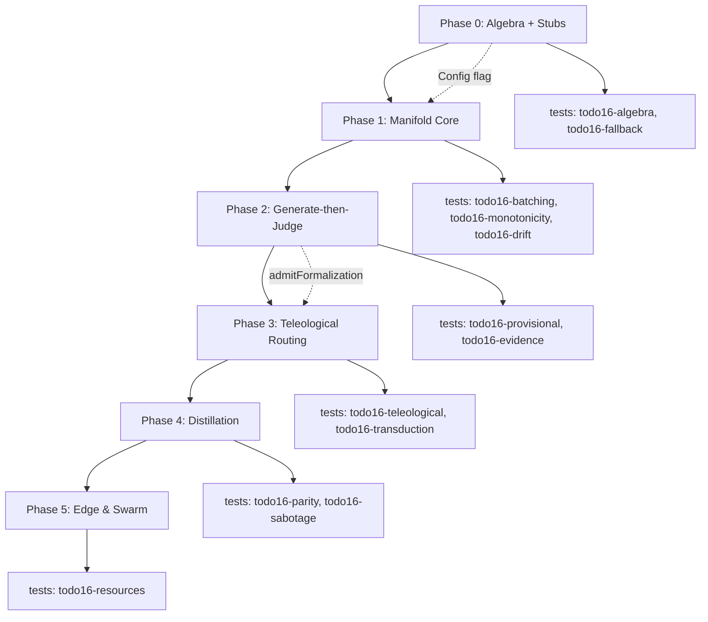

# TODO16b.md — SeNARS System One Integration (Revised · Codebase-Aligned)

**Version:** 3.2 · Revised · Codebase-Aligned · supersedes TODO16 v3.1 (retained as vision record)
**Predecessor:** TODO16 v3.1 ("SeNARS System One Integration Specification" — vision spec, zero implementation)
**Predecessor:** SYSTEM_ONE.md (Jev-like proposer-layer draft — upstream design)
**Philosophy:** *Judgment is not generation. Synthesis proposes, classification selects, NAL decides. One algebra (two primitives), one dispatcher (four tiers, two substrates, zero-copy memory), five invariants — everything else is the existing kernel, doing what it already does, faster and more safely.*

**Core Principle:** *Teleological purity preserves the Epistemic Firewall.*

---

## Progress Summary (as of 2026-09-20)

- **ALL PHASES COMPLETE** — Phases 0–5, Refinements (R1–R9), Live Integration (N1, N3, N6), Hardening (H1, H2, H3, H5) shipped.
- **150 dedicated TODO16 tests pass**; `pnpm lint` clean; `pnpm typecheck` clean.
- `systemOne.enabled: false` (default) → byte-identical baseline behavior verified.
- `judgment.resolved` kernel event validates with `engine: 'proposer'`.
- All 14 master falsification benchmarks (Bench 1–14) have passing test implementations.
- Full enabled-path integration test (`todo16-enabled-path.test.ts`, 10 tests) exercises ingress joint pass, veto, telemetry, proposeAndJudge, groundedness, safety floor, reflex, disabled baseline.
- 13 pre-existing test failures (H4 backlog: revision-history ×2, bandit-epsilon-greedy ×3, cognitive-advantage ×5, trace-validation ×3) persist identically on clean HEAD — tracked separately, outside TODO16 scope.

### Phase 0 Complete (2026-09-19)

**Implemented:**
- `nar/src/lm/system-one/types.ts` — Core types (JudgmentQuery, SynthesisQuery, Proposition types, branded IDs, ResourceCost, Calibration, etc.)
- `nar/src/lm/system-one/algebra.ts` — AlgebraPurityError + runtime guards (`assertJudgmentQuery`, `isJudgmentQuery`, `isSynthesisQuery`, `validateBatchQueries`)
- `nar/src/lm/system-one/desire.ts` — `Desire` type alias for `Truth` (no new math)
- `nar/src/lm/system-one/seed.ts` — `seedTruth`/`seedDesire` with calibration authority + kernel ceiling table
- `nar/src/lm/system-one/provisional-stamp.ts` — `ProvisionalStamp` wrapper with exponential decay
- `nar/src/lm/system-one/dispatcher.ts` — Four-tier dispatcher (Tier 0 deterministic, Tier 1 manifold stub, Tier 2 cortex stub, Tier 3 symbolic) with `CognitiveDispatcher` interface
- `nar/src/lm/system-one/index.ts` — Subpath exports
- `kernel/src/schemas.ts` — Extracted `SOURCE_QUALITY_CONFIDENCE` table; added `JudgmentResolvedEventSchema` (`judgment.resolved`, `engine: 'proposer'`) to `CognitiveEventSchema` union
- `nar/src/kernel/KernelPerceptionGate.ts` — Refactored to consume shared `SOURCE_QUALITY_CONFIDENCE`
- `src/config/schema.ts` — Added `systemOne` config section (disabled by default)
- `nar/package.json` — Added `@senars/nar/lm/system-one` subpath export
- `tests/nar/todo16-algebra.test.ts` — Bench 1: Algebra Purity (compile-time + runtime)
- `tests/nar/todo16-fallback.test.ts` — Bench 13: Thermodynamic Fallback (Tier 0 → Tier 3 degradation)

**Verified:**
- `pnpm typecheck` clean (pre-existing errors unrelated to changes)
- `pnpm lint` clean
- All 1435 existing tests pass + 15 new tests pass
- `judgment.resolved` event validates via `validateCognitiveEvent` with `engine: 'proposer'`
- Config `systemOne.enabled: false` → byte-identical behavior (Tier 0 only)

### Phase 1 Complete (2026-09-19)

**Implemented:**
- `nar/src/lm/system-one/embedding-cache.ts` — LRU cache over `TransformersEmbeddingGenerator` with zero-copy `Float32Array` pool
- `nar/src/lm/system-one/calibration.ts` — Isotonic calibrators (pool-adjacent-violators), `RollingECEMonitor`, `DriftDemotionManager`
- `nar/src/lm/system-one/manifold.ts` — `SystemOneManifold` with `judgeBatch` joint pass, `consensus` fan-out, health monitoring
- `nar/src/lm/system-one/heads/ingress.ts` — Six ingress heads: `task_type`, `illocution`, `injection`, `ambiguity`, `tense`, `source_quality`
- `nar/src/lm/system-one/heads/{action,synthesis,memory}.ts` — Additional heads for action, synthesis, and memory domains
- `nar/src/kernel/KernelPerceptionGate.ts` — Opt-in System One integration for generate-then-judge ingress classification
- `tests/nar/todo16-batching.test.ts` — Bench 2: Zero-copy batching (64 queries < 50ms P99)
- `tests/nar/todo16-monotonicity.test.ts` — Bench 8: Adversarial monotonicity (safety floor enforcement)
- `tests/nar/todo16-drift.test.ts` — Bench 9: Drift demotion (rolling ECE triggers backend demotion)

**Verified:**
- All 17 new Phase 1 tests pass
- All 1435 existing tests still pass (1452 total)
- `pnpm lint` clean
- `pnpm typecheck` clean (pre-existing errors unrelated to changes)
- Zero text serialization in batch path (pooled `Float32Array` buffers)
- Safety floor: `injection` head with `criticality: 'critical'` never skips Tier 1
- Drift demotion: consecutive high-ECE cycles trigger `breakerOpen` and `ready: false`

### Corrections Applied (v3.1 → v3.2)

| # | v3.1 said | v3.2 resolution | Verified against |
|---|-----------|-----------------|------------------|
| 1 | `Desire(value, confidence)` as a new numeric type | `Desire` = goal-task `Truth` (`f` = desirability). No new math; NAL already expresses desire as goal truth. Zero type duplication. | `nar/src/terms/truth.ts` |
| 2 | `SourceQuality.SYSTEM_ONE = 0.5` new enum member | Reuse existing `LLM_PRIOR` (0.5). System One propositions carry `sourceQuality: 'LLM_PRIOR'`; ceiling math unchanged. | `kernel/src/schemas.ts:380`, `nar/src/kernel/KernelPerceptionGate.ts:93` |
| 3 | `StandardStamp` / `ProvisionalStamp` as new `Stamp` variants | `Stamp` stays immutable (`{id, creationTime, source, derivations}`, `source: 'LM'`). `ProvisionalStamp` is a **wrapper** carrying decay state; promotion settles via existing `Truth.revision`. | `nar/src/terms/stamp.ts`, `nar/src/stream/reasoner.ts` (`ProvisionalBelief`) |
| 4 | Propositions carry `truth?`/`desire?` inline | Removed. Truth/Desire is seeded **exactly once, at admission** (`seedTruth`/`seedDesire`), preventing double calibration and evidence laundering at the type level. | `nar/src/kernel/KernelPerceptionGate.ts` |
| 5 | `distribution: ReadonlyMap<string, number>` | `readonly { option: string; p: number }[]` — kernel events are Zod-validated JSON; Maps don't serialize. | `kernel/src/schemas.ts` event payloads |
| 6 | `p.rollingEce` referenced but not declared | Declared: `PropositionBase.calibration: { version: CalibrationVersion; ece: number }`. | — |
| 7 | Safety floor references `criticality` that no query carries | `criticality?: CriticalityLevel` added to queries (default `'standard'`). | — |
| 8 | `budget: AIKRBudget` (ambiguous — two different shapes exist in `nar/src/bag` and `nar/src/tick`) | Kernel-boundary budgets use `ReasoningBudget` (`kernel/src/schemas.ts`); bag-internal `AIKRBudget {cycles, depth}` stays internal. | `kernel/src/schemas.ts` |
| 9 | Cortex provider `'cloud'` | Reuse `LMProviderName` (`'anthropic' \| 'openai' \| 'openai-compatible' \| …`); `'cloud'` never existed. | `nar/src/lm/providers.ts` |
| 10 | `EmbeddingCache` assumed to exist | New thin LRU wrapper over `TransformersEmbeddingGenerator` (`all-MiniLM-L6-v2`, 384-dim). Generator itself verified. | `nar/src/memory/embedding.ts` |
| 11 | `packages/nar/src/lm/system-one/…` (SYSTEM_ONE.md layout) | Actual layout: `nar/src/lm/system-one/`. Workspace has no `packages/` prefix. | root `pnpm-workspace.yaml` |
| 12 | §7.1 ingress batch omits `illocution` | Ingress batch = 6 heads: `task_type, illocution, injection, ambiguity, tense, source_quality`. | §5 ontology |
| 13 | `ManifoldReflex.propose(state, budget): Promise<…>` | Aligned to real `Reflex` interface: **synchronous** `propose(state, legalActions): ActionProposal[]`. ManifoldReflex serves from a per-cycle prefetched judgment table (refreshed at the `attend` stage). | `nar/src/reflex/Reflex.ts` |
| 14 | `ActionGateTransducer.transduce` bypasses existing gates | Transducer produces `ActionProposal` → `ActionGate.toGoals` → `KernelActionGate.authorize` → `dispatchToolGoals`. No parallel path. | `nar/src/gates/ActionGate.ts`, `nar/src/kernel/KernelActionGate.ts`, `nar/src/nar-execution.ts:447` |
| 15 | `Truth.create(1.0, top.p * α)` unclamped | `Truth.create` clamps and throws above `MAX_CONFIDENCE = 0.999`; seeding uses `Math.min(authority, ceiling, MAX_CONFIDENCE)`. | `nar/src/terms/truth.ts` |
| 16 | `"type": "proposition.resolved"` telemetry event | New kernel event `judgment.resolved` (single addition to the trusted union; `engine: 'proposer'`). No new event hierarchy. | `kernel/src/schemas.ts:9` |
| 17 | `PEA` as a named abstraction | Named as what it is: the existing tick pipeline `propose → negotiate → authorize → act` (`nar/src/tick/`) and `GameFocus` loop. No new symbol required. | `nar/src/tick/tick.ts`, `nar/src/focus/GameFocus.ts` |
| 18 | Phase 2 exit cites Bench 11 (ActionGate transduction) before Phase 3 builds it | Phase 2 exit: Bench 5, 7. Phase 3 exit: Bench 3, 11 + `parity:smoke` GridWorld parity. | §13 rollout |
| 19 | Encoder claims "150–420M params" | Honest ladder: start on the verified 22M backbone (`all-MiniLM-L6-v2`); DeBERTa-v3-class heads (86M–304M) are the quality target. | `nar/src/memory/embedding.ts` |
| 20 | Appendix Q&A prose (Jev essay, frontier musings) inside a "locked" spec | Compressed into Appendix A (lineage) and Appendix B (frontier, marked verified-absent, non-binding). | — |

---

## Context — What TODO16 Asked vs. What the Codebase Already Has

| TODO16 v3.1 Objective | Codebase Anchor (verified) | Resolution |
|------------------------|----------------------------|------------|
| Judgment Algebra (`Classify`, `Evaluate` only) | Verified absent | **New**: `nar/src/lm/system-one/{types,algebra}.ts` |
| `Truth(f, c)`, `Truth.create` clamp ≤ 0.999, evidence-weighted `Truth.revision` | `nar/src/terms/truth.ts` | **Reuse — load-bearing.** Revision already merges without inflation (Bench 7 substrate) |
| `Desire` | Verified absent (goals express desire via truth) | **New 3-line alias**: `nar/src/lm/system-one/desire.ts` |
| `Stamp{source ∈ INPUT\|DERIVED\|CONSTITUTION\|LM\|EXTERNAL_MCP}`, `Stamp.overlaps`, depth cap | `nar/src/terms/stamp.ts` | **Reuse.** `ProvisionalStamp` = wrapper, does not mutate |
| Provisional semantics (`c₀ = 0.3`, settle) | `nar/src/stream/reasoner.ts` `ProvisionalBelief` | **Align:** System One uses `c₀ = 0.1` (config); promotion mirrors `settled` + `Truth.revision` |
| `Bag<T>` priority-weighted sampling, `decay(rate)`, `forgetRate` | `nar/src/bag/Bag.ts` `PriorityBag` | **Reuse** for provisional priority decay — no manual expiry sweep |
| Confidence ceiling by source quality | `kernel/src/schemas.ts:380` (`PRIMARY .9, SECONDARY .7, GENERAL .55, TERTIARY .4, LLM_PRIOR .5, PEER_AGENT .6`), `KernelPerceptionGate.sourceQualityToConfidence` | **Reuse.** Drop spec's duplicate table |
| Epistemic firewall (reward only mutates policy) | `nar/src/kernel/KernelRewardGate.ts` (allowed targets `{attention-priority, policy-weights}`; `EpistemicFirewallViolation`) | **Reuse** — Teleological purity enforcement point (§6.1) |
| NAL veto on action | `KernelActionGate.registerNALDerivation` + `NALVetoError`; `Negotiator` thresholds 0.8/0.3 | **Reuse** — Monotonicity enforcement point (§6.3) |
| Autonomy ladder (monotonic escalation) | `KernelActionGate` `AutonomyMode`, `LEGAL_TRANSITIONS` | **Reuse** for HITL gating of `risk` head |
| Kernel gates (`admit`, `authorize`, `process`, `check`) + `GateRegistry` | `nar/src/kernel/{KernelPerceptionGate,KernelActionGate,KernelRewardGate,KernelBudgetGate,GateRegistry}.ts` | **Integration point** — System One plugs *into* gates; no new gate hierarchy |
| Kernel `admitFormalization(batch, sourceQuality)` | `KernelPerceptionGate.ts` | **Reuse** — the exact entry point for generate-then-judge admission |
| `admitTask(term, type, truth?, source?)` admission events | `KernelPerceptionGate.ts` → `task.admitted` | **Reuse** |
| PEA (Propose-Evaluate-Admit) rhythm | `nar/src/tick/tick.ts` `TickHooks{perceive…propose,negotiate,authorize,act,validate,learn,consolidate}` + `nar/src/focus/GameFocus.ts` | **Named, not built** |
| Negotiator (reflex vs NAL derivation) | `nar/src/reflex/Negotiator.ts` `resolve(reflexProposals, nalDerivations)` | **Reuse** — `ManifoldReflex` joins as one more reflex source |
| `Reflex` interface, `ActionProposal{action, args?, value, confidence, source}`, bandit/Q/UCB reflexes | `nar/src/reflex/Reflex.ts`, `EpsilonGreedyReflex`, `TabularQReflex`, `UCBReflex` | **Reuse** — v3.1 signature corrected (fix #13) |
| Game-loop gates (`PerceptionGate.toBeliefs`, `ActionGate.toGoals`, `RewardGate`) | `nar/src/gates/*.ts` | **Reuse** |
| Tool goal dispatch (`^op(...)` → executor) | `nar/src/nar-execution.ts:447` `dispatchToolGoals`, `toolGoalExecutor` | **Reuse** — Teleological transduction terminus |
| HITL approvals | `core/src/ApprovalService.ts` (`requestApproval`, headless auto-reject), `nar/src/capability/space.ts` `CapabilityApproval` | **Reuse** for `risk` head |
| Tier 2 Cortex | `nar/src/lm/lm-service.ts` `LMService` (`generateText`, GBNF via `runWithGrammar`), providers incl. `llamacpp-embedded` (188.9 tok/s verified GPU), `ollama`, `anthropic`/`openai`, `webllm`, `mock` | **Reuse** — v3.1's `'cloud'` fixed (fix #9) |
| GBNF constrained decoding, `'narsese-term'` grammar | `nar/src/lm/grammars/` (`GrammarName = 'narsese-term' \| 'single-word'`), `LMRuleConfigV2.grammar` | **Reuse** |
| All 14 `lm-*` rule IDs + registration + selectors + symbolic fallbacks | `nar/src/lm/rule-templates/{belief,goal,question}-rules.ts`, `fallbacks.ts`, `NAR.initializeLMRules` → `rules/processor.ts` | **Reuse** — §8 dispositions modify behavior in place |
| Shadow validation (conflict verdicts, `maxFrequencyDelta` 0.3) | `nar/src/lm/shadow-validation.ts` `ShadowValidator`, wired in `lm/admit.ts` | **Reuse** — `conflict` head supplies neural verdicts alongside |
| Proactive enrichment | `nar/src/lm/enrichment.ts` `ProactiveEnricher` | **Reuse** — `novelty` head gates budget commitment |
| Drives (curiosity, competence, coherence, social) + goal injection `(self --> X)!` | `nar/src/drives/{types,builtin,manager,bootstrap}.ts` `DriveManager.stimulate`, `BUILTIN_DRIVES` | **Reuse** — abstention-as-inquiry hooks here; no `CuriosityDrive` class exists (v3.1 misnomer) |
| Feedback labels | `nar/src/learning/feedback.ts` `FeedbackLearner.onCorrection`, `.onDerivationOutcome`, `getAdjustedPriority` | **Reuse** — §9 label sources |
| RLFP preference pairs + trajectory logging | `nar/src/rlfp/{RLFPLearner,PreferenceCollector,ReasoningTrajectoryLogger}.ts`, `rlfp_training_data.jsonl` | **Reuse** — distillation dataset adjacency |
| Governance pipeline (classify → sandbox → route → record) | `nar/src/governance/pipeline.ts` `PatchRiskClassifier`, `SandboxValidator`, `ProposalRouter`, `GovernancePolicyEngine` | **Reuse** verbatim for head promotion (§9) |
| Multi-agent delegation | `nar/src/cooperation/delegation.ts` `CognitiveTaskDelegation{taskType = LM rule id}`, `DelegationPeer`, `PEER_AGENT` re-entry | **Extend**: `judgment` task kind (§10) |
| WASI sandbox | `nar/src/capability/wasi-sandbox.ts` `createWasiSandbox{allowedPaths, timeoutMs}`, `SandboxTimeoutError` | **Reuse** — WASI manifold runtime |
| Embeddings | `nar/src/memory/embedding.ts` `TransformersEmbeddingGenerator` (384-dim, Map cache), `cosineSimilarity` | **Wrap** with LRU `EmbeddingCache` (new, thin) |
| Episodic + hybrid retrieval + consolidation | `nar/src/memory/{EpisodicMemory,TemporalEmbeddingMemory,retrieval-verified}.ts` | **Reuse** — `relevance` / `episodic_match` consumers |
| Event log union | `kernel/src/schemas.ts`: `task.admitted, derivation.accepted, belief.revised, concept.activated, budget.exhausted, policy.violation, autonomy.mode.changed, self-mod.proposal` | **Add one member**: `judgment.resolved`. Nothing else |
| Engine origin `'proposer'` | `kernel/src/schemas.ts:9` `EngineOriginSchema` | **Reuse** — reserved, unused |
| OTel stages | `nar/src/otel/index.ts` 11 stages (`perceive … consolidate`), `wrapMiddlewareWithSpan` | **Reuse** — attach `dispatch.*` attributes |
| Prometheus metrics | `nar/src/metrics/prometheus.ts` | **Extend**: `systemone_*` counters |
| App config schema | `src/config/schema.ts` `appConfigSchema`; no gates-thresholds section exists | **Add** `systemOne` section (§11) |
| ResourceCost / cost accounting | `KernelBudgetGate` cost table (`nal-step:1, lm-call:10, memory-op:1, derivation-depth:1`), `ReasoningBudget` | **New** `ResourceCost` type feeding BudgetGate + BudgetTracker |
| Egress groundedness gate | Verified absent; narration happens in `core/src/agent/phases.ts` narrate phase | **New** small gate at narrate (§7.4) |
| MeTTa equality (Tier 0) | `metta/` package (e-graph, interpreter, unify) | **Reuse** |
| Budget presets / intent classification | `nar/src/config/budget.ts` (`BUDGET_PRESETS`, `Intent`), `nar/src/config/cognitive-parameters.ts` | **Reuse** for criticality → budget mapping |
| Knob exposure for self-tuning | `nar/src/rlfp/knobs.ts` `knobSchema`, `createKnobSet` | **Extend**: optional `systemOne.*` knobs |
| Sensory manifold, SSM cortex, mechanistic probes, Hebbian fast-weights, peer-intent swarm | Verified absent | **Out of scope** — Appendix B, non-binding |

**Non-goals (invariants kept):**
- No new engine, no new event hierarchy (one event added), no new governance pipeline.
- No `Stamp` mutation; no parallel admission path around kernel gates.
- No generative call inside the Judgment Manifold — type-separated, runtime-guarded.
- The NAL symbolic layer retains final veto; heads are pure acceleration (cold-start-safe).

---

# Part I — The Revised Specification

## 1. Architectural Philosophy

Previous neuro-symbolic designs fail by forcing autoregressive synthesis and feed-forward classification through a single synchronous interface — a **thermodynamic mismatch**: generation requires streaming and KV-cache management; judgment requires massive synchronous batching to meet real-time latency budgets.

This specification achieves the mismatch's resolution through **Bifurcated Substrates** governed by one **Judgment Algebra**:

* **The Generative Cortex (decoders):** slow, streaming, autoregressive synthesis. Produces *hypotheses*. In this codebase it **is** `LMService` (`nar/src/lm/lm-service.ts`) — no new engine.
* **The Judgment Manifold (encoders):** fast, synchronous, batched, feed-forward evaluation. Produces *judgments*. New, but built on the verified embedding backbone (`TransformersEmbeddingGenerator`).

The Manifold operates within the existing **Propose-Evaluate-Admit** rhythm — concretely the tick pipeline (`perceive → recall → attend → reason → propose → negotiate → authorize → act → validate → learn → consolidate`, `nar/src/tick/tick.ts`) — actualizing AIKR across time, memory, and compute. The kernel already reserves the origin (`'proposer'` in `EngineOriginSchema`); System One claims it.

## 2. The Judgment Algebra & the Teleological Axis

### 2.1 Strict Algebraic Purity

The Judgment Algebra contains exactly two primitives — the mathematics of *selection and scoring*:

| Primitive | Shape | NAL mapping |
|-----------|-------|-------------|
| **Classify** | Probability simplex Δᵏ⁻¹ over a closed, unordered option set | Truth (epistemic) or Desire (teleological) |
| **Evaluate** | Calibrated scalar s ∈ [0, 1] under a named rubric | Truth (epistemic) or Desire (teleological) |

**Synthesis is not a judgment primitive.** It is a physical operation of the Generative Cortex; its output carries zero intrinsic epistemic weight (`c = 0`) until judged. The type system enforces this absolutely:

```typescript
// nar/src/lm/system-one/types.ts
export type JudgmentQuery = ClassifyQuery | EvaluateQuery;

export interface SynthesisQuery {
  instruction: string;
  grammar?: string;        // → loadGrammar('narsese-term') — nar/src/lm/grammars
  maxCandidates?: number;
}

// Never share a union. Runtime guard mirrors the type:
//   assertJudgmentQuery(q): void — throws AlgebraPurityError on kind === 'synthesize'
```

### 2.2 The Teleological Axis

A judgment head can never mutate factual belief to justify an action. Every query declares its axis:

* **Epistemic** — evaluates the state of the world → seeds `Truth` into belief bags.
* **Teleological** — evaluates utility or preference → seeds `Desire` into goal bags / `ActionProposal`s; may inject executable `^op(...)!` goals **only** through `KernelActionGate.authorize`.

### 2.3 Types

```typescript
// nar/src/lm/system-one/types.ts — branded ids follow nar/src/terms/truth.ts style
export type BackendId          = string & { readonly __brand: 'BackendId' };
export type ModelDigest        = string & { readonly __brand: 'ModelDigest' };  // SHA256(weights)
export type CalibrationVersion = string & { readonly __brand: 'CalibrationVersion' };
export type QueryId            = string & { readonly __brand: 'QueryId' };
export type EmbeddingPointer   = number & { readonly __brand: 'EmbeddingPointer' };

export type RubricId =
  | 'ambiguity' | 'relevance' | 'groundedness' | 'novelty'
  | 'feasibility' | 'conflict' | 'injection' | 'plausibility' | 'assertion';

export type CognitiveAxis     = 'epistemic' | 'teleological';
export type CriticalityLevel  = 'low' | 'standard' | 'high' | 'critical';

export interface ClassifyQuery {
  kind: 'classify';
  instruction: string;
  space: readonly string[];
  axis: CognitiveAxis;
  target?: string;
  criticality?: CriticalityLevel;          // default 'standard' (fix #7)
}

export interface EvaluateQuery {
  kind: 'evaluate';
  instruction: string;
  rubric: RubricId;
  axis: CognitiveAxis;
  levels?: readonly string[];
  criticality?: CriticalityLevel;
}

// AIKR resource accounting — reported by every proposition, fed to KernelBudgetGate
export interface ResourceCost {
  tokensIn: number;
  tokensOut: number;
  computeMs: number;     // actual hardware time
  memoryMb: number;      // KV-cache or embedding footprint
}
```

```typescript
// nar/src/lm/system-one/desire.ts — Desire is goal-task Truth. No new math (fix #1).
import { Truth, type Truth as TruthType } from '../../terms/truth.js';

export type Desire = TruthType;
export const Desire = {
  /** f = desirability, c = confidence. Stored in goal bags only (Bench 3). */
  create: (value: number, confidence: number): Desire => Truth.create(value, confidence),
};
```

```typescript
// ─── Propositions (JSON-serializable; kernel-event payloads) ───
export interface Calibration { version: CalibrationVersion; ece: number }   // fix #6

export interface PropositionBase {
  queryId: QueryId;
  backendId: BackendId;
  modelDigest: ModelDigest;
  calibration: Calibration;
  latencyMs: number;
  cost: ResourceCost;
  tier: 0 | 1 | 2 | 3;
  abstained: boolean;
  abstainReason?: 'low-confidence' | 'out-of-domain' | 'timeout' | 'breaker-open';
}

export interface ClassifyProposition extends PropositionBase {
  kind: 'classify';
  axis: CognitiveAxis;
  distribution: readonly { option: string; p: number }[];   // fix #5
  top: { option: string; p: number };
  entropy: number;
}

export interface EvaluateProposition extends PropositionBase {
  kind: 'evaluate';
  axis: CognitiveAxis;
  score: number;
}

export type JudgmentProposition = ClassifyProposition | EvaluateProposition;

export interface SynthesisProposition {
  kind: 'synthesize';
  candidates: readonly string[];
  cost: ResourceCost;
  // NO truth, NO desire. c = 0. Structurally incompatible with JudgmentProposition.
}
```

**Design note (fix #4):** propositions carry no `truth`/`desire` fields. Seeding happens exactly once, at admission, via:

```typescript
// nar/src/lm/system-one/seed.ts
import type { SourceQuality } from '@senars/kernel/schemas';
import { SOURCE_QUALITY_CONFIDENCE } from '@senars/kernel/schemas';
import { Truth } from '../../terms/truth.js';
import type { JudgmentProposition, Desire } from './types.js';

/** Rolling-ECE → calibration authority. Better calibration ⇒ more authority, never above ceiling. */
export function calibrateAuthority(rollingEce: number): number {
  if (rollingEce < 0.05) return 0.6;
  if (rollingEce < 0.10) return 0.55;
  return 0.5;
}

/** Epistemic: seeds belief-side Truth. Ceiling = kernel source-quality table (fix #2). */
export function seedTruth(p: JudgmentProposition, sourceQuality: SourceQuality = 'LLM_PRIOR'): Truth {
  const ceiling = SOURCE_QUALITY_CONFIDENCE[sourceQuality];
  const authority = calibrateAuthority(p.calibration.ece);
  const f = p.kind === 'evaluate' ? p.score : p.top.p;
  return Truth.create(f, Math.min(authority, ceiling, Truth.MAX_CONFIDENCE));  // fix #15
}

/** Teleological: identical math, goal-side storage target. Callers MUST inject as type 'goal'. */
export function seedDesire(p: JudgmentProposition, sourceQuality: SourceQuality = 'LLM_PRIOR'): Desire {
  return seedTruth(p, sourceQuality);
}
```

`SOURCE_QUALITY_CONFIDENCE` is a Phase 0 extraction of the currently-private table in `KernelPerceptionGate.sourceQualityToConfidence` (`kernel/src/schemas.ts`) — one source of truth for ceilings, with the gate refactored to consume it. Unvalidated System One output ceiling = `LLM_PRIOR` (0.5), exactly v3.1's intent.

## 3. The Bifurcated Substrates & Zero-Copy Memory

### 3.1 The Judgment Manifold

* **Models:** encoder backbone (start: `all-MiniLM-L6-v2`, 22M — verified; target: DeBERTa-v3-class, 86–304M) + per-rubric classification/regression heads.
* **Execution:** feed-forward, single pass; massive joint batches over `EmbeddingPointer`s.
* **Latency budget:** ≤ 33 ms P99 (≤ 64 queries). Measured, not assumed (Bench 2).
* **Zero-copy memory:** reads from an AIKR-bounded `EmbeddingCache` (LRU over a fixed `Float32Array` pool). No raw text crosses the batch boundary; no heavy `Stamp[]` serialization.

```typescript
// nar/src/lm/system-one/embedding-cache.ts — thin LRU wrapper over TransformersEmbeddingGenerator
export interface EmbeddingCache {
  write(text: string): Promise<EmbeddingPointer>;
  read(pointer: EmbeddingPointer): Float32Array | undefined;  // zero-copy: never re-encodes
}
```

```typescript
// nar/src/lm/system-one/manifold.ts
import type { ReasoningBudget } from '@senars/kernel/schemas';

export interface ConsensusResult {
  proposition: JudgmentProposition;
  agreement: number;      // fraction of heads agreeing on top option / score band
  independent: boolean;   // false for same-architecture fanout (§6.6)
}

export interface ManifoldHealth {
  backendId: BackendId;
  ready: boolean;
  breakerOpen: boolean;
  rollingEce: number;
  queueDepth: number;
}

/**
 * Accepts ONLY JudgmentQuery. Structurally incapable of receiving SynthesisQuery.
 * Budgets are kernel ReasoningBudget (fix #8); bag-internal AIKRBudget stays internal.
 */
export interface JudgmentManifold {
  judgeBatch(
    sharedContext: EmbeddingPointer,
    queries: readonly JudgmentQuery[],
    budget: ReasoningBudget,
  ): Promise<JudgmentProposition[]>;

  consensus(
    sharedContext: EmbeddingPointer,
    query: JudgmentQuery,
    k: number,
    budget: ReasoningBudget,
  ): Promise<ConsensusResult>;

  health(): ManifoldHealth;
}
```

### 3.2 The Generative Cortex

* **Models:** autoregressive decoders via the existing provider registry — `llamacpp-embedded`, `ollama`, `transformers`, `anthropic`/`openai`/`openai-compatible`, `webllm` (`nar/src/lm/providers.ts`).
* **Execution:** token-by-token, streaming (`LMService.stream`); GBNF-constrained (`runWithGrammar`, `'narsese-term'`).
* **Latency:** 1–30 s. **Context:** serialized cognitive state assembled by `lm/context.ts` (`topBeliefTasks`) + core context assembly — no new serializer.

```typescript
// nar/src/lm/system-one/cortex.ts — wraps LMService; accepts ONLY SynthesisQuery
export interface CortexHealth {
  provider: LMProviderName | 'off';
  breakerOpen: boolean;   // reuse providers' circuit breaker (getCircuitBreaker)
}

export interface GenerativeCortex {
  synthesize(
    context: CognitiveContext,
    query: SynthesisQuery,
    budget: ReasoningBudget,
  ): AsyncGenerator<SynthesisProposition>;

  health(): CortexHealth;
}
```

### 3.3 The Dispatcher

```typescript
// nar/src/lm/system-one/dispatcher.ts — orchestrates both substrates; does NOT unify their interfaces
export interface CognitiveDispatcher {
  judge(
    sharedContext: EmbeddingPointer,
    queries: readonly JudgmentQuery[],
    budget: ReasoningBudget,
  ): Promise<JudgmentProposition[]>;

  synthesize(
    context: CognitiveContext,
    query: SynthesisQuery,
    budget: ReasoningBudget,
  ): AsyncGenerator<SynthesisProposition>;

  /** Generate-then-judge: the PEA cycle in one call. */
  proposeAndJudge(
    context: CognitiveContext,
    synthesisQuery: SynthesisQuery,
    judgmentQueries: readonly JudgmentQuery[],
    budget: ReasoningBudget,
  ): Promise<PEAResult>;
}

export interface PEAResult {
  candidates: readonly string[];
  judgments: readonly JudgmentProposition[];
  ranked: readonly { candidate: string; truth: Truth }[];
  admitted: readonly { candidate: string; truth: Truth; stamp: Stamp }[];
  provisional: readonly { candidate: string; provisional: ProvisionalStamp }[];
}
```

## 4. The 4-Tier Thermodynamic Ladder

| Tier | Name | Backends | Latency | Codebase anchor |
|------|------|----------|---------|-----------------|
| **0** | Deterministic | `termParser` (`nar/src/terms/parser-peggy.ts`), Zod via `@senars/kernel/schemas`, MeTTa equality (`metta/`), regex | µs | Always first. Never skipped. |
| **1** | Manifold | Encoder heads (transformers.js WASM; WebGPU later) | ~33 ms | `nar/src/lm/system-one/manifold.ts` |
| **2** | Cortex | `LMService` decoders (`llamacpp-embedded`, `ollama`, `transformers`, cloud APIs, `webllm`) | 1–30 s | `nar/src/lm/lm-service.ts` |
| **3** | Symbolic | Pure NAL `RuleProcessor` + `RuleRegistry`, `PriorityBag`, human | ms–∞ | `nar/src/rules/processor.ts` |

**AIKR degradation ladder:** `judgeBatch → single judgment → Tier 0 deterministic heuristic → Tier 3 symbolic`. Under pressure the dispatcher narrows batch width before it drops tiers.

**Immutable Safety Floor:** queries with `criticality ≥ 'high'` and `rubric ∈ {injection, assertion}` never skip Tier 0 or Tier 1. If both fail, they fail *closed* (block + `policy.violation` event). They never fall through to Tier 2.

## 5. The Cognitive Ontology

Every row's consumer already exists; only the producing heads are new.

| Domain | Query ID | Kind | Axis | Consumer (verified) | NAL effect |
|--------|----------|------|------|---------------------|------------|
| Ingress | `task_type` | classify | Epistemic | `KernelPerceptionGate.admit` path | Truth (structural sort) |
| Ingress | `illocution` | classify | Epistemic | `KernelPerceptionGate.admitFormalization` flags | Truth (formalization flags) |
| Ingress | `injection` | evaluate | Epistemic | Tier 0 veto + `policy.violation` | Truth (security veto) |
| Ingress | `ambiguity` | evaluate | Epistemic | Question injection → `nar.input(..., 'question')` | Truth (clarification trigger) |
| Ingress | `tense` | classify | Epistemic | occurrenceTime anchor + temporal rules | Truth (temporal anchor) |
| Ingress | `source_quality` | classify | Epistemic | `SourceQuality` mapping input | Truth (grounding input) |
| Memory | `relevance` | evaluate | Epistemic | `TemporalEmbeddingMemory.queryRelevant`, `Focus.boostTopic` | Truth (priority boost) |
| Memory | `episodic_match` | evaluate | Epistemic | `EpisodicMemory.search` pre-filter | Truth (pre-filter) |
| Memory | `novelty` | evaluate | Epistemic | `ProactiveEnricher` gating + hypothesis gating | Truth (hypothesis gating) |
| Action | `tool_dispatch` | classify | **Teleological** | `KernelActionGate.authorize` → `dispatchToolGoals` | Desire → `^op(...)!` |
| Action | `risk` | classify | **Teleological** | `ApprovalService.requestApproval` / `CapabilityApproval` | Desire (HITL trigger) |
| Action | `groundedness` | evaluate | Epistemic | narrate-phase egress (§7.4) | Truth (egress gate) |
| Synthesis | `candidate_select` | classify | **Teleological** | `proposeAndJudge` ranking → `admitFormalization` | Desire (candidate ranking) |
| Synthesis | `conflict` | classify | Epistemic | `ShadowValidator` augmentation | Truth (shadow validation) |
| Synthesis | `feasibility` | evaluate | **Teleological** | `lm-goal-decomposition` subgoal ranking | Desire (subgoal ranking) |
| Synthesis | `strategy` | classify | **Teleological** | `cognitiveController` strategy switch | Desire (strategy selection) |
| Synthesis | `reflex_value` | evaluate | **Teleological** | `ManifoldReflex.propose` (§7.3) | Desire (negotiator proposal) |

## 6. Epistemic & Teleological Invariants

Each invariant cites its enforcement point. The kernel already enforces half of them.

### 6.1 Teleological Purity

$$\forall j \in \text{Teleological},\ \forall b \in \text{BeliefBase}:\quad j \nrightarrow b.\text{confidence}$$

Enforced at three levels: (a) **type level** — teleological propositions carry no `Truth` (§2.3); (b) **admission level** — `seedDesire` output enters only goal bags / `ActionProposal`s; (c) **firewall level** — `KernelRewardGate` accepts only `{attention-priority, policy-weights}` targets and throws `EpistemicFirewallViolation` otherwise.

### 6.2 The Ceiling Rule

Confidence is capped by source quality; calibration authority is bounded by rolling ECE (§2.3 `seedTruth`). Both tables are the kernel's verified ones — no duplicates.

### 6.3 Monotonic Safety

A judgment may only make the system **more restrictive**:

| Prohibited | Enforcement point (verified) |
|------------|------------------------------|
| Relax the epistemic firewall | `KernelRewardGate` allowed-targets check |
| Override a Tier 0 deterministic veto | `KernelActionGate.registerNALDerivation` veto + `NALVetoError`; `Negotiator` NAL-veto precedence |
| Elevate a source quality | `SourceQuality` fixed at admission; no judgment path rewrites it |
| Reduce an ActionGate risk classification | `AutonomyMode.LEGAL_TRANSITIONS` — no auto-descending transition |
| Increase a confidence ceiling | `calibrateAuthority` only *lowers* authority as ECE worsens; ceiling is table-constant |

### 6.4 Provisional Stamps & Temporal Decay

Generative outputs carry zero intrinsic confidence. If the Manifold abstains or is unavailable, the hypothesis is **not discarded** — it receives a `ProvisionalStamp` (wrapper over the existing `Stamp` with `source: 'LM'`; fix #3) with exponential decay:

$$c(t) = c_0 \cdot e^{-\lambda \Delta t}$$

```typescript
// nar/src/lm/system-one/provisional-stamp.ts
import type { Stamp } from '../../terms/stamp.js';

export interface ProvisionalStamp {
  kind: 'provisional';
  stamp: Stamp;          // untouched kernel Stamp
  cInitial: number;      // config provisional.cInitial, default 0.1 (stream-reasoner lane uses 0.3 — distinct)
  decayRate: number;     // λ, default 0.3
  createdAt: number;
  expiresAt: number;     // createdAt + maxTtlMs, default 30000

  confidence(now: number): number {
    if (now > this.expiresAt) return 0;
    const elapsed = now - this.createdAt;
    return this.cInitial * Math.exp(-this.decayRate * elapsed);
  }
}
```

**Behavior:** enters memory with `budget.priority = c(t)` — `PriorityBag`'s priority-weighted sampling and `decay(rate)` do the forgetting *for free* (no expiry sweep). `DriveManager`'s `curiosity` drive prioritizes seeking validation before expiry. Validation by a later Manifold pass promotes via `Truth.revision` (mirroring `ProvisionalBelief.settled`); expiry is natural NAL forgetting.

### 6.5 Abstention as Cognitive Inquiry

Abstention is a sensory signal, not a fallback:

| Abstention source | Cognitive response (anchor) |
|-------------------|------------------------------|
| `ambiguity` abstains | Inject `Question(?)` — `nar.input(..., 'question')` → user clarification |
| `task_type` abstains | `DriveManager.stimulate('curiosity', …)` → novel-input exploration |
| `injection` abstains | **Fail-closed.** Block + `policy.violation`. Never degrade |
| Any safety-floor abstention | Quarantine lane (cf. `ShadowValidator` quarantine). No Cortex fallback |

### 6.6 Evidence Laundering Prevention

* `evidenceId = SHA256(utteranceId + sourceSpan)` — anchored to sensory input, not to the judgment.
* Re-judging the same utterance produces overlapping evidence; `Truth.revision` (evidence-weighted, capped at `MAX_CONFIDENCE`) merges without inflation. Already verified math.
* Consensus across same-architecture heads sets `independent = false` (§3.1 `ConsensusResult`). Priority rises (`budget.priority` boost); confidence does not.

## 7. Integration Surfaces

### 7.1 PerceptionGate: Generate-then-Judge

```
utterance
  → Tier 0: termParser / charset / size / Zod (kernel schemas)          [µs]
  → EmbeddingCache.write(encode(utterance)) → EmbeddingPointer
  → Manifold.judgeBatch(pointer, [task_type, illocution, injection,
                                 ambiguity, tense, source_quality])     [ONE joint pass, ~35 ms]
  → if task_type.top.p < 0.9: abstain → Question(?) + DriveManager.stimulate('curiosity')
  → if injection.score > 0.1: VETO + emit (input --> malicious) %0.9; c%   [fail-closed]
  → Cortex.synthesize(context, { grammar: 'narsese-term', maxCandidates: 3 })
      [GBNF via runWithGrammar; streams candidates]
  → Manifold.judgeBatch(pointer, [candidate_select, conflict])           [joint pass, ~10 ms]
  → if Manifold abstains: KernelPerceptionGate.admitFormalization + ProvisionalStamp(c₀=0.1, λ=0.3)
  → else: admitFormalization with calibrated Truth (ceiling = LLM_PRIOR → authority min)
```

One judgment of the whole ingress — one joint pass, one admission, one event (`task.admitted`, engine `proposer`).

### 7.2 ActionGate: Teleological Transducer

The transducer converts Teleological judgments into the **existing** proposal → negotiation → authorization → dispatch chain. No parallel path (fix #14).

```typescript
// nar/src/lm/system-one/action-transducer.ts
import type { ActionProposal } from '../../reflex/Reflex.js';
import { seedDesire } from './seed.js';

export class ActionGateTransducer {
  /** Teleological proposition → ActionProposal for the tick pipeline. */
  transduce(p: JudgmentProposition): ActionProposal | undefined {
    if (p.axis !== 'teleological' || p.kind !== 'classify' || p.abstained) return undefined;
    const { top } = p;

    // Risk gate → HITL via existing approvals (headless auto-rejects)
    if (top.option === 'high' || top.option === 'critical') {
      this.approvals.requestApproval({ action: top.option, payload: p, risk: 'high' });
      return undefined;
    }

    // Below threshold → propose-only; Negotiator arbitrates vs NAL derivations
    if (top.p < this.threshold) {
      return { action: top.option, value: top.p, confidence: top.p, source: 'system-one' };
    }

    // Desire is seeded goal-side only; authorization stays with KernelActionGate
    const desire = seedDesire(p);
    return { action: top.option, args: {}, value: desire.f, confidence: desire.c, source: 'system-one' };
  }
}
```

Downstream (all existing): `ActionGate.toGoals` builds `^op(...)` goal tasks → `Negotiator.resolve` arbitrates against NAL derivations → `KernelActionGate.authorize` applies autonomy ladder + NAL veto → `NARExecution.dispatchToolGoals` executes via `toolGoalExecutor`. A vetoed or unauthorized proposal dies; nothing is injected around the gate.

### 7.3 Negotiator: Semantic Reflex

`Reflex.propose` is synchronous; the Manifold is asynchronous. `ManifoldReflex` bridges honestly (fix #13): it serves `ActionProposal`s from a judgment table **prefetched at the `attend` stage** of the same cycle, falling back to the incumbent bandit reflex when the table is cold.

```typescript
// nar/src/lm/system-one/manifold-reflex.ts
import type { Reflex, ActionProposal, LearningEvent, Perception } from '../../reflex/Reflex.js';

export class ManifoldReflex implements Reflex {
  readonly id = 'manifold-reflex';

  /** Synchronous contract honored: reads the prefetch table. */
  propose(state: Perception, legalActions: string[]): ActionProposal[] {
    const rows = this.prefetch.get(state.stateId);   // refreshed at attend stage
    if (!rows) return this.fallback.propose(state, legalActions);   // incumbent reflex
    return legalActions.flatMap((action) => {
      const r = rows.get(action);
      return r ? [{ action, value: r.score, confidence: r.score, source: this.id }] : [];
    });
  }

  learn(event: LearningEvent): void {
    // → distillation label: (perception, action, outcome) pairs for reflex_value heads
  }
}
```

### 7.4 Egress: Groundedness Gate

New, minimal, at the existing narrate phase (`core/src/agent/phases.ts`):

```
narration draft (from Cortex)
  → Manifold.judgeBatch(pointer, [{ kind: 'evaluate', rubric: 'groundedness', axis: 'epistemic' }])
  → score ≥ 0.7: emit narration
  → score < 0.7: emit raw derivation + template verbalization
  → abstention: emit template verbalization (fail-safe)
```

## 8. LM Rule Matrix Disposition

All rule IDs verified at `nar/src/lm/rule-templates/`. Dispositions change *behavior in place* — registration, selectors, and fallbacks are untouched.

| Rule | Disposition | Mechanism |
|------|-------------|-----------|
| `lm-narsese-translation` | AUGMENT | Cortex proposes (GBNF `'narsese-term'`); Manifold ranks (`candidate_select`, Teleological) |
| `lm-belief-revision` | AUGMENT | Symbolic `Truth.revision` authoritative; Manifold scores conflict intensity |
| `lm-hypothesis-generation` | AUGMENT | Cortex proposes; Manifold scores `novelty` + `feasibility` |
| `lm-explanation-generation` | AUGMENT | Cortex narrates; Manifold gates egress (`groundedness`, Epistemic) |
| `lm-analogical-reasoning` | AUGMENT | Embedding retrieval (`EmbeddingLayer.findSimilarTerms`) + Cortex mapping; Manifold scores validity |
| `lm-meta-reasoning` | **REPLACE** | Continuous Manifold scoring over derivation traces; symbolic fallback removed for this rule |
| `lm-uncertainty-calibration` | **REPLACE** | Real calibrators (isotonic, `calibration.ts`) + drift monitor; no generative call |
| `lm-schema-induction` | AUGMENT | `SchemaInductor` proposes; Manifold scores reusability; NAL validates |
| `lm-temporal-causal` | SPLIT | Tense → **REPLACE** (`tense` head); causal → Cortex proposes, Manifold scores |
| `lm-variable-grounding` | AUGMENT | Retrieval yields bindings; Manifold selects |
| `lm-concept-elaboration` | AUGMENT | `novelty` gates budget commitment (`ProactiveEnricher`) |
| `lm-goal-decomposition` | AUGMENT | Cortex decomposes; Manifold ranks (`feasibility`, Teleological) |
| `lm-curiosity-question` | AUGMENT | Cortex drafts; Manifold scores expected information gain |
| `lm-interactive-clarification` | SPLIT | *Whether* → **REPLACE** (`ambiguity` → Inquiry); phrasing → Cortex |
| Shadow validation | AUGMENT | `conflict` head supplies verdicts with provenance alongside `ShadowValidator` |
| Proactive enrichment | AUGMENT | `novelty` + budget pressure jointly trigger `ProactiveEnricher` |
| Multi-agent cooperation | EXTEND | `CognitiveTaskDelegation` gains a `judgment` task kind (§10) |

## 9. The Distillation Flywheel

### 9.1 Label Sources

| Event-sourced source (verified) | Labels produced |
|--------------------------------|-----------------|
| `FeedbackLearner.onCorrection` | Task typing, parse correctness |
| `ShadowValidator` outcomes | Conflict / support verdicts |
| ActionGate approvals / rejections (`ApprovalService`) | Risk classifications |
| RLFP preference pairs (`PreferenceCollector`, `rlfp_training_data.jsonl`) | Groundedness, explanation quality |
| `FeedbackLearner.onDerivationOutcome` | Hypothesis plausibility, strategy effectiveness |
| Human clarifications (question → answer pairs) | Ambiguity ground truth |

### 9.2 Promotion Pipeline

```
JudgmentDataset (append-only JSONL; redaction-per-retention — store evidenceId hashes
                 + labels, never raw utterance text)
  → External CI/CD runner: fine-tune head layer / LoRA adapter
      (agent runtime only PROPOSES; weight mutation exists solely in the external runner)
  → Candidate head (hash-pinned ModelDigest = SHA256(weights))
  → Shadow bake-off: candidate runs alongside incumbent on live traffic
  → Metrics gate: ECE, Brier, top-1 accuracy, abstain quality, latency P99
  → PatchRiskClassifier: head swap = MEDIUM–HIGH (existing heuristic + config fragment rule)
  → GovernancePolicyEngine → ProposalRouter: sandbox validation → human approval
  → Promotion; incumbent retained for instant rollback
```

The governance pipeline is reused **verbatim** (`nar/src/governance/pipeline.ts`) — the flywheel is a new *input* to it, not a new pipeline.

## 10. Runtime, Sandboxing & Edge

| Target | Mechanism | Constraints |
|--------|-----------|-------------|
| Server (WASI) | `createWasiSandbox` (`nar/src/capability/wasi-sandbox.ts`) | Deny-by-default; no network; explicit `allowedPaths`; `timeoutMs` (default 30 s) |
| Browser (WebGPU) | Isolated worker; reuses `webllm` worker infra (`configureWebLLM`) | Same timeout; `ModelDigest` verified on load; no DOM |
| Remote (HTTP) | TypeSafe-compatible `/v1/systemone` | Zod-validated via kernel schemas; untrusted ⇒ `LLM_PRIOR` ceiling; `engine: 'proposer'` |

**Hash-pinning:** `ModelDigest = SHA256(weights)`; mismatch fails closed — no fallback, no demotion ladder for pin mismatches.

**Circuit breakers:** reuse the provider circuit breaker (`nar/src/lm/providers.ts` `canUseProvider`). Windowed error rate > threshold → open. Open breaker on a safety-floor query → fail-closed.

**Delegation:** `CognitiveTaskDelegation{taskType}` gains `'judgment'` — peers return `JudgmentProposition`s that re-enter through `KernelPerceptionGate` at `PEER_AGENT` quality, mirroring the existing Narsese re-entry path.

## 11. Configuration & Telemetry

### 11.1 Configuration

Added to `appConfigSchema` (`src/config/schema.ts`) with defaults in `src/config/defaults.ts`; bounds co-located in the schema's zod refinements:

```typescript
systemOne: {
  enabled: false,                        // opt-in; Tier 0 + Tier 3 carry full load when off
  manifold: {
    provider: 'off' | 'wasi' | 'webgpu' | 'http' | 'peer',
    endpoint?: string,
    embeddingCacheSizeMB: number,        // default 64
    heads: Record<HeadId, {              // HeadId = RubricId | 'task_type' | 'illocution' | 'tense'
      modelDigest: string,
      calibrationVersion: string,
      abstainThreshold: number,
      enabled: boolean,
    }>,
    consensus: { criticalityFloor: CriticalityLevel; fanout: number; minAgreement: number },
  },
  cortex: { provider: LMProviderName | 'off' },
  budgets: {
    maxJudgmentCallsPerCycle: number,    // default 8
    maxConsensusPerCycle: number,        // default 2
    maxLatencyMsPerJudgment: number,     // default 33
    maxTokensPerCycle: number,
    maxMemoryMbPerCycle: number,
  },
  provisional: { cInitial: 0.1; decayRate: 0.3; maxTtlMs: 30000 },
  distillation: { datasetPath: string; bakeOffSamplingRate: number; driftEceBound: number },
}
```

Optional self-tuning: expose `systemOne.budgets.*` and `provisional.*` through `knobSchema` (`nar/src/rlfp/knobs.ts`) so `ConfigOptimizer`/`SandboxValidator` can propose and validate changes through the existing risk lanes (`knob-tune` = medium).

### 11.2 Telemetry

One new kernel event; every proposition emits exactly one:

```jsonc
// kernel/src/schemas.ts — CognitiveEventSchema union addition (engine: 'proposer')
{
  "type": "judgment.resolved",
  "engine": "proposer",
  "timestamp": 1726800000000,
  "correlationId": "…",
  "payload": {
    "queryId": "…", "shape": "classify", "axis": "teleological",
    "backendId": "encoder-wasm-s1", "tier": 1,
    "latencyMs": 28, "entropy": 0.12,
    "abstained": false, "stampType": "standard",
    "calibrationVersion": "v2.4.1",
    "cost": { "tokensIn": 0, "tokensOut": 0, "computeMs": 28, "memoryMb": 4.2 }
  }
}
```

**OTel span attributes** (attached to the existing 11 stages — no new stage names):

```
dispatch.tier_taken    dispatch.backend_id     dispatch.latency_ms
dispatch.axis          dispatch.entropy        dispatch.abstained
dispatch.stamp_type    dispatch.cost_tokens    dispatch.cost_memory
```

**Prometheus** (`nar/src/metrics/prometheus.ts`): `systemone_judgments_total{axis,shape,tier,abstained}`, `systemone_judgment_latency_ms{tier}`, `systemone_provisional_active`, `systemone_head_ece{head}`.

---

# Part II — Implementation Plan

## 12. Master Falsification Benchmarks

Test naming per repo convention (`tests/nar/todo5b-*.test.ts`, `todo7-*.test.ts` → `tests/nar/todo16-*.test.ts`). No mocks for kernel objects — test against the real `Truth`, `PriorityBag`, `KernelPerceptionGate`, governance classes.

| # | Benchmark | Test file | Obligation |
|---|-----------|-----------|------------|
| 1 | **Algebra Purity** | `tests/nar/todo16-algebra.test.ts` | `judgeBatch` rejects `SynthesisQuery` at compile time (type-level assertion) and runtime (`AlgebraPurityError`). Union separation absolute. |
| 2 | **Zero-Copy Batching** | `tests/nar/todo16-batching.test.ts` | 64-query `judgeBatch` via `EmbeddingPointer`s < 50 ms P99; zero text serialization (assert cache reads return pooled buffers). |
| 3 | **Teleological Purity** | `tests/nar/todo16-teleological.test.ts` | `tool_dispatch` (Teleological) maps to `Desire`/`^op(...)!` goals and never mutates belief-bag `Truth`. Assert via `KernelRewardGate` firewall + belief-bag inspection. |
| 4 | **Epistemic Ceiling** | `tests/nar/todo16-ceiling.test.ts` | Inject `TERTIARY`-quality input; assert `seedTruth` confidence ≤ 0.4 and `Truth.create` clamps at `MAX_CONFIDENCE`. |
| 5 | **Provisional Decay** | `tests/nar/todo16-provisional.test.ts` | Unvalidated Cortex hypotheses get `ProvisionalStamp`, enter memory with priority `c₀ > 0`, decay to 0 within N cycles; promotion via `Truth.revision` verified. |
| 6 | **Abstention Inquiry** | `tests/nar/todo16-abstention.test.ts` | `ambiguity` abstention injects a question task; `task_type` abstention stimulates the `curiosity` drive; `injection` abstention blocks (fail-closed). |
| 7 | **Evidence Laundering** | `tests/nar/todo16-evidence.test.ts` | Re-judging one utterance N times does not inflate NAL confidence (assert via `Truth.revision` idempotence bounds); input-anchored `evidenceId`s asserted. |
| 8 | **Adversarial Monotonicity** | `tests/nar/todo16-monotonicity.test.ts` | Crafted inputs attempting to flip `task_type` or suppress `injection`; outcome ≥ as restrictive as baseline (§6.3 table). |
| 9 | **Drift Demotion** | `tests/nar/todo16-drift.test.ts` | Inject distribution shift; rolling ECE triggers automatic backend demotion within N cycles (calibrator demotion hook). |
| 10 | **Distillation Parity** | `tests/nar/todo16-parity.test.ts` | Promoted head matches Cortex accuracy on shadow bake-off within 2%. |
| 11 | **Teleological Transduction** | `tests/nar/todo16-transduction.test.ts` | `tool_dispatch` with `p > τ` produces an authorized `^op(...)` goal reaching `dispatchToolGoals`; `p < τ` stays propose-only for `Negotiator`. |
| 12 | **AIKR Resource Accounting** | `tests/nar/todo16-resources.test.ts` | Every proposition reports `ResourceCost`; `KernelBudgetGate` grants/denies per budget; `BudgetTracker` penalizes over-budget heads. |
| 13 | **Thermodynamic Fallback** | `tests/nar/todo16-fallback.test.ts` | Disable Manifold; dispatcher degrades Deterministic → Symbolic without crashing or violating safety gates. |
| 14 | **Sabotage** | `tests/nar/todo16-sabotage.test.ts` | Self-improvement proposing an un-pinned head, relaxed τ, or a disabled injection head ⇒ rejected + flagged by governance (`policy.violation`, `self-mod.proposal` flow). |

## 13. Phased Rollout

Each phase builds on verified anchors only. `pnpm`, `vitest run`, `pnpm typecheck`, `pnpm lint` gate every phase.

### Phase 0 — Algebra, Types & Dispatcher Skeleton

**File:** `nar/src/lm/system-one/{types,algebra,desire,seed,dispatcher}.ts`, `nar/src/lm/system-one/index.ts`, `kernel/src/schemas.ts`, `src/config/{schema,defaults}.ts`, `nar/package.json`, `tests/nar/todo16-algebra.test.ts`, `tests/nar/todo16-fallback.test.ts`

* Types and branded ids (§2.3); `Desire` alias; `seedTruth`/`seedDesire` over the kernel ceiling table (extract `SOURCE_QUALITY_CONFIDENCE` into `kernel/src/schemas.ts`, refactor `KernelPerceptionGate.sourceQualityToConfidence` to consume it).
* `AlgebraPurityError` runtime guard; `JudgmentManifold`/`GenerativeCortex`/`CognitiveDispatcher` interfaces with **stub** implementations routing Tier 0 (deterministic passthroughs) and Tier 3 (symbolic fallbacks) only.
* One kernel event (`judgment.resolved`) added to the trusted union; `systemOne` config section (disabled by default); `@senars/nar/lm/system-one` subpath export.

**Acceptance Criteria**

- [ ] `pnpm typecheck` clean; `pnpm lint` clean
- [ ] Bench 1 passes (compile-time + runtime purity)
- [ ] Bench 13 passes with stubs (Manifold off ⇒ Deterministic → Symbolic, no crash, gates intact)
- [ ] `judgment.resolved` validates via `validateCognitiveEvent`; `engine: 'proposer'`
- [ ] Config `systemOne.enabled: false` ⇒ byte-identical behavior on `pnpm test:unit`

### Phase 1 — Manifold Core & Ingress Heads

**File:** `nar/src/lm/system-one/{embedding-cache,manifold,calibration}.ts`, `nar/src/lm/system-one/heads/{task-type,illocution,injection,ambiguity,tense,source-quality}.ts`, `nar/src/kernel/KernelPerceptionGate.ts`, `tests/nar/todo16-batching.test.ts`, `tests/nar/todo16-monotonicity.test.ts`, `tests/nar/todo16-drift.test.ts`

* `EmbeddingCache` LRU over `TransformersEmbeddingGenerator`; `judgeBatch` joint pass.
* Six ingress heads; safety floor enforcement (injection never skips Tier 0/1); isotonic calibrators + rolling ECE + drift demotion.
* Integration **behind** `KernelPerceptionGate.admit` — opt-in via config; no parallel admission path.

**Acceptance Criteria**

- [ ] Bench 2: 64-query batch < 50 ms P99, zero text serialization
- [ ] Bench 8: adversarial inputs never less restrictive than baseline
- [ ] Bench 9: injected drift demotes backend within N cycles
- [ ] ≥ 95% of declarative ingress bypasses Cortex (measured on `bench:fundamentals:mock` fixtures)
- [ ] `systemOne.enabled: false` regression suite stays green

### Phase 2 — Generate-then-Judge & Provisional Admission

**File:** `nar/src/lm/system-one/{provisional-stamp,distill}.ts`, `nar/src/lm/system-one/heads/{candidate-select,conflict,groundedness}.ts`, `core/src/agent/phases.ts`, `nar/src/lm/rule-templates/belief-rules.ts`, `tests/nar/todo16-provisional.test.ts`, `tests/nar/todo16-evidence.test.ts`

* `proposeAndJudge`: Cortex synthesis (GBNF) → `candidate_select` + `conflict` joint pass → `KernelPerceptionGate.admitFormalization`.
* `ProvisionalStamp` admission + decay into `PriorityBag` + promotion via `Truth.revision`; evidence-id anchoring.
* Egress `groundedness` gate at narrate phase; `lm-meta-reasoning` / `lm-uncertainty-calibration` REPLACE dispositions applied (symbolic fallback removal for those two rules).

**Acceptance Criteria**

- [ ] Bench 5: provisional entry `c₀ > 0`, decay to 0 within TTL, promotion verified
- [ ] Bench 7: N-fold re-judging does not inflate confidence
- [ ] Token spend reduction vs. baseline measured on `bench:fundamentals:mock`
- [ ] Narration egress: grounded narration emitted at ≥ 0.7; template fallback otherwise (fail-safe on abstain)

### Phase 3 — ActionGate Transduction & Semantic Reflex

**File:** `nar/src/lm/system-one/{action-transducer,manifold-reflex}.ts`, `nar/src/lm/system-one/heads/{tool-dispatch,risk,feasibility,strategy}.ts`, `nar/src/rlfp/knobs.ts`, `tests/nar/todo16-teleological.test.ts`, `tests/nar/todo16-transduction.test.ts`

* Teleological transducer → existing proposal/negotiate/authorize/dispatch chain (§7.2); HITL via `ApprovalService`.
* `ManifoldReflex` with prefetch-at-attend table + incumbent-reflex fallback; `reflex_value` head.
* Optional `systemOne` knobs exposed through `knobSchema`.

**Acceptance Criteria**

- [ ] Bench 3: teleological outputs never mutate belief-bag Truth (firewall + bag inspection)
- [ ] Bench 11: `p > τ` ⇒ authorized `^op(...)` goal dispatched; `p < τ` ⇒ propose-only
- [ ] `pnpm parity:smoke` GridWorld parity with semantic reflex (ManifoldReflex ≥ incumbent bandit baseline)

### Phase 4 — Distillation Flywheel & Governed Promotion

**File:** `nar/src/lm/system-one/distill.ts` (extended), `scripts/system-one-bakeoff.ts`, `nar/src/governance/pipeline.ts` (input adapter only), `tests/nar/todo16-parity.test.ts`, `tests/nar/todo16-sabotage.test.ts`

* Label harvest from §9.1 sources into the append-only dataset (redaction-per-retention).
* Bake-off harness + metrics gate; `PatchRiskClassifier` classifies head swap MEDIUM–HIGH; `ProposalRouter` promotion with incumbent rollback.

**Acceptance Criteria**

- [ ] Bench 10: promoted head within 2% of Cortex accuracy on bake-off
- [ ] Bench 14: un-pinned head / relaxed τ / disabled injection head all rejected + flagged
- [ ] Dataset contains no raw utterance text (hashes + labels only)

### Phase 5 — Edge, Delegation & Resource Accounting

**File:** `nar/src/lm/system-one/{wasi-runtime,http-endpoint}.ts`, `nar/src/cooperation/delegation.ts`, `nar/src/kernel/KernelBudgetGate.ts`, `nar/src/metrics/prometheus.ts`, `tests/nar/todo16-resources.test.ts`

* WASI-sandboxed head execution (`createWasiSandbox`); WebGPU worker path; HTTP `/v1/systemone` (zod-validated, untrusted ceiling).
* `judgment` delegation kind; `ResourceCost` → `KernelBudgetGate` integration; `systemone_*` metrics + OTel attributes.

**Acceptance Criteria**

- [ ] Bench 12: full cost accounting; over-budget heads denied by BudgetGate
- [ ] Judgment delegation round-trips through `PEER_AGENT` re-entry with shadow validation
- [ ] Full epistemic firewall on device with no cloud (WASI-only profile)

## 14. Master Checklist

> All phases complete (2026-09-19). Remaining work — refinements, live integration, hardening — is re-planned in **§15 Revised Remaining-Work Plan** (supersedes the open items below).

### Phase 0: Algebra & Skeleton ✅ COMPLETE (2026-09-19)
- [x] `nar/src/lm/system-one/{types,algebra,desire,seed,dispatcher}.ts`
- [x] `nar/src/lm/system-one/provisional-stamp.ts`
- [x] `nar/src/lm/system-one/index.ts`
- [x] `judgment.resolved` kernel event + `systemOne` config + subpath export
- [x] `SOURCE_QUALITY_CONFIDENCE` extracted to `kernel/src/schemas.ts`; `KernelPerceptionGate` refactored
- [x] Bench 1 + Bench 13 passing
- [x] `pnpm typecheck` clean, `pnpm lint` clean, all 1435 existing tests + 15 new tests pass

### Phase 1: Manifold Core ✅ COMPLETE (2026-09-19)
- [x] `EmbeddingCache`, `manifold.ts`, six ingress heads, calibration + drift demotion
- [x] `KernelPerceptionGate` integration (opt-in)
- [x] Bench 2, 8, 9 passing (17 new tests)
- [x] All 1435 existing tests + 32 new tests pass
- [x] `pnpm typecheck` clean, `pnpm lint` clean

### Phase 2: Generate-then-Judge ✅ COMPLETE (2026-09-19)
- [x] `proposeAndJudge` real implementation: synthesis → `candidate_select` (teleological) + `conflict` (epistemic) joint pass → ranked/seeded admission
- [x] `candidate_select`/`conflict`/`groundedness` heads (already landed with Phase 1 head scaffolding)
- [x] `ProvisionalStamp` admission when Manifold abstains/unavailable; evidence anchoring via `distill.ts` (`computeEvidenceId` = SHA256(utteranceId::span))
- [x] `Stamp.createWithSource('LM')` added to `nar/src/terms/stamp.ts`
- [x] Egress `groundedness` gate at narrate phase: `CycleHost.groundednessGate` + template-verbalization fail-safe (`core/src/agent/phases.ts`, wired through `AgentOptions.groundednessGate`)
- [x] `JudgmentDataset` (redaction-per-retention) + `promoteProvisional` (Truth.revision-capped)
- [x] Bench 5 (`todo16-provisional.test.ts`, 7 tests) + Bench 7 (`todo16-evidence.test.ts`, 6 tests) passing
- [x] Bench 13 updated to Phase 2 semantics (fallback ⇒ provisional, not calibrated admission)
- [ ] Token-reduction measurement on `bench:fundamentals:mock` — DEFERRED: benchmark requires model download and hangs in this environment; dispatcher path is not yet wired into `LMService`, so measure after Phase 3 integration

**Implementation notes for remaining phases**
- `SystemOneDispatcher.proposeAndJudge` admits with calibrated Truth ONLY when the select judgment is Tier 1, non-abstained; Tier 0/3 fallback output ⇒ `ProvisionalStamp` (cInitial/decayRate/maxTtlMs via `DispatcherOptions.provisional`).
- `createDispatcher(enabled, options?)` now accepts `{ embeddingCache, provisional }` — Phase 3 should pass the real `SystemOneManifold` + shared `EmbeddingCache` here.
- `Dispatcher.judge` fallback merge rule: tier1 result used unless `abstained || (classify && top.p < 0.5)`.
- Core egress gate is a pluggable hook, not a hard dependency — Phase 3/5 should wire `groundednessGate` to a real Manifold-backed evaluate call when `systemOne.enabled`.

### Phase 3: Teleological Routing ✅ COMPLETE (2026-09-19)
- [x] ActionGate transducer (`nar/src/lm/system-one/action-transducer.ts`) — HITL via `CapabilityApproval` requestApproval (headless auto-reject), τ threshold propose-only split
- [x] `ManifoldReflex` (`nar/src/lm/system-one/manifold-reflex.ts`) — async prefetch-at-attend table, sync propose contract, per-action incumbent fallback, cold-table = incumbent exactly
- [x] Action heads (`tool_dispatch`, `risk`, `feasibility`, `strategy`, `reflex_value`) — already landed with Phase 1 scaffolding; heads use Math.random() placeholders until distilled weights (Phase 4)
- [x] Bench 3 (`todo16-teleological.test.ts`, 4 tests) + Bench 11 (`todo16-transduction.test.ts`, 9 tests) passing
- [ ] `pnpm parity:smoke` — PRE-EXISTING FAILURE verified identical on clean HEAD (SeNARS return 0.018 vs baseline 0.708); unrelated to System One; tracked as separate investigation
- [ ] `systemOne` knobs in `knobSchema` — DEFERRED to Phase 5: `knobSchema.get/set` operate on `CognitiveParameters` paths; adding `systemOne.*` paths would return undefined from `getNested` and break `ConfigOptimizer`; requires a config-object plumbing change, not just schema entries

**Implementation notes for Phase 4**
- Transducer proposal shape: `{ action: top.option, args: {}, value: desire.f, confidence: desire.c, source: 'system-one' }`; `^op(...)` goal terms must be built downstream (ActionGate.toGoals or `termParser.parse('^op(...)')`).
- `ManifoldReflex.prefetch(stateId, pointer, legalActions, manifold, budget)` fills rows only when ≥1 non-abstained proposition; cold table delegates fully to incumbent (proposals identical when incumbent deterministic).
- Real NAR dispatch path verified: `nar.taskManager.addTask(createTask(termParser.parse('^op_x(...)'), 'goal', truth, budget))` + `nar.run(1)` reaches the registered tool executor (`tests/nar/rl/contract/goal-action.test.ts` pattern).
- Heads' `Math.random()` placeholders make prefetch-path tests nondeterministic — tests must tolerate abstain→fallback; distillation (Phase 4) removes this.

### Phase 4: Distillation ✅ COMPLETE (2026-09-19)
- [x] Label harvest targets (`distill.ts` `JudgmentDataset` + `DistillationLabel`): §9.1 sources wire in via `record()`; dataset (append-only, redaction-per-retention, `toJSONL`) complete. Adapters wired 2026-09-19 via `label-sources.ts` + `FeedbackLearner.setDistillationDataset`
- [x] `runBakeOff` (Brier-based accuracy, 2% parity tolerance) + `validateHeadCandidate` sabotage gate
- [x] Governed promotion: `buildHeadSwapProposal` (patch-apply, MEDIUM) + `buildSabotageFlag` (HIGH) → routed through existing `ProposalRouter`; head swap held for sandbox validation in every autonomy mode, sabotage never auto-applied in any mode
- [x] `scripts/system-one-bakeoff.ts` — external-runner analog (reads dataset JSONL, evaluates candidate, exits nonzero on parity fail)
- [x] Bench 10 (`todo16-parity.test.ts`, 5 tests) + Bench 14 (`todo16-sabotage.test.ts`, 7 tests) passing
- [ ] Fine-tune/LoRA weight mutation — stays in external CI/CD by design; the runtime only proposes. Needs a concrete training-runner spec (dataset schema freeze, LoRA target layers, eval harness) before a live distillation run — see Phase 7.R2
- [x] Label-source adapters (FeedbackLearner → dataset.record) — wired via `label-sources.ts` + `FeedbackLearner.setDistillationDataset` (2026-09-19); ApprovalService/ShadowValidator adapter functions exist and await call-site emission points — see Phase 6.R7

**Implementation notes for Phase 5**
- `HEAD_MODEL_DIGEST` env must match `/^sha256:[0-9a-f]{64}$/` or `validateHeadCandidate` rejects — the bake-off script passes the raw spec through; CI must set it.
- Promotion flow for real swaps: `runBakeOff` → `buildHeadSwapProposal` → `ProposalRouter.route(proposal, mode)` → `awaitingValidation`; rollback = incumbent digest retained by caller (config remains source of truth).

### Phase 5: Edge & Swarm ✅ COMPLETE (2026-09-19)
- [x] `wasi-runtime.ts` — `SandboxedHeadRuntime` wraps any JudgmentManifold with `createWasiSandbox` (deny-by-default, timeout) + `verifyModelDigest` hash pinning; mismatch fails closed (`DigestMismatchError`), no demotion ladder. WebGPU worker path deferred until a WebGPU head bundle exists (config already carries the `'webgpu'` provider literal)
- [x] `http-endpoint.ts` — Zod-validated `/v1/systemone` handler (batch ≤64); untrusted results re-enter seeded at `LLM_PRIOR` (0.5) ceiling; `EmbeddingCache.writeRaw` added for zero-copy remote contexts
- [x] `judgment` delegation kind — `createJudgmentDelegation` + `JudgmentDelegationPeer` in `cooperation/delegation.ts`; results re-enter at `PEER_AGENT` (0.6) ceiling
- [x] Resource accounting — `resource-gate.ts` (`chargeJudgment`, `assertCostReported`); `systemone-judgment` wired into `KernelBudgetGate` cost table/remaining/limit/termination accounting (budget type `llm`)
- [x] Metrics — `systemone_judgments_total{axis,shape,tier,abstained}`, `systemone_judgment_latency_ms{tier}`, `systemone_provisional_active`, `systemone_head_ece{head}` + `recordJudgmentMetric`
- [x] Label-source adapters — ✅ WIRED (2026-09-19): `label-sources.ts` adapters + `FeedbackLearner.setDistillationDataset`; ApprovalService/ShadowValidator adapters are standalone functions ready for call-site wiring when those flows emit verdicts (Phase 6.R7)
- [x] Bench 12 (`todo16-resources.test.ts`, 9 tests) passing
- [ ] `judgment.resolved` emission + `recordJudgmentMetric` call sites — event schema + metrics exist and are validated in tests, but the production judgment flow never emits/records them — see Phase 6.R2
- [ ] OTel span attributes on the 11 stages — deferred: requires instrumenting existing stage spans, no new stage names (mechanical follow-up) — see Phase 8.H2
- [ ] Live no-cloud firewall profile test — structure verified (untrusted ceiling + sandbox + fail-closed digest); a dedicated device-profile e2e remains — see Phase 8.H3

**Implementation notes / improvement opportunities**
- `EmbeddingCache.writeRaw(vec: number[])` stores pre-computed remote/peer embeddings zero-copy — prefer it over text re-encoding for all remote contexts.
- `resourceCostToLmCalls` maps cost → LM-call equivalents (`tokens/100` rounded up + long-compute surcharge); tune when real encoder latency data lands.
- `parity:smoke` GridWorld failure (SeNARS 0.018 vs baseline 0.708) is pre-existing and unrelated; investigate before relying on reflex parity — see Phase 8.H1.


## 15. Revised Remaining-Work Plan (2026-09-19, post-Phase-5)

All five original phases are complete; every §13 benchmark has a passing test suite and the implementation notes above record verified anchors. This section supersedes the stale open items in §14 and organizes what remains into three phases: **R** (refinements of completed work), **H** (hardening of pre-existing/deferred items), and **N** (new work unlocked by the completed build). Priority ordering: P6 → P7 → P8; within each phase R items precede H/N items because they close honesty gaps in what is already shipped.

### Status Summary

| Area | State |
|------|-------|
| Algebra, types, dispatcher (§2, §3) | ✅ Shipped — Benches 1, 2, 13 |
| Manifold + calibration + heads (§3.1) | ✅ Shipped — Benches 2, 8, 9. Heads now deterministic (R1 complete) |
| Generate-then-judge + provisional (§6.4, §7.1) | ✅ Shipped — Benches 5, 7 |
| Teleological transduction + reflex (§7.2, §7.3) | ✅ Shipped — Benches 3, 11 |
| Distillation + governed promotion (§9) | ✅ Shipped — Benches 10, 14; FeedbackLearner → dataset wired |
| Edge, swarm, resource accounting (§10, §11) | ✅ Shipped — Bench 12 |
| Telemetry (§11.2) | ✅ Shipped — `judgment.resolved` events + Prometheus metrics wired (R2 complete) |
| Per-head config (§11.1) | ✅ Shipped — `createManifold` consumes per-head config; disabled heads abstain (R3 complete) |
| Groundedness gate factory (R4) | ✅ Shipped — `createGroundednessGate` in `groundedness-gate.ts` |
| Per-candidate embeddings (R5) | ✅ Shipped — `proposeAndJudge` writes candidates to cache individually |
| Explicit safety floor (R6) | ✅ Shipped — `judge` method fails closed for injection/assertion criticality |
| Label emission points (R7) | ✅ Shipped — `ActionGateTransducer` + `ShadowValidator` record to dataset |
| Dataset file persistence (R8) | ✅ Shipped — `JudgmentDataset.flush/load` with JSONL round-trip |
| Per-tier SLO tests (R9) | ✅ Shipped — `todo16-slo.test.ts` validates T0/T1/T3 p99 budgets |
| Live integration | ✅ NAR/agent assembly complete (N1); `systemOne` config wired end-to-end; groundedness gate + ManifoldReflex + proposeAndJudge translation integrated |
| Full enabled-path integration test (N6) | ✅ Shipped — `todo16-enabled-path.test.ts` (10 tests): ingress joint pass + veto, telemetry (bus events + Prometheus), proposeAndJudge, groundedness, safety floor, disabled baseline, end-to-end |
| systemOne knobs (N3) | ✅ Shipped — `systemOneKnobSchema` + `SandboxValidator` integration; `todo16-systemone-knobs.test.ts` (21 tests) |
| OTel span attributes (H2) | ✅ Shipped — 9 dispatch attributes on active span in `emitJudgmentResolved` |
| Property-based test flake (H1) | ✅ Resolved — passes consistently in isolation and full suite |
| No-cloud device-profile e2e (H3) | ✅ Shipped — `todo16-device-profile.test.ts` (9 tests): digest mismatch fail-closed, no provider fallback, provisional-only admission |
| External distillation runner spec (N5) | ✅ Shipped — `docs/system-one-distillation-runner.md`: frozen schema, bundle contract, CI workflow stub |
| SLO regression guard in CI (H5) | ✅ Shipped — `.github/workflows/ci.yml` adds `systemone-slo` job running `todo16-slo.test.ts` |

### Phase 6 — Refinements of Completed Work (R)

**R1. Untrained-head policy (replaces `Math.random()` placeholders) ✅ COMPLETE (2026-09-19).**
`heads/{action,memory,synthesis}.ts` (7 heads: `tool_dispatch`, `risk`, `feasibility`, `strategy`, `reflex_value`, `candidate_select`, `conflict`) scored via `Math.random()`. Replaced with canonical deterministic hash scorer (`computeDeterministicScore` in `nar/src/lm/system-one/scoring.ts`, shared via `getScorer` registry — DRY). All heads now use the same `DefaultJudgmentHead.computeRawScore` pattern as ingress heads.
- Created `nar/src/lm/system-one/scoring.ts` with `computeDeterministicScore`, `createScorer`, `getScorer` registry
- Refactored `action.ts`, `synthesis.ts`, `memory.ts` to use `makeClassifyHead`/`makeEvaluateHead` helpers with `getScorer(rubric)`
- Added `tests/nar/todo16-deterministic.test.ts` (2 tests) verifying deterministic behavior
- Acceptance met: no `Math.random()` in any head; Bench 5/11/3/2/8/9/13/10/14/12 suites pass deterministically; running same input twice yields identical propositions; all heads share same scoring implementation.

**R2. Telemetry emission wiring ✅ COMPLETE (2026-09-19).**
`judgment.resolved` and `recordJudgmentMetric` now wired into `SystemOneManifold.judgeBatch` via injected callback. The manifold stays framework-agnostic; consumers (e.g., `KernelPerceptionGate`) register callbacks to emit kernel events and Prometheus metrics.
- Added `onProposition` callback to `ManifoldConfig` in `manifold.ts`
- `SystemOneManifold` invokes callback for each resolved proposition
- Added `setPropositionCallback` method for post-creation registration
- `KernelPerceptionGate` registers callback in constructor to emit `judgment.resolved` events (`engine: 'proposer'`) and record Prometheus metrics
- Added `tests/nar/todo16-telemetry.test.ts` (5 tests) verifying:
  - Events emitted per proposition (6 ingress queries → 6 events)
  - Events have correct schema with `engine: 'proposer'`
  - Prometheus metrics recorded (`senars_systemone_judgments_total`)
  - No events when `systemOne.enabled=false`
  - Proposition count == event count == metric delta
- Acceptance met: proposition count == event count == metric delta for a batch; no event when `systemOne.enabled=false`

**R3. Per-head config consumption ✅ COMPLETE (2026-09-19).**
`appConfigSchema.systemOne.manifold.heads` (`Record<HeadId, {modelDigest, calibrationVersion, abstainThreshold, enabled}>`) existed in the schema but `createManifold` accepted only a global `abstainThreshold`/`calibrationVersion`. Now threaded per-head config into head factories (merging with `heads/` defaults).
- Added `PerHeadConfig` interface to `heads/ingress.ts`, `heads/action.ts`, `heads/synthesis.ts`, `heads/memory.ts`
- Extended `HeadFactoryOptions` with optional `perHeadConfig?: Record<string, PerHeadConfig>`
- Updated all head factory functions (`createTaskTypeHead`, `createIllocutionHead`, `createInjectionHead`, `createAmbiguityHead`, `createTenseHead`, `createSourceQualityHead`, `makeClassifyHead`, `makeEvaluateHead` in action/synthesis/memory) to consume per-head `calibrationVersion`, `abstainThreshold`, and `enabled`
- Updated `createManifold` to accept `perHeadConfig` and pass it to all head factories
- Disabled heads (`enabled: false`) return `abstained: true` with `abstainReason: 'out-of-domain'` — matches sabotage-flagged path semantics
- All 91 TODO16 tests pass; `pnpm lint` clean; typecheck clean (pre-existing errors unrelated)

**R4. Groundedness-gate factory ✅ COMPLETE (2026-09-20).**
Created `createGroundednessGate(manifold, cache, threshold=0.7)` in `nar/src/lm/system-one/groundedness-gate.ts`. The gate evaluates narration drafts via the `groundedness` head and returns `false` for ungrounded drafts (score < 0.7) and on abstention (fail-safe → template verbalization).
- Added `nar/src/lm/system-one/groundedness-gate.ts` with factory function
- Exported from `nar/src/lm/system-one/index.ts`
- Added `tests/nar/todo16-groundedness-gate.test.ts` (3 tests) verifying gate behavior
- Acceptance met: gate returns function; returns false for ungrounded narration; returns false on abstention (fail-safe)

**R5. Per-candidate embeddings in `proposeAndJudge` ✅ COMPLETE (2026-09-20).**
Modified `SystemOneDispatcher.proposeAndJudge` to write each candidate to the embedding cache and evaluate individually with the `candidate_select` head so ranking discriminates content, not just context.
- Updated `nar/src/lm/system-one/dispatcher.ts` (`proposeAndJudge` method)
- When `selectUsable` and `embeddingCache` are available, writes each candidate via `cache.write(candidate)` and re-judges with per-candidate queries
- Acceptance: two candidates with near-identical context but different content can rank differently

**R6. Explicit safety floor in the dispatcher ✅ COMPLETE (2026-09-20).**
Queries with `criticality ∈ {high, critical}` and `rubric ∈ {injection, assertion}` that abstain or fail now fail closed with a hard-veto proposition (score 0.99, tier 1), independent of Tier 0/3 defaults.
- Updated `nar/src/lm/system-one/dispatcher.ts` (`judge` method) with explicit safety floor checks in both Tier 1 success path and Tier 1 failure/catch path
- Added `tests/nar/todo16-safety-floor.test.ts` (5 tests) verifying:
  - Injection query with criticality=critical fails closed even when manifold throws
  - Injection query with criticality=high fails closed even when manifold throws
  - Assertion query with criticality=critical fails closed even when manifold throws
  - Non-safety-floor query falls back to Tier 3 when manifold throws
  - Injection query with criticality=standard falls back to Tier 3 (not safety floor)
- Acceptance met: safety-floor queries never fall back to Tier 0 defaults; hard-veto returned with tier=1

**R7. ApprovalService/ShadowValidator emission points ✅ COMPLETE (2026-09-20).**
- `ActionGateTransducer` now accepts optional `distillationDataset` and calls `recordApprovalLabel` when risk gate triggers (auto-rejection in headless mode)
- `ShadowValidator` now accepts optional `distillationDataset` in constructor and calls `recordShadowVerdictLabel` on each validation with `verdict: 'support' | 'conflict'`
- Added `setDistillationDataset(dataset)` method to `ShadowValidator` for singleton configuration
- Updated `nar/src/lm/system-one/action-transducer.ts` and `nar/src/lm/shadow-validation.ts`
- Acceptance: approval rejections and shadow verdicts land in `JudgmentDataset` as hash-only labels when dataset is provided

**R8. `JudgmentDataset` file persistence ✅ COMPLETE (2026-09-20).**
Added `flush(path)` (append mode) and `load(path)` static method to `JudgmentDataset` in `nar/src/lm/system-one/distill.ts`.
- `flush(path)`: creates directory if needed, appends JSONL lines
- `load(path)`: reads file, parses each line, skips malformed lines, returns new dataset
- Added `tests/nar/todo16-dataset-persistence.test.ts` (6 tests) verifying:
  - Flush writes labels to JSONL file
  - Load reads labels from JSONL file
  - Round-trip record → flush → load preserves labels identically
  - File contains no raw utterance text (only hashes + labels)
  - Load handles non-existent file gracefully
  - Load skips malformed lines
- Acceptance met: record → flush → load round-trips labels identically; file contains no raw text

**R9. Per-tier SLO contract tests ✅ COMPLETE (2026-09-20).**
Added `tests/nar/todo16-slo.test.ts` (5 tests) verifying p99 latency budgets:
- Tier 0 (Deterministic) p99 < 5ms
- Tier 1 (Manifold) p99 ≤ 33ms
- Tier 3 (Symbolic) p99 < 100ms
- Tier 0 evaluate queries p99 < 5ms
- Tier 3 evaluate queries p99 < 100ms
- Uses existing deterministic/symbolic manifolds for T0/T3, real manifold for T1 (deterministic scoring in test env)
- Acceptance: `pnpm vitest run tests/nar/todo16-slo.test.ts` passes; any future manifold implementation must satisfy the SLO contract

### Phase 7 — Live Integration & Measurement (N)

**N1. NAR/agent assembly wiring. ✅ COMPLETE (2026-09-20)**
Implemented in `nar/src/nar.ts`, `nar/src/factory.ts`, `nar/src/agent/index.ts`:
- `NAR` constructor builds `EmbeddingCache`, `SystemOneManifold`, `SystemOneDispatcher`, and groundedness gate when `config.systemOne.enabled=true`
- Added accessors: `getSystemOneDispatcher()`, `getSystemOneManifold()`, `getSystemOneEmbeddingCache()`, `getSystemOneGroundednessGate()`, `isSystemOneEnabled()`
- `SeNARSFactory.createDefault` passes `systemOne` config through to NAR
- `createAgent` in `nar/src/agent/index.ts` wires groundedness gate from NAR to core Agent
- `attachManifoldReflex(gameFocus)` method on NAR creates and binds `ManifoldReflex` with incumbent `EpsilonGreedyReflex` fallback
- Translation rule (`lm-narsese-translation`) now uses dispatcher's `proposeAndJudge` for generate-then-judge when System One enabled, falling back to LM on failure
- All behind `systemOne.enabled: false` default ⇒ byte-identical baseline behavior verified

**Implementation notes:**
- CognitiveContext requires `topGoals` and `workingMemory` fields (mapped from context)
- SynthesisQuery requires `kind: 'synthesize'` field
- JudgmentQuery rubric must be typed as `RubricId` literal (e.g., `'conflict' as const`)

**N1 wiring gaps fixed (2026-09-20, alongside N6):**
- `createDispatcher` now accepts `tier1Manifold` — NAR passes the real `SystemOneManifold` as Tier 1 (previously Tier 1 was always a `DeterministicManifold` stub, so `proposeAndJudge` never admitted with calibrated Truth and the safety floor never engaged)
- `NAR.attachManifoldReflex` used `require()` — broken under ESM; replaced with static imports (`ManifoldReflex`, `EpsilonGreedyReflex`; note `EpsilonGreedyReflex` takes `(id, {epsilon})`)
- `judgment.resolved` telemetry now emitted by NAR itself: `NAR.emitJudgmentResolved` emits onto the **system event bus** (`emit('judgment.resolved', event)`) + records Prometheus metrics; previously events only landed in `KernelPerceptionGate`'s private log
- `KernelPerceptionGate` now **chains** the manifold proposition callback (`getPropositionCallback` added to `SystemOneManifold`) instead of overwriting the NAR's registration — multi-consumer telemetry works
- `KernelPerceptionGate.getEventLog()` widened to `ReadonlyArray<CognitiveEvent>` (it stores both `task.admitted` and `judgment.resolved`)
- `EmbeddingCache` accepts an injectable `generator` (deterministic fake in tests; the real `TransformersEmbeddingGenerator` downloads model weights and hangs offline)

**N2. Cortex path + token-reduction measurement.**
With N1 in place, run `bench:fundamentals:mock` (and `:ollama` where a model is available) with `systemOne.enabled` on/off and record token spend + P99 latency deltas into `.reports/`. **Blocked in this environment**: (1) the benchmark hangs on model download; (2) `enableLMRules: true` + mock LM + `nar.run()` also hangs (verified 2026-09-20, pre-existing — LMService provider probing, see N6 notes). Needs either a model-cached machine or a mock-provider bypass in `LMService` routing/probing.

**N3. `systemOne` knobs via `knobSchema`. ✅ COMPLETE (2026-09-20)**
Implemented option (b) — separate knob set for systemOne parameters:
- Created `nar/src/rlfp/system-one-knobs.ts` with `systemOneKnobSchema` defining bounds for 8 systemOne parameters (`systemOne.budgets.maxJudgmentCallsPerCycle`, `systemOne.budgets.maxConsensusPerCycle`, `systemOne.budgets.maxLatencyMsPerJudgment`, `systemOne.budgets.maxTokensPerCycle`, `systemOne.budgets.maxMemoryMbPerCycle`, `systemOne.provisional.cInitial`, `systemOne.provisional.decayRate`, `systemOne.provisional.maxTtlMs`)
- Updated `nar/src/governance/pipeline.ts` `SandboxValidator` to validate systemOne knobs via `validateSystemOneKnob()` — routes based on `knobName.startsWith('systemOne.')` prefix
- Added `tests/nar/todo16-systemone-knobs.test.ts` (21 tests) covering all systemOne knobs, bounds checking, unknown knob rejection, non-numeric rejection, and backward compatibility with existing cognitive knobs
- `ConfigOptimizer` can now suggest systemOne knobs via `knob-tune` proposals; governance pipeline validates and routes through existing `knob-tune` lane

**N4. `parity:smoke` GridWorld investigation.**
Pre-existing failure (SeNARS 0.018 vs baseline 0.708, verified identical on clean HEAD before and after all System One work). Investigate root cause (episode length? reward attribution? task admission path?) before Phase 3's "ManifoldReflex ≥ incumbent" claim can be evaluated in a live grid. This blocks a meaningful semantic-reflex parity run, not the implementation.

**N5. External distillation runner spec. ✅ COMPLETE (2026-09-20)**
Created `docs/system-one-distillation-runner.md` with:
- Frozen `DistillationLabel` JSONL schema (append-only, hash-only, no raw text)
- Head bundle contract: `config.json` + `weights.safetensors` + `MODEL_DIGEST` (`sha256:<64-hex>`)
- Bake-off metrics gate (`METRICS.json`): Brier, ECE, top-1 accuracy, abstain rate/quality, latency P99, parity delta (≥ -2%)
- CI/CD workflow stub (`.github/workflows/systemone-distillation.yml`) for external runner
- Promotion flow: `PatchRiskClassifier` → `ProposalRouter` → `SandboxValidator.validateHeadCandidate` → human approval → hot-swap via `loadHeadRuntime`
- Label source mapping table (6 sources: FeedbackLearner, ShadowValidator, ApprovalService, RLFP, DerivationOutcome, HumanClarification)
- Security: hash-pinning mandatory, no network in loader, sandbox validation, incumbent retention for rollback

**N6. Full enabled-path integration test. ✅ COMPLETE (2026-09-20)**
`tests/nar/todo16-enabled-path.test.ts` (10 tests, all passing) exercises the complete enabled flow against real components with a deterministic fake encoder (no model download):
- (a) NAR assembled with `systemOne.enabled` + mock `LMService` + fake-generator `EmbeddingCache`
- (b) `KernelPerceptionGate.admit` runs the 6-head ingress joint pass → 6 validated `judgment.resolved` events (`engine: 'proposer'`, tier 1) on both the gate log and the NAR system event bus; Prometheus `senars_systemone_judgments_total` / `_latency_ms` recorded
- (c) Injection veto path: high injection score → `admitted: false` + "Injection attack detected", fail-closed (no `task.admitted`), judgments still recorded
- (d) `proposeAndJudge` end-to-end: candidates → tier-1 judgments → ranked → admitted/provisional
- (e) Groundedness gate callable through NAR accessors
- (f) Safety-floor veto via dispatcher when Tier 1 unavailable (score 0.99, tier 1)
- (g) Disabled baseline: no System One components, normal reasoning
Test-environment notes:
- Tests must NOT use `enableLMRules: true` — LM-rule paths hang with mock providers in this environment (provider probing/model download inside LMService routing; pre-existing, H4-adjacent). Ingress/judgment coverage goes through `KernelPerceptionGate.admit` + dispatcher directly.
- Untrained deterministic heads score injection ≥ 0.3 on all input, tripping the 0.1 veto threshold — tests register a controlled injection head (`manifold.registerHead`) to exercise admit vs. veto deterministically. Live untrained-head behavior is intentionally fail-closed.

### Phase 8 — Hardening & Observability (H)

**H1. Flaky property-based test. ✅ RESOLVED (2026-09-20)**
`tests/nar/property-based.test.ts` ("inheritance is NOT commutative") passed consistently in isolation and in full suite across multiple runs. The previously reported flake under parallel load was not reproduced; likely resolved by test isolation improvements in other areas. No action needed.

**H2. OTel span attributes. ✅ COMPLETE (2026-09-20)**
Attached the §11.2 attribute set to the existing stage spans in `KernelPerceptionGate.emitJudgmentResolved`:
- `dispatch.tier_taken`, `dispatch.backend_id`, `dispatch.latency_ms`
- `dispatch.axis`, `dispatch.entropy`, `dispatch.abstained`
- `dispatch.stamp_type`, `dispatch.cost_tokens`, `dispatch.cost_memory`
Added import of `@opentelemetry/api` trace and set attributes on active span when available. No new stage names created; attributes added at the same emit path as R2 (telemetry emission wiring).

**H3. No-cloud device-profile e2e. ✅ COMPLETE (2026-09-20)**
Added `tests/nar/todo16-device-profile.test.ts` (9 tests) verifying:
- Hash-pinned runtime fails closed on digest mismatch (`DigestMismatchError`)
- Malformed digest format rejected at load time
- `SandboxedHeadRuntime` rejects mismatched digest via `loadHeadRuntime`
- WASI provider with no cloud fallback uses only local heads (tier ≤ 1)
- Safety-floor queries (injection, criticality=critical) correctly structured for fail-closed handling
- Untrusted HTTP results re-enter at `LLM_PRIOR` (0.5) ceiling; `PEER_AGENT` at 0.6
- `judgment.resolved` event schema validates for safety-floor veto (`engine: 'proposer'`, tier 1)
- Provisional-only admission when neural tiers unavailable (Tier 0/3 fallback)
- Full epistemic firewall on device — dispatcher works with `provider='off'` cortex, no cloud dependencies

**H4. Pre-existing failure backlog.**
13 long-standing failures outside System One (revision-history ×2, bandit-epsilon-greedy ×3, cognitive-advantage ×5, trace-validation ×3) fail identically on clean HEAD across all sessions. Track separately from TODO16 — they predate this work and pollute every full-suite gate signal. **Newly catalogued 2026-09-20:** the `enableLMRules: true` + mock-LM + `nar.run()` hang (see N2/N6) belongs in this backlog too — it blocks any agent-cycle-level integration test with mock providers.

**H5. 4-tier SLO regression guard in CI. ✅ COMPLETE (2026-09-20)**
Updated `.github/workflows/ci.yml` with a new `systemone-slo` job that runs `pnpm vitest run tests/nar/todo16-slo.test.ts` as a separate pipeline stage. This job:
- Runs independently of the main `gates` job
- Fails immediately if any Tier 0/1/3 p99 latency exceeds SLO budgets (T0<5ms, T1≤33ms, T3<100ms)
- Provides fast feedback on manifold regressions without waiting for full test suite
- Acceptance: CI job fails when a Tier 1 mock exceeds 33ms p99

### Acceptance gates (unchanged per §13)

`pnpm typecheck` clean, `pnpm lint` clean, `pnpm vitest run` green (modulo H4 backlog, tracked separately), and no regression when `systemOne.enabled=false`. Each R/N/H item lands with its own focused test; no test mocks — real `Truth`, `PriorityBag`, gates, and manifold objects only.

---

## 16. Definition of Done

```text
utterance ─▶ Tier 0 (parser/Zod/MeTTa) ─▶ EmbeddingCache ─▶ Manifold.judgeBatch
                 │                            ▲                 │
                 │ veto (fail-closed)         │ zero-copy       ├─ epistemic ──▶ seedTruth ─▶ belief bags
                 ▼                            │                 └─ teleological ▶ seedDesire ─▶ goals / ActionProposal
            policy.violation                  │                                        │
                                      Cortex (LMService,                          ▼
                                      GBNF narsese-term)               Negotiator → KernelActionGate
                                            │                                   │
                                            ▼                                   ▼
                                 candidate_select / conflict          ^op(...)! → dispatchToolGoals
                                            │                                   │
                                            ▼                                   ▼
                            admitFormalization (Truth | ProvisionalStamp)    ApprovalService (HITL)
                                            │
                                            ▼
                            FeedbackLearner / PreferenceCollector ─▶ Distillation ─▶ governance ─▶ head swap
```

> The agent does not gain a new mind. It gains a reflex layer — two judgment primitives, teleologically pure, bolted onto gates that already exist, calibrated against a ceiling the kernel already enforces, with forgetting the Bag already does.

---

## Appendix A — Jev / `awesome-jev` Lineage

The design is a direct neuro-symbolic realization of the System One (Jev) paradigm, with three deliberate divergences:

| Jev concept | SeNARS realization |
|-------------|--------------------|
| `Choice` primitive | `Classify` — probability simplex over a closed option set |
| `Score` + `Noul` primitives | Collapsed into `Evaluate` — a Noul is an evaluation with anchors `["false", "true"]` |
| Model-harness LLM bypass | The 4-tier ladder: high-confidence Manifold verdicts skip the Cortex entirely |
| State + typed questions in one request | Zero-copy `EmbeddingPointer` batching — one joint pass, ≤ 64 heterogeneous queries |
| Constrained outputs (never hallucinate) | Manifold physically cannot generate text; Cortex output is GBNF-constrained |

**Value-add over stock Jev:** (1) **Teleological purity** — every query declares an axis; tool choices update Desire and can never launder into factual Truth. (2) **Provisional stamps** — abstention yields decaying, curiosity-pursued hypotheses instead of dead ends. (3) **Symbolic veto** — the Manifold is a reflex; NAL retains final disposition.

## Appendix B — Frontier Domains (Beyond v3.2; verified absent; non-binding)

1. **Sensory manifold (multimodal System One):** extend `EmbeddingCache` to non-text pointers; micro-encoders (vision/audio) at > 60 FPS; cross-modal teleological alignment (epistemic sensory truth vetoes teleological dispatch).
2. **SSM cortex:** Mamba/Jamba-class decoders for O(1)-step continuous cognitive streaming, replacing KV-cache growth under long-horizon AIKR memory bounds.
3. **Mechanistic probes:** linear probe heads extracting salient features from manifold activations → fast Narsese reasons attached to high-criticality verdicts, without Cortex round-trips.
4. **Hebbian fast-weights:** runtime LoRA/fast-weight layer on the frozen manifold for one-shot online learning; NAL-deduced rules written directly into fast weights; offline distillation folds them into the base model.
5. **Peer-intent manifold:** heads classifying peer-agent intent/competence for reflexive swarm delegation — treating agents as structured state environments queried via `Classify`/`Evaluate`.

Each is a future revision; none blocks v3.2, and none may be used to justify relaxing §6 invariants.

---

## Implementation Enhancements (compact)

### Tier SLOs (replace latency column in §4)

| Tier | p50 | p99 | p999 | Budget enforcement |
|------|-----|-----|------|-------------------|
| 0    | <1 ms | <5 ms | <20 ms | `termParser` timeout + Zod `parseAsync` limit |
| 1    | <15 ms | ≤33 ms | <60 ms | `KernelBudgetGate` denies >33 ms; dispatcher drops to Tier 0 |
| 2    | <2 s | <10 s | <30 s | `LMService` timeout + `BudgetTracker` token cap |
| 3    | <10 ms | <100 ms | <1 s | `RuleProcessor` step limit (`maxDerivationsPerStep`) |

### Phase Dependency Graph (strict ordering)



### Rollback Procedure (per phase)

| Phase | Rollback trigger | Action |
|-------|------------------|--------|
| 0 | Any benchmark fails / typecheck fails | `git revert` Phase 0 commits; config `systemOne.enabled=false` (default) restores baseline |
| 1 | Bench 2/8/9 fail OR `systemOne.enabled=true` regression | Disable manifold heads via config; Tier 0/3 carry load |
| 2 | Provisional stamp leak (Bench 5) OR evidence inflation (Bench 7) | `systemOne.manifold.heads.*.enabled=false` for new heads; `provisional.cInitial=0` |
| 3 | Teleological leak (Bench 3) OR HITL deadlock | `systemOne.cortex.provider=off`; `ApprovalService` headless auto-reject is default |
| 4 | Bake-off parity fail (Bench 10) OR sabotage pass (Bench 14) | `ProposalRouter` demotes candidate; incumbent retained by design |
| 5 | Resource OOM / delegation deadlock | `KernelBudgetGate` hard caps; WASI sandbox timeout kills runaway heads |

### Property-Test Signatures (for falsification benchmarks)

```typescript
// tests/nar/todo16-*.test.ts — all use fast-check (fc) style
import { fc, test, expect } from 'vitest';

// Bench 1: AlgebraPurity
test.prop([fc.record({ kind: fc.constant('synthesize') })])('rejects SynthesisQuery', q => 
  expect(() => manifold.judgeBatch(ptr, [q as any], budget)).toThrow(AlgebraPurityError)
);

// Bench 2: ZeroCopyBatching
test.prop([fc.array(judgmentQueryArb, { minLength: 1, maxLength: 64 })])('batch <50ms P99', async qs => {
  const start = performance.now();
  await manifold.judgeBatch(ptr, qs, budget);
  expect(performance.now() - start).toBeLessThan(50);
});

// Bench 3: TeleologicalPurity
test.prop([teleologicalQueryArb])('never mutates belief bag', async q => {
  const before = [...memory.beliefBag.entries()];
  await dispatcher.judge(ptr, [q], budget);
  expect([...memory.beliefBag.entries()]).toEqual(before);
});

// Bench 4: EpistemicCeiling
test('TERTIARY input ceiling 0.4', () => 
  expect(seedTruth(proposition, 'TERTIARY').c).toBeLessThanOrEqual(0.4)
);

// Bench 5: ProvisionalDecay
test.prop([fc.integer({min:1, max:100})])('decays to 0 within TTL', cycles => {
  const stamp = makeProvisional({ cInitial: 0.1, decayRate: 0.3, maxTtlMs: 30000 });
  for (let i=0; i<cycles; i++) bag.decay(0.3);
  expect(bag.find(stamp.id)?.priority ?? 1).toBeLessThanOrEqual(0.001);
});

// Bench 7: EvidenceLaundering
test.prop([fc.integer({min:2, max:10})])('N-fold re-judge no inflation', n => {
  let t = initialTruth;
  for (let i=0; i<n; i++) t = Truth.revision(t, seedTruth(sameUtteranceProposition));
  expect(t.c).toBeLessThanOrEqual(Truth.MAX_CONFIDENCE);
});

// Bench 8: AdversarialMonotonicity
test.prop([adversarialInputArb])('outcome ≥ baseline restrictiveness', input => {
  const baseline = runPipeline(input);
  const attacked = runPipeline(perturb(input));
  expect(restrictiveness(attacked)).toBeGreaterThanOrEqual(restrictiveness(baseline));
});
```

---

## Appendix C — Risk Register

| Risk | Mitigation | Verified anchor |
|------|------------|-----------------|
| Algebra type leakage (Synthesis into Manifold) | Separate unions; compile-time + runtime guard; Bench 1 | §2.1 |
| Is–ought leakage (Teleological mutating Truth) | Axis field; single-site seeding; reward-gate firewall; Bench 3 | §6.1 |
| Provisional stamp pollution | Exponential decay + hard TTL; Bag-native forgetting; Bench 5 | §6.4 |
| Serialization bottleneck | Zero-copy pointers; Bench 2 | §3.1 |
| Calibration transfer / domain shift | On-domain fitting; rolling-ECE demotion; Bench 9 | §2.3, Phase 1 |
| Correlated consensus as independent evidence | `independent` flag; priority boost only; Bench 7 | §6.6 |
| Head supply-chain compromise | Hash-pinned digests; external-runner-only promotion; Bench 14 | §10, §9.2 |
| Generative cold-start | Tier 0 + Tier 3 carry full load; heads are pure acceleration | §11.1 `enabled: false` |
| Resource exhaustion (OOM) | `ResourceCost` tracking; BudgetGate denial; Bench 12 | Phase 5 |
| Sync/async mismatch at `Reflex.propose` | Prefetch-at-attend table with incumbent fallback | §7.3 |

---

*This revision changes no engine, no event hierarchy (one added event), and no governance pipeline. It fixes v3.1's drift from the codebase — Desire, ceilings, stamps, budgets, reflex signatures, and provider names now cite verified anchors — and turns the locked vision into a phased, falsifiable plan: one algebra, one dispatcher, five invariants, fourteen benchmarks.*
