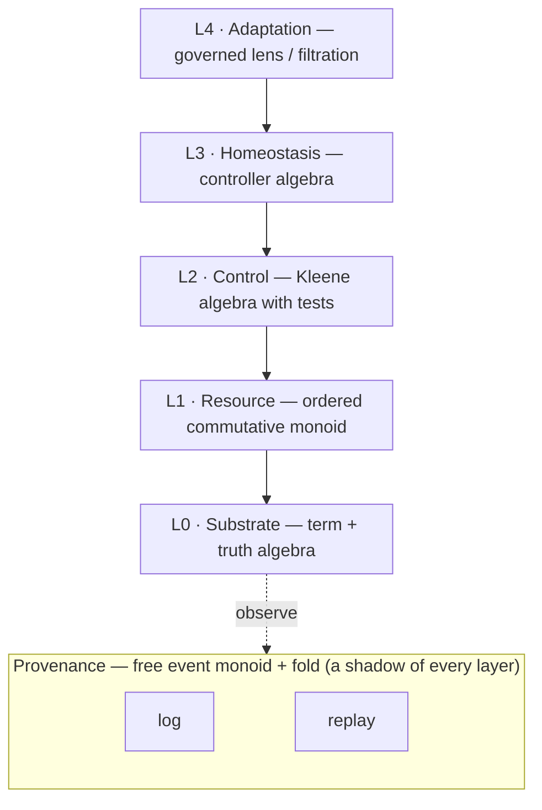
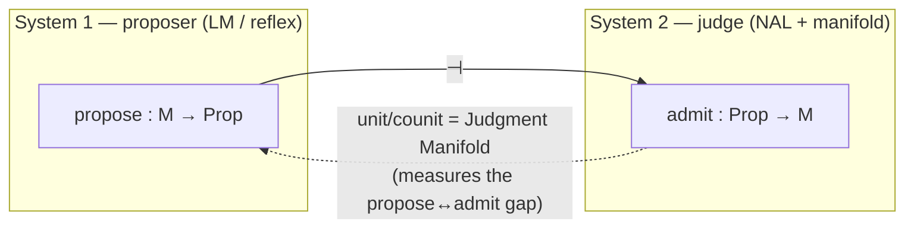

# A Control Algebra for Reasoner Behavior

## The thesis

`flow.md` reveals that SeNARS is not, at bottom, "a NAL engine." It is a **controlled, bounded, gated, event-sourced transducer**: a machine that turns stimulus streams into response streams under resource pressure, where *every* write is admitted by a gate, *every* step is paid from a budget, and the whole thing is made auditable by an event fold. The NAL rules are just the substrate this particular machine happens to run.

So the right way to specify the design space is to make the **control structure first-class and parameterized**, and treat SeNARS as one evaluation of it.

**One-line essence.** A reasoner is a *bounded, gated, event-sourced coalgebra*: its tick is a **control word** acting on a state space, every write filtered by an **oriented gate lattice**, every step paid from a **consumed resource monoid**, kept alive by **homeostatic controllers**, self-modified through a **governed filtration**, and made auditable by a **provenance fold**.

I'll define this as the **Cognitive Control Algebra** $\mathfrak{C}$, then locate SeNARS in it, then show how the algebra invites us to redesign SeNARS itself.

---

## §1 — The signature

Seven layers. Each has carriers (sorts) and generating operations. Everything below is chosen so that SeNARS is a *model* of it.

**Sorts.** $M$ = memory/state · $A$ = cognitive content (terms) · $V$ = belief-truth · $G$ = goal-desire · $R$ = resources · $E$ = events · $2=\{0,1\}$ · $\Theta,\rho$ = stimulus/response.

| Layer | Generator | Type | SeNARS instance |
|---|---|---|---|
| **L0 Substrate** | $\mathsf{term}$ | term algebra over $A$ | canonical, interned Narsese |
| | $\vdash_\rho$ | $A^n \rightharpoonup A\times V$ | the 44 NAL rule declarations |
| | $\star$ (rev family) | $V^2\to V$ | `Truth.revision/deduction/induction/abduction` |
| | $\mathsf{rew}$ | $A\to A$ | MeTTa exact rewrite (a *tool*, not an engine) |
| **L1 Resource** | $(\oplus,\mathbf 0)$ | ordered commutative monoid | the 4-dim AIKR budget |
| | $\mathsf{chg}$ | $R\times\mathsf{Scope}\to R+\mathsf{Refuse}$ | `charge` / `budgetRefusal` |
| | $\mathsf{cyc}$ | $R\to R$ | `beginCycle` (open-once reset) |
| **L2 Control** | $\mathsf{stg}_\sigma$ | $M\to M\otimes E^*$ | the 6 kernel stages |
| | $\mathsf{gate}_g$ | $E\to 2\times V$, orient $\delta_g$ | the 4 kernel gates |
| | $\mathsf{pick}$ | $\mathsf{Bag}(A)\to A$ | priority/novelty/goal sampling |
| | $\kappa$ | **KAT expression** | the *fixed* word (Loop B) |
| **L3 Homeostasis** | $\mathsf{drv}_d$ | $M\to[0,1]$ (setpoint, decay) | 4 drives |
| | $\mathsf{inj}$ | $\to A$ | `injectMetaGoals` |
| **L4 Adaptation** | $\mathsf{apt}$ | $K\times E^*\to K$ | RLFP / `controller.adapt` |
| | $\mathsf{gov}$ | $\mathsf{Prop}\to\mathsf{Verdict}$ | governance ladder + shadow CI |
| **Provenance** | $\mathsf{log}$ | $\to E^*$ (append-only) | event sourcing (JSONL/SQLite) |
| | $\mathsf{replay}$ | $E^*\to M$ | `replayCognitiveState` |

**The multiplication.** The algebra's product is **composition of control words**. Control words live in a **Kleene Algebra with Tests (KAT)** — the standard algebra of control flow: $\cdot$ (sequence), $+$ (choice), $^*$ (iteration), $p?$ (test/guard), $1$ (skip). A reasoner's tick is the *action* of a control word $\kappa$ on $M$.

---

## §2 — The axioms (what makes it *coherent*, not arbitrary)

These are the laws. A point in the design space is any model satisfying them. Each is grounded in a SeNARS mechanism.

- **(A1) Gate orientation.** Every gate is **idempotent** ($g\circ g=g$) and is either a **closure** (extensive, $x\le g(x)$ = *fail-open*) or an **interior** (contractive, $g(x)\le x$ = *fail-closed*). Gates compose by meet. → SeNARS: **egress = closure, ingress = interior.** This is the deepest fact in `flow.md` §9.1, now an algebraic bit.
- **(A2) Epistemic firewall (grading).** $A$ is $\{B,G\}$-graded. Rules are grade-respecting; **no generator has type $\mathsf{Reward}\to V$.** Reward acts only on the *attention channel* of $G$-graded items. → SeNARS `RewardGate`.
- **(A3) Resource monotonicity + open-once.** $\mathsf{chg}$ only decreases; $\mathsf{cyc}$ reopens each scope **at most once per cycle** (else "a bound wearing a counter"). → SeNARS `beginCycle` / `charge`.
- **(A4) Provenance fidelity.** $\mathsf{replay}\circ\mathsf{log}\cong\mathrm{id}$ on reachable states; **admit-before-write** (no state write without a preceding gate event). → SeNARS event log + derivation verifier.
- **(A5) AIKR boundedness + anytime.** All bags capacity-bounded; there is a global $\mathsf{abort}$ that is **natural** (commutes with every stage). → SeNARS `AbortSignal` + deadlines.
- **(A6) Control-word well-formedness.** $\kappa$ is a *closed* KAT term; the tick $\Phi_\kappa$ is its action. → SeNARS's 6-stage `for`-loop is a (degenerate, linear) $\kappa$.
- **(A7) Governance filtration.** Self-modification authority forms a **filtration** $\mathcal F_0\subset\cdots\subset\mathcal F_4$; higher index = more authority; $V$ is **never** a self-modification target. → SeNARS autonomy ladder + shadow worktree CI.

---

## §3 — The design space

The space of reasoners is the moduli of models of $\mathfrak{C}$ satisfying (A1–A7). Concretely it's a constrained product of coordinates:

| Coordinate | Range | **SeNARS** |
|---|---|---|
| Substrate logic | classical / intuitionistic / linear / NAL / exact / probabilistic | **NAL + MeTTa (exact tool)** |
| Truth carrier | $2$ / $[0,1]$ / $[0,1]^2$ / lattice | **$[0,1]^2$ for beliefs, $(d,c)$ for goals** |
| Resource bound | $\infty$ / lifetime / per-cycle / adaptive | **lifetime main + 6 per-cycle scopes** |
| Control word $\kappa$ | linear / conditional-KAT / event-driven | **linear (fixed 6-stage)** |
| Gate orientation | fail-open / fail-closed / calibrated | **ingress closed, egress open, System-1 calibrated** |
| Scheduler | priority / novelty / goal / fair | **priority bags + pluggable sampling** |
| Drives | none / homeostatic / learned | **4 homeostatic drives** |
| Adaptation | none / RL / RLFP / schema | **RLFP + schema induction + governed self-mod** |
| System 1/2 | absent / proposer-judge | **LM+reflex proposers, NAL+manifold judge** |
| Provenance | none / trace / event-sourced+verifier | **event-sourced + standalone verifier** |
| Firewall | none / graded / modal | **graded** |

SeNARS is the point that is **rich in almost every coordinate but linear in $\kappa$**. That single observation drives §6.

---

## §4 — Navigating the space (other reasoners are other points)

| Archetype | Substrate | $\kappa$ | Orientation | Provenance | Drives/Adaptation |
|---|---|---|---|---|---|
| **ATP / Prolog** | classical, $V=2$ | fixed saturation loop | fail-open | proof trace only | none |
| **Pure RL agent** | trivial rules | episode loop | calibrated | episode log | learned reflex, no NAL |
| **RAG chatbot** | retrieval, no $\vdash$ | linear, 2 stages | fail-open | none | none |
| **Audited theorem prover** | exact (MeTTa/Lean) | depth-bounded loop | **fail-closed everywhere** | full event-sourced | none |
| **SeNARS** | NAL+MeTTa | **linear 6-stage** | mixed | event+verifier | homeostatic + RLFP |
| **SeNARS-max (§6)** | NAL+MeTTa | **conditional KAT** | mixed+calibrated | event+verifier+correlation | tower-governed |

The algebra doesn't just *contain* these; it gives you **paths** between them (dial a coordinate), which is what makes it a *design space* rather than a taxonomy.

---

## §5 — The proposer/judge adjunction (the System 1/2 handoff, algebraically)

SeNARS's neuro-symbolic boundary is the cleanest thing to algebraize. Propose and admit form an **adjunction**:

$$\mathsf{propose}\;\dashv\;\mathsf{admit}$$

The **Judgment Manifold is the (co)unit**: it measures how much of a proposal survives judgment. Tightening the adjunction → pure symbolic; loosening it → LM-heavy. This makes "how much do we trust System 1" a **continuous parameter**, not a wiring decision.

---

## §6 — What the algebra tells us to change in SeNARS

This is the "reconsider how SeNARS fundamentally works" part. Each item resolves a real gap flagged in `flow.md` §13.3.

**R1 — Replace the fixed stage sequence with a KAT control word.** *(flow.md: "no stage-level conditionality.")* Stages become generators; the tick is a KAT term with tests, choice, and iteration. SeNARS's Loop B is the word
$$\kappa_{\text{now}}=\mathsf{perceive}\cdot\mathsf{attend}\cdot\mathsf{reason}\cdot\mathsf{authorize}\cdot\mathsf{propose}\cdot\mathsf{learn}$$
A richer, still-lawful point:
$$\kappa=\mathsf{perceive}\cdot\mathsf{attend}\cdot(\mathsf{ready}?\cdot\mathsf{reason}\cdot\mathsf{authorize})\cdot(\mathsf{hasProducer}?\cdot\mathsf{propose}+\neg\mathsf{hasProducer}?\cdot 1)\cdot(\mathsf{due}?\cdot\mathsf{learn})^*$$
Now "skip propose when there's no producer," "loop learn until due," and "early-exit on abort" are *data*, not code. The cycle becomes inspectable, replayable, and A/B-testable as a term.

**R2 — Collapse the dual loop into one parameterized recursion.** The macro/micro split is an accident of layering. Both are $\Phi_\kappa$ for different $\kappa$ and granularity. A reasoner is a single recursion scheme (unfold stimulus → fold response); "agent turn" and "kernel tick" are two fixpoints of the same operator. The "one-way nesting" rule disappears because there's nothing left to nest.

**R3 — Gates as an oriented lattice, not four hard-coded components.** Per A1, gates are interior/closure operators with an orientation bit; the four SeNARS gates are just generators. New gates = new lattice elements; the epistemic firewall = a **closed ideal** in the lattice. The ingress/egress asymmetry stops being a comment in the source and becomes a *typed orientation field*.

**R4 — Resources as a module over a semiring, with dynamic scopes.** Instead of six fixed `BUDGET_SCOPES` rows, scopes are a **basis of a free module**; tensor independent pools, mint scopes at runtime, and make refusal reasons typed semiring elements. This fixes the "two write paths with differently-shaped bounds" problem (`processPending` on lifetime budget vs `proposal-application` per-cycle) by making *both* projections of one resource object.

**R5 — Abort and reconfigure as first-class control operators (delimited continuations).** Make them `shift`/`reset`-style operators over $\kappa$. Reconfigure becomes a *delimited capture* that transforms the control word **without discarding** `derivationCount` and the circular-detector state (`flow.md` §13.3 gap: "reconfigure is not guarded against in-flight reasoning").

**R6 — The firewall as a grade, enforced by the algebra's type system.** Promote A2 from convention to typing: rules must be grade-respecting, reward may only touch the attention channel of $G$-graded items. "No sycophancy" becomes a **theorem about the signature**, not a review comment.

**R7 — Correlation as an indexing (natural transformation).** Thread `correlationId` so events form a functor from stimuli: for every stimulus there's a natural family of events. This closes the "no cycle-to-cycle causality" gap and makes "which cycle admitted this?" a well-formed query.

**R8 — Learning as a governed tower.** Unify RLFP, schema induction, and the governance ladder as one **filtration of control authority**: each meta-level governs the one below with strictly bounded, decreasing authority, and $V$ sits outside the tower entirely (A7). Self-improvement = ascent in the tower, gated at every rung.

---

## §7 — The minimal core (what's actually load-bearing)

Strip the algebra to its generators and ask what you *cannot* remove and still call it a reasoner. Five things:

1. **A substrate** ($\mathsf{term}$, $\vdash$, $\star$) — something to reason *with*.
2. **A control word** ($\kappa$) — something to sequence the reasoning.
3. **An admission gate** ($\mathsf{gate}$) — a boundary between "outside" and "state."
4. **A resource monoid** ($\mathsf{chg}$) — the AIKR fact that cognition is finite.
5. **A provenance fold** ($\mathsf{log}/\mathsf{replay}$) — the auditability that makes the rest trustworthy.

Everything else — drives, System 1, RLFP, schema induction, the manifold, the tower — is **enrichment**: coordinates you can dial from "present" to "absent" without leaving the space. SeNARS sets nearly all of them to "present," which is exactly why it reads as *a lot*. The algebra shows which parts carry the weight and which are optional furniture — and, more usefully, it gives you the coordinates to build the next reasoner by *moving* from SeNARS rather than starting over.

**Net effect of implementing it:** SeNARS stops being "a dual-loop pipeline with four gates and six scopes" and becomes **one point — a linear, NAL-grounded, mixed-orientation, richly-adaptive point — in a space you can now steer.**