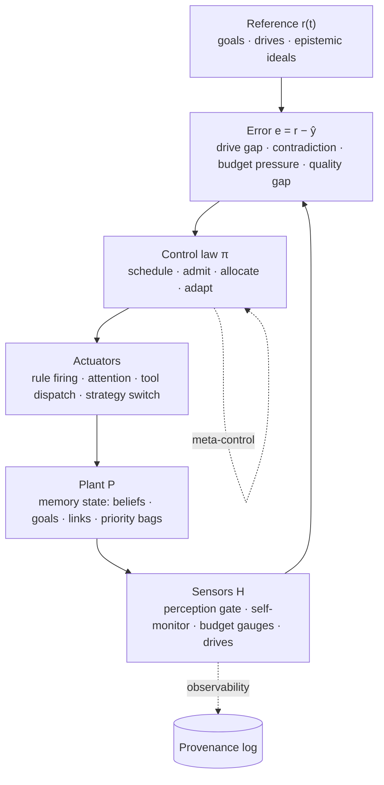
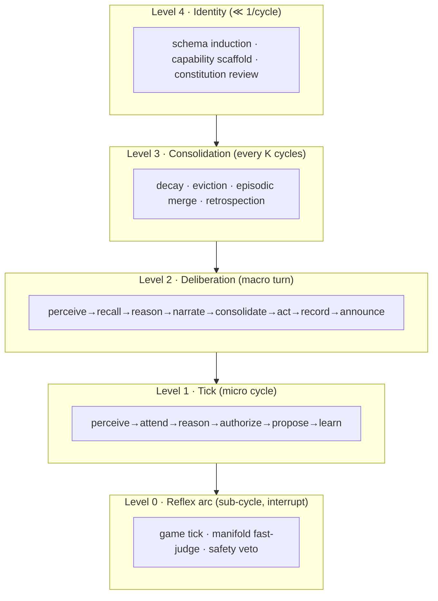

# A Control Model of Reasoner Design Space

Below is a formal control-theoretic model that (1) defines the space of possible reasoner behaviors, (2) locates SeNARS as one point in it, and (3) proposes a redesigned architecture — call it **SeNARS⁺** — that moves deliberately along several axes. The SeNARS drift-and-gaps record (§12–§13 of `flow.md`) is used as empirical evidence for which moves are most natural.

---

## 1. The abstraction: a reasoner as a resource-bounded reflexive controller

Strip away Narsese, MeTTa, and LLMs. What remains is a **closed-loop control system whose plant is its own knowledge state.**



Formally, a reasoner is a tuple

```
R = ⟨ W, Σ, Γ, Φ, Λ, Ω, Π ⟩
```

| Slot | Meaning | In SeNARS |
|---|---|---|
| **W** — world/state space | Beliefs, goals, attention, resources | `Memory` concepts, links, `Bag<T>` |
| **Σ** — inference system | Truth algebra + rule set | NAL `(f, c)` + 44-rule loaded table |
| **Γ** — control graph | Nodes = stages, edges = transitions | 8-phase macro onion ⊃ 6-stage micro `for`-loop |
| **Φ** — budget algebra | Resource accounting over paths in Γ | Main lifetime budget + 6 per-cycle scopes |
| **Λ** — admission lattice | Gates, trust, veto | 4 kernel gates, fail-closed-in / fail-open-out |
| **Ω** — reflexive tower | Levels of self-modification | L2 strategy select + governed L3 rule admit |
| **Π** — control policy | The actual scheduler/controller | Hard-coded stage order + RLFP periodic adapt |

**The design space is the product of the choice made at each slot.** SeNARS is one vector in that product. The rest of this document names each axis, plots SeNARS on it, then proposes moves.

---

## 2. The eight axes of reasoner behavior

Each axis is a spectrum. SeNARS's position is marked **▲**.

### Axis 1 — Epistemic substrate (what "truth" is)

```
axiomatic ── bayesian ── non-axiomatic(NAL) ── paraconsistent ── pragmatist
                                  ▲
```

SeNARS: NAL `(frequency, confidence)` + paraconsistent coexistence of `(A→B)` and `¬(A→B)`, with a hard **Belief/Goal firewall**. This is already near the flexible end. *Cost:* no single scalar to optimize; *benefit:* reward can't launder into fact.

### Axis 2 — Temporal nesting (how many loops, at what clocks)

```
flat (one loop) ── dual (two loops) ── N-heterochronous tower ── continuous/multi-rate
                    ▲
```

SeNARS: exactly **two** nested loops (macro conversational turn ⊃ micro tick) plus a third inner inference generator. Consolidation runs *once per `run()`*, reflexes want a *faster* loop, identity/schema induction wants a *slower* one. Two is a compromise.

### Axis 3 — Scheduling discipline (how the next inference is chosen)

```
fixed sequence ── priority agenda ── market/auction ── planned lookahead ── learned deliberative
      ▲
```

SeNARS micro-tick is a **fixed sequence** (`perceive→attend→reason→authorize→propose→learn`). Within `reason`, sampling is priority-weighted — so the *content* is agenda-driven but the *control flow* is not. `flow.md` §13.3 names this directly: *"No stage-level conditionality… the only branch is abort."*

### Axis 4 — Resource semantics (budget algebra)

```
unbounded ── scalar ── flat vector ── nested scopes ── lattice/tradable ── internal market
                              ▲
```

SeNARS: a **flat vector of 6 scopes + one lifetime budget**. Notably, the two write-paths into memory carry *differently-shaped* bounds (`processPending` charges lifetime `memory-op`; proposals charge per-cycle `proposal-application`) — §7.4 ⚠. Scopes can't be transferred, delegated, or composed.

### Axis 5 — Trust topology (who is believed, how)

```
monolithic ── layered+gated ── calibrated field ── federated peers ── adversarial-self
                 ▲
```

SeNARS: **layered + gated** with a binary asymmetry (ingress fail-closed, egress fail-open). The Judgment Manifold already computes *continuous* calibrated scores — but admission still snaps to a hard admit/reject. The calibration is computed and then partially thrown away.

### Axis 6 — Reflexive depth (how much of itself it may change)

```
L0 frozen ── L1 knobs ── L2 strategy ── L3 rules ── L4 topology ── L5 constitution
                            ▲────────────▲
```

SeNARS: **L2** (strategy selection via RLFP, periodic) + **L3** (rule/schema admission under governance). **L4 is blocked**: the stage graph is straight-line code; the 11-stage vocabulary is dead; reconfigure rebuilds the controller wholesale and loses in-flight state (§13.3).

### Axis 7 — Observability / replayability (what can be reconstructed)

```
none ── final state ── derivation trace ── control trace ── full controller replay
                              ▲─────────────▲
```

SeNARS: **derivation trace** (event log + standalone verifier) is excellent; **control trace** (`CycleTrace` regions) exists but is a *shadow* of cognition, not itself event-sourced. You can replay *what was believed* but not *why the controller chose to reason that way*. No `correlationId` threads stimulus→cycle→derivation (§13.3).

### Axis 8 — Stability machinery (what prevents divergence)

```
none ── passive decay ── homeostatic drives ── predictive/governor ── verified-stable
                            ▲
```

SeNARS: **homeostatic drives** (decay + replenishment) + truth decay + budget ceilings + NAL veto + governance. Reactive, not predictive. There is no explicit *stability certificate* for the control loop itself (risk of runaway self-modification is contained by governance, not by analysis).

---

## 3. SeNARS as a point — and why it sits there

```
SeNARS = ⟨ NAL+paraconsistent ,
           dual-loop ,
           fixed-sequence-control ⊗ agenda-content ,
           flat-scope-budgets ,
           layered-binary-trust ,
           L2+governed-L3 ,
           derivation-replay-only ,
           homeostatic-stability ⟩
```

This point is **not accidental**. It is optimized for one objective above all: **auditable, bounded, trustworthy continuous operation**. Every conservative choice (fixed stages, binary gates, hard firewall, governed self-modification) reduces power in exchange for *replayability and safety*. The drift list (§12.1) and structural gaps (§13.3) are the fossil record of where that conservatism now costs the most.

The single highest-leverage observation: **SeNARS already solved the dispatch primitive for Loop A (onion middleware) but never applied it to Loop B.** The generalization is to make *control itself* first-class data.

---

## 4. SeNARS⁺ — a redesigned point in the space

Eight moves, each moving along one axis and each motivated by a named SeNARS gap. The constitution (Belief/Goal firewall, event-sourced provenance, AIKR) is **preserved**; what changes is *control*.

### M1 · Control flow as a typed conditional graph
**Moves Axis 3 & 6 (scheduling → data-driven; reflexivity → L4).**
*Gap addressed:* §13.3 "No stage-level conditionality," "Stage order is not data"; §12.1 #1 dead 11-stage vocabulary.

Replace the straight-line 6-stage `for`-body with a `StageGraph` over the *existing* `dispatch()` middleware primitive, reuniting Loop A and Loop B under one mechanism:

```ts
type StageNode = { id: StageId; run: Middleware<CycleCtx> };
type StageEdge = { from: StageId; to: StageId;
                   when: (ctx: CycleCtx) => boolean;   // conditional edge
                   budget?: BudgetScopeId };            // edge may cost a scope

const MICRO_GRAPH: StageGraph = {
  nodes: [perceive, attend, reason, authorize, propose, learn, triage],
  edges: [
    { from:'perceive', to:'attend',    when: always },
    { from:'attend',   to:'reason',    when: c => c.signals.hasWork },
    { from:'attend',   to:'triage',    when: c => c.budget.starved('control-work') },
    { from:'reason',   to:'authorize', when: always },
    { from:'authorize',to:'propose',   when: c => c.proposals.bound },
    { from:'propose',  to:'learn',     when: always },
    { from:'learn',    to:'perceive',  when: c => !c.signal.aborted }, // loop edge
  ],
};
```

Now the 11-stage vocabulary stops being dead: it becomes a *superset node registry* from which graphs are composed. Stage-skipping, triage branches, and alternative loops are expressible without restructuring. The no-nested-`propose` invariant becomes a *graph property* (no path `reason →* propose`) checkable statically, strengthening §12.2.

### M2 · Correlation manifold
**Moves Axis 7 (observability).**
*Gap addressed:* §13.3 "No cycle-to-cycle causality," "which cycle admitted this?"

Mint one `CorrelationId` at the stimulus (macro entry) and thread it through every `CycleTrace.begin`, every `task.admitted`, every `nar:derivation`, every `budget.exhausted`. Provenance becomes a **causal DAG**, not parallel shadows:

```
stimulus ──▶ macro-cycle ──▶ micro-cycle N ──▶ derivation d
   │              │               │                 │
   └──────────────┴───────────────┴─────────────────┘  same CorrelationId
```

This makes the verifier's job compositional: a conclusion's proof *and* its control history are joinable. It also makes M5's meta-controller auditable.

### M3 · Budget lattice (from flat scopes to a resource algebra)
**Moves Axis 4 (resource semantics).**
*Gap addressed:* §7.4 differently-shaped bounds on the two memory write-paths; scopes can't compose.

Promote `BUDGET_SCOPES` to a **lattice** `(Scope, ≤, ⊔, ⊓)` with two operations:

- **Transfer** `transfer(from, to, amount)` — a scope with surplus lends to a starved one (e.g., unspent `decision-derivations` → `derivations`), preserving the *total* budget so AIKR still binds globally.
- **Sublation** `derive(child ⊑ parent)` — a child scope inherits every dimension of its parent *except its own*, exactly generalizing the existing `scopeBudget()` inheritance rule into a partial order.

The four dimensions (`cycles, memoryOps, llmCalls, depth`) stay the single source of truth (`BUDGET_RESOURCES`); the lattice only governs *how ceilings move*. The two write-paths' differently-shaped bounds become two points in one lattice rather than two ad-hoc shapes. Crucially, **starvation becomes distinguishable from health**: a denied `transfer` is a typed event, fixing the §4.6 ⚠ where `control-work` exhaustion masquerades as `aikrPressure: 'low'`.

### M4 · Heterochronous loop tower
**Moves Axis 2 (temporal nesting).**
*Gap addressed:* consolidation once per `run()`; reflexes need faster loops; schema induction needs slower ones.

Generalize "two nested loops" to an **N-level tower**, each level an instance of the same `StageGraph` runner from M1, each with its own clock, budget slice, and trust posture:



Lower levels can *interrupt* higher ones (reflex veto); higher levels *configure* lower ones. SeNARS's current structure is recovered by collapsing to levels {1,2}. The `Game`/`Reflex` substrate finally gets its natural timescale instead of bolting arcade ticks onto the macro cycle.

### M5 · Deliberative meta-controller
**Moves Axis 6 (reflexivity L2 → L4) & Axis 3.**
*Gap addressed:* `adapt()` is a modulo interval, not deliberation; reconfigure rebuilds wholesale and loses `derivationCount` + circular-detector state (§5.3 ⚠, §13.3).

Make the meta-controller **itself an anytime reasoner** that reasons *about* control under its own budget slice:

```
meta-goal:  (current_control --> adequate)?
evidence:   control-work starvation events, contradiction rate, derivation yield,
            reflex-vs-NAL veto frequency, trace grades
action:     emit a StageGraph edit proposal (M1) + a budget-lattice transfer (M3)
```

Two hard constraints preserve safety:
1. The meta-controller **proposes; it does not apply.** Its output is a `SelfImprovementProposal` routed through the existing governance pipeline (`ProposalRouter` → `SelfMetaGame`), so L4 edits inherit the autonomy ladder.
2. **Hot-swap, not rebuild**: a `StageGraph` edit is installed at a *cycle boundary* with the circular-detector and derivation counters carried across, fixing the in-flight-reconfigure hazard.

This is the move from "the system tunes knobs every 100 cycles" to "the system *infers* that its current loop shape is the bottleneck and proposes a new one."

### M6 · Calibrated trust field
**Moves Axis 5 (trust topology).**
*Gap addressed:* the Manifold computes continuous calibrated scores but admission snaps to binary; the ingress/egress asymmetry is hard-coded.

Replace the binary admit/reject with a **trust field**

```
T(source, content, context, history) ∈ [0,1]
```

built from the *already-existing* ingredients: source-quality ceilings, source-reputation multipliers, manifold head scores, and isotonic calibration. Admission becomes a **soft gate** with three bands (act / review / block — the `ConfidenceRouter` already exists):

- ingress: low `T` → fail-closed reject (unchanged for safety) *or* admit as low-confidence `LLM_PRIOR` when calibrated confidence supports it;
- egress: `T` below veto threshold → veto (unchanged), but the veto now emits a **typed event** (fixing §13.3 "egress veto has no ingress counterpart in the trace");
- ambiguity: abstention injects a clarification `Question` + curiosity spike (already present) rather than dropping.

The fail-closed/fail-open asymmetry becomes a **parameterized default**, not a branch buried in two files — and it is *measured*, because every soft decision lands in the distillation flywheel.

### M7 · Control-plane event sourcing
**Moves Axis 7 (observability → full controller replay).**
*Gap addressed:* control decisions live only in `CycleTrace` regions; silent `catch {}` on `engine.reason` (§9.1).

Elevate control to the same provenance tier as cognition: **every scheduling, admission, budget, and graph-edit decision is a `CognitiveEvent`** appended to the event log. Then:

```
replayCognitiveState(events)   → reconstructs beliefs       (exists)
replayControlState(events)     → reconstructs WHY it reasoned that way  (new)
```

Two immediate wins: the two silent `catch {}` blocks become `engine.fault` events (closing Loop A's largest blind spot), and `derived` stops conflating "tasks admitted" with "derivations produced" (§3.4) because each is a distinct event type with its own counter.

### M8 · Arbitration algebra
**Moves Axis 5 + Axis 3 (multi-source trust & scheduling).**
*Gap addressed:* the `Negotiator` only arbitrates Reflex-vs-NAL; symbolic, LM, manifold, peer, and MeTTa proposals each take different admission routes.

Generalize the `Negotiator` into a **generic arbitration monoid** over any set of proposers:

```
arbitrate : Proposer[] × Proposal[] → Decision
  with  veto      (NAL retains veto — preserved)
        quorum    (k-of-n proposers must agree)
        weighting (confidence-weighted merge)
        demotion  (a vetoed proposer's weight decays — veto-aware)
```

Every source — reflex arc, manifold, LM rule, peer agent, MeTTa exact result — submits through the same interface and is judged by the same trust field (M6). The epistemic firewall is enforced *inside* the algebra: a proposal tagged `teleological` can never be merged into a `belief` slot regardless of quorum.

---

## 5. The redesigned point

```
SeNARS⁺ = ⟨ NAL+paraconsistent ,                    (unchanged — this is the crown jewel)
            N-heterochronous tower ,                (M4)
            conditional-graph control ⊗ deliberative meta-controller ,  (M1, M5)
            budget-lattice ,                        (M3)
            calibrated-trust-field ,                (M6, M8)
            L4-with-governance ,                    (M5)
            full controller replay ,                (M2, M7)
            homeostatic + governance-stability ⟩    (preserved)
```

What this buys, concretely:

| SeNARS gap | SeNARS⁺ mechanism |
|---|---|
| No stage-level conditionality | M1 conditional graph |
| No cycle-to-cycle causality | M2 correlation manifold |
| Two write-paths, differently-shaped bounds | M3 budget lattice |
| Reconfigure loses in-flight state | M5 hot-swap at cycle boundary |
| Starvation reads as health | M3 typed `transfer` denial + M7 event |
| Silent engine faults | M7 `engine.fault` events |
| Manifold calibration thrown away | M6 soft-gated trust field |
| Negotiator is two-source | M8 arbitration algebra |

---

## 6. Navigating the space — the tradeoff surface

The design space is not free. Each move has a cost that SeNARS's conservatism was avoiding:

- **M1 (graph control)** trades *static verifiability of the loop shape* for flexibility. Mitigation: the no-nested-`propose` invariant becomes a graph predicate, and graph edits are governed (M5).
- **M3 (budget lattice)** risks *resource laundering* if transfers compose. Mitigation: total-budget preservation is an invariant of `transfer`; every transfer is event-sourced.
- **M4 (tower)** multiplies the number of budget/gate interactions. Mitigation: one runner, one gate registry, per-level budget *slices* that sum to the global budget.
- **M5 (deliberative meta-control)** is the closest approach to recursive self-modification. Mitigation: propose-don't-apply + autonomy ladder + hot-swap only at boundaries. This is the move to make *last* and guard *most*.
- **M6 (soft trust)** widens the attack surface versus binary fail-closed. Mitigation: the fail-closed default remains for the lowest band; every soft decision is calibration data, so the system gets *more* conservative as it learns where it was burned.

**The governing principle:** move the *control* plane toward expressiveness and learning, while keeping the *epistemic* plane (NAL truth algebra, Belief/Goal firewall, event-sourced replay, standalone verification) rigid. SeNARS's genius is that it already drew that boundary; SeNARS⁺ simply makes the side of the boundary that was allowed to move, actually move.

The deepest lesson of the design space: **a reasoner's power is bounded not by its inference rules but by the expressiveness of its control graph and the depth of its reflexivity — and its safety is bounded by how much of that control is event-sourced, replayable, and governed.** SeNARS optimized safety; the space shows how to recover power without spending it.