# SeNARS — Control-Flow Reference

> Total distillation of `/home/me/senars12` into a control-flow graph. `README.md` is the prose; this is
> the machine-shaped view: **nodes, edges, gates, write surfaces, seams, and — critically — which flows
> are actually wired.**
>
> Every flow carries a **wiring status**. A component existing is not a flow running.

---

## 0. Notation

### 0.1 Node marks

| Mark | Meaning |
|---|---|
| `▓` | **Trusted boundary** — kernel, gates, event log. |
| `░` | **Untrusted proposer** — LM / Reflex / peer / remote manifold. |
| `●` | Mutating node. Any state change is a dot, never a line. |
| `◇` | Port / contract (compile-time seam, structurally typed). |
| `⛔` | Red gate — a CI check that fails the build if the invariant breaks. |
| `⊘` | Unreachable branch (kept, documented). |

### 0.2 Wiring status

| Code | Meaning | How to check it |
|---|---|---|
| **`W`** | **Wired** — reachable from a production entry point | `grep` the call site |
| **`G`** | **Gated** — reachable, behind a config flag | flag named inline |
| **`P`** | **Partial** — some call sites only | sites enumerated |
| **`D`** | **Dormant** — fully implemented, **no production caller** | the gap *is* the finding |
| **`B`** | **Bench-only** — reachable from `scripts/` gates or `tests/` | |
| **`X`** | **Unreachable / dead** | documented, kept |

### 0.3 Direction

Every arrow flows **toward** state. Read backwards for *refusal* propagation — all four gates fail
closed. Three states are declared unreachable and retained: `⊘ admitTask` refusal ·
`⊘ CapabilitySpace.validateDiff` (no caller) · `⊘ threadScope.delete` (LRU-only eviction).

---

## 1. Topology

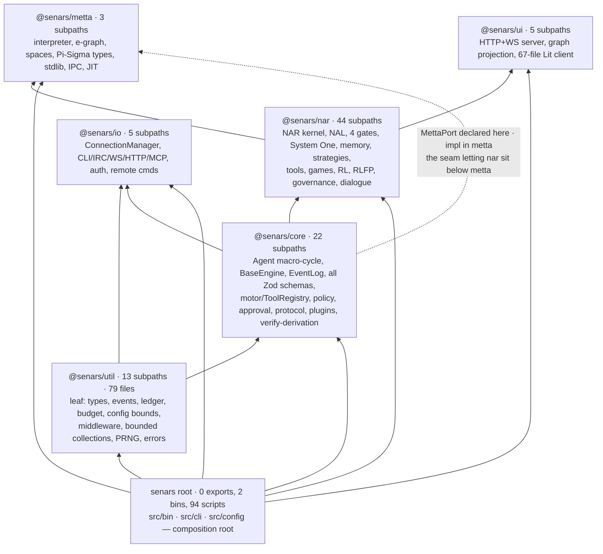

| Package | Subpaths | Owns | Cycle-path reachability |
|---|---|---|---|
| `util/` | 13 | vocabularies · `dispatch` onion · `BoundedRing`/`BoundedMap`/`LruCache` · `SeededRNG` · `QTable` · `Ledger` · `sha256Hex` · `sortableIdSource` | always |
| `core/` | 22 | `Agent` · `BaseEngine` · `EventLog` · **all** Zod schemas · `ModelRunner` · `PolicyEngine` · `ApprovalService` · `motor` · `verify-derivation` · WS protocol · `Lens` · plugin loader | via `nar` |
| `nar/` | 44 | `NAR` · `NARExecution` · 4 gates · NAL · System One · `ToolManager` · `Game` · RL/RLFP · governance · dialogue | — |
| `io/` | 5 | transports · `ConnectionManager` · `bindAgentToConnection` · auth | edge only |
| `metta/` | 3 | exact-computation substrate | **tool only** `W` |
| `ui/` | 5 | server + client | edge only |

**Capability tier reachability** — the deepest structural claim, enforced at build time by `NARBuilder`:

| Tier | Meaning | Profiles | Is `nar/src/lm` loaded? |
|---|---|---|---|
| 0 | reflex only | `device`, `arcade` | **no** — never imported at runtime |
| 1 | manifold only | — | yes (heads), no provider |
| 2 | cortex + NAL | `conversation`, `tool-use`, `research` | yes |
| 3 | NAL-governed | — | yes |

`complexity-budget.json` baseline: 87 export subpaths · 75 596 production LOC · **3** append-only
persistence sites · 0 unbounded accumulators · 11 circular chains · 0 bin typecheck errors · 6
workspaces. Every rule is a ratchet (`mustNotIncrease` / `mustRemainZero`).

---

## 2. Entry Points & Composition Roots

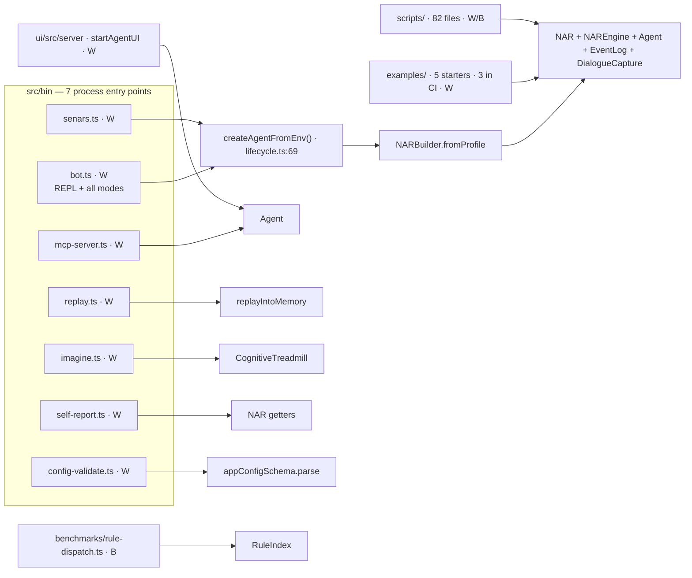

| Entry | Arg / mode | Reaches |
|---|---|---|
| `bot.ts` | *(none)* | interactive `senars>` REPL |
| | `--status` | manifold health · per-head ECE · spend · governance queues |
| | `--doctor` | creds · LM probe · effective LM/routing matrix |
| | `--tune` | parameter tuning |
| | `--arcade` | `scripts/arcade.ts` — multi-game, multi-arm |
| | `--multiagent` | one agent + 2 transports (see §20.4 — **not** a peer mesh) |
| `mcp-server.ts` | stdio / SSE / streamable-HTTP | one shared NAR/agent · `HttpGuard` |
| `replay.ts` | `--from/--to --from-id/--to-id --verify --snapshot` | `replayIntoMemory` + hash verify |
| `imagine.ts` | profile: induction · transitive · contradiction_storm · overload · drift · narrative | `CognitiveTreadmill` |
| `self-report.ts` | — | drives · meta-goals · AIKR pressure |
| `config-validate.ts` | `--config --json` | zod validation only |
| `startAgentUI` | `ENABLE_WEB_UI=true` `W` | `/metrics` · WS protocol · graph projection |

### 2.1 `createAgentFromEnv()` — the single assembly chain `W`

```
assertValidEnv()                                      env:grammar
  → loadConfig()                                      config/loader.ts:50
      migrate → version-check → deepMerge(env) → appConfigSchema.parse (strict)
  → resolveLMSettings()                               lm/env-config.ts:155
  → NARBuilder.fromProfile('tool-use')                20 with*() steps, each recorded
      .withLM .withSystemOne .withCapabilities .withParameters .withGates
      .withPersistence .withMemory .withMetta(mettaPort()) .withSessionManager
      .withPromptBuilder .withThreadScope .withDeviceHead .withCapabilityOntology
      .build()   → BuilderError on an inconsistent spec
  → initializeLMRules()                               19 templates → ModelRule registry
  → consolidateMemory()
  → { nar, agent, engine, metta, sessionManager, dialogue, tools }
```

**Profiles are data** (`nar/src/agent/profiles.ts`): `conversation` (t2, self+lmRules) · `tool-use`
(t2, lmRules) · `research` (t2, +rlfp) · `device` (t0) · `arcade` (t0). Tier-0 ⇒ LM never imported.

---

## 3. Assembly Graph — `NAR` constructor `W`

19 ordered steps, `nar/src/nar.ts:150`. The facade is delegation; real work lives in
`nar-execution.ts`, `nar-io.ts`, `nar-lm.ts`, `facade/*`.

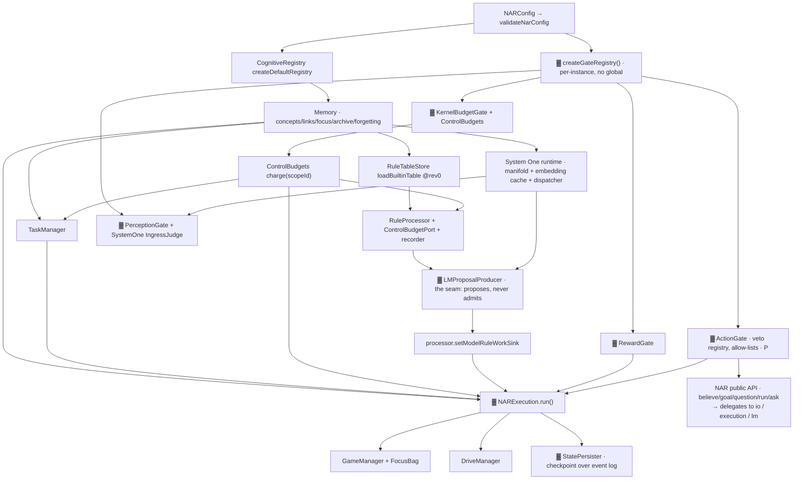

| Invariant | Mechanism |
|---|---|
| Gates + strategy registry unconditional | always built; "no strategy config" is unreachable |
| `processor.setConfig({budgets, memory, host})` at construction | the rule layer never reaches the gate or the `Memory` facade |
| System One wired **before** `gates.initialize` | the perception config is the injection point; `enabled:false` ⇒ byte-identical path |
| `ControlBudgets` over the gate's own scopes | one budget, one table (`core/budget`) |
| Proposal sink installed last | the cycle's only route to a provider; it never admits |

---

## 4. Flow Index — the master table

Every named flow, with entry, exit, gates consulted, and **wiring status**.

| # | Flow | Entry | Exit | Gates | Status |
|---|---|---|---|---|---|
| **F1** | Kernel micro-tick | `NARExecution.run(n)` | derived tasks admitted | **P** — all four | `W` |
| **F2** | Agent macro-cycle | `agent.chat` / `submit` / transport msg | `text-delta` stream + `finish` | perception · egress | `W` |
| **F3** | Focus/Game tick | `GameFocus.step(budget)` | `game.step(action)` | budget · action · reward | `W` |
| **F4** | Focus driver | `FocusScheduler.start` / `FocusTree` | per-focus reports | budget | `W` |
| **F5** | Task admission | `nar.input` → `NARIO.input` | `memory.addTask` | **perception** · budget | `W` |
| **F6** | Derived admission | `NARExecution.authorize` stage | `memory.addTask` | **perception** · budget | `W` |
| **F7** | Content proposal | `LMProposalProducer.pump` → `takeDerived` | `memory.addTask` | lifecycle · perception | `W` |
| **F8** | **Rule proposal** | `LMProposalProducer.submitRule` | `RuleTableStore.admit` | lifecycle only, **no gate** | `D` |
| **F9** | Tool-goal dispatch | `NARExecution.perceive` → `dispatchToolGoals` | `ToolManager.execute` | **none** — see §10.3 | `W` |
| **F10** | Model tool call | `toToolSet` → `motor.execute` | `ToolResult` | **none** — no policy, no approval | `W` |
| **F11** | Chat `act` tool | `phases.act` → `commandParser` | `motor.execute` | `PolicyEngine.checkCommand` | `W` |
| **F12** | Self-mod landing | self-tools → `shadowChange` | worktree merge | shadow CI + approval | `P` — approval not injected |
| **F13** | Capability execute | `CapabilitySpace.execute` | sandboxed result | policy `D` · approval `G` | `W` (checks inert) |
| **F14** | Ask / query | `nar.ask` | `Answer` | **none** | `W` |
| **F15** | Ask + derivation | `nar.askWithDerivation` | `Answer.derivation` | verifier | `W` |
| **F16** | NL ask | `nar.askNaturalLanguage` | string | **perception** (via re-inject) | `W` |
| **F17** | NL formalization | `NLUnderstandingService.understand` | `DialogueTurn.formalizations` | **none** | `W` (annotation only) |
| **F18** | Formalization admission | `perceptionGate.admitFormalization` | `TaskAdmittedEvent[]` payload | perception, **judge skipped** | `B` |
| **F19** | NL generation | `NLGenerationService.generate` | `GenerationOutput` | none | `D` — no production caller |
| **F20** | Egress gate | `phases.narrateStreaming` | `egress.gate.rejected` + replacement | **groundedness** | `W` |
| **F21** | Per-delta egress | `bot.ts collectChat` | `'[filtered]'` | groundedness | `W` |
| **F22** | LM enrichment | `ProactiveEnricher` → `admitTasks` | memory | perception · shadow validation | `W` |
| **F23** | LM feedback loop | `BidirectionalFeedbackLoop` → `admitTasks` | memory | perception · shadow validation | `W` |
| **F24** | Proof stream | `nar.getProofStream(signal)` | `readonly Task[]` chains | none | `W` |
| **F25** | Schema induction | `SchemaInductor.onDerivation` / `induceIfPressured` | `SelfImprovementProposal` | **pressure ≥ 0.7** | `W` |
| **F26** | MeTTa rule learning | `ProofMettaProposer.learnFromProofStream` | `MettaRule[]` → governance | support ≥ 3 · conf ≥ 0.7 | `W` (MeTTa absent ⇒ fallback) |
| **F27** | Task delegation | `agent.delegate` | `CognitiveTaskResult` | perception @ `GENERAL` | `W` |
| **F28** | Judgment delegation | `createJudgmentDelegation` | `JudgmentDelegationResult` | none | `D` — no caller |
| **F29** | Remote manifold | `provider:'http'` | propositions @ `LLM_PRIOR` | perception ceiling | `G` |
| **F30** | Open-replica manifold | `provider:'open-systemone'` | abstained-or-scored | none | `B` |
| **F31** | Reward ingest | `ExternalRewardGate.ingest` | policy-weights write | **reward** | `W` |
| **F32** | Self reward | `SelfRewardGate.propose`/`submit` | `SelfImprovementProposal` | **reward** (routes) | `W` |
| **F33** | Governance apply | `ProposalRouter` → `SelfMetaGame.applyProposal` | apply / PR / review / reject | **reward** (risk tier) | `W` |
| **F34** | Dialogue capture | `createCapturePhase` → `DialogueCapture.onExchange` | hash-only `DialogueTurn` | `enabled` | `G` (default **off**) |
| **F35** | Retrospective | `.retrospect` / `autoRetrospect` | digest-pinned `Retrospective` | none | `W` |
| **F36** | Strategy adaptation | `RetrospectiveAdapter.adaptFromRetrospective` | strategy switch + ledger | one-shot per digest | `W` |
| **F37** | Reconsolidation | `Reconsolidator.reconsolidate(n)` | lessons → `nar.input` | perception | `W` |
| **F38** | Curriculum probes | `selectProbes(source)` | `Probe[]` | none | `W` |
| **F39** | Event replay | `replayIntoMemory(options)` | `Memory` + hash | none | `W` |
| **F40** | Arcade tick | `arcade.ts` | Brier-scored decisions | budget · action · reward | `W` |
| **F41** | Persist / restore | `StatePersister.load`/`save` | `nar-state` snapshot | none | `G` (`persistState`) |
| **F42** | Episodic promotion | `consolidateEpisodes` | `PromotionResult` | relevance ≥ 0.5 | `B` — no `src/` caller |
| **F43** | Cross-memory recall | `MemoryQuery.search(filter)` | ranked merged list | none | `W` |
| **F44** | Model runner loop | `ModelRunner.run(composed)` | `ModelEvent[]` | none | `W` |
| **F45** | Peer Narsese delegation | `NARDelegationPeer.executeTask` | Narsese conclusions | none in-peer | `W` (via `transport.ws`) |
| **F46** | Multi-agent demo | `multi-agent-runner.ts` | CLI + WS to **one** agent | none | `W` (not a mesh) |
| **F47** | Cooperation peer mesh | — | — | — | `D` — `cooperation/` unexported |
| **F48** | Source reputation write | `.react` / per-delta gate | `SourceReputation.record` | — | `P` — 2 sites |

**Totality:** 48 flows — 32 `W` · 6 `G` · 4 `P` · 4 `B` · 5 `D`. See §25 for the dormant set.

---

## 5. The Four Loops

| # | Loop | Owner | Cadence | Mutates memory? | Status |
|---|---|---|---|---|---|
| **L1** | Kernel micro-tick | `NARExecution.run()` | per `run(n)` | **yes — `authorize` only** | `W` |
| **L2** | Agent macro-cycle | `core/src/agent/phases.ts:332` | per turn | indirectly via L1 | `W` |
| **L3** | Focus/Game tick | `GameFocus.step()` | per tick | no (own bags) | `W` |
| **L4** | Focus driver | `FocusScheduler` / `FocusTree` | wall-clock `hz` | no | `W` |

L1 nests inside L2 (`reason`). **L3/L4 are independent of L1** — a focus runs headless with gates and
no NAR (`examples/rl-gridworld.ts` drives a manifold only).

### 5.1 L1 — Kernel Micro-Tick `W`

`nar/src/nar-execution.ts:210`. Stages are the *type* order (`CYCLE_STAGES`,
`nar/src/proposal/stages.ts:25`). Auxiliary regions: `cycle`, `rlfp.optimize`, `self.assess`,
`self.correct`, `memory.consolidate`.

```mermaid
flowchart TD
  OPEN(["cycle open · ▓ budgets.beginCycle()<br/>reset cycleSignals"]) --> P
  subgraph ST1["perceive"]
    P["dispatchToolGoals · F9<br/>pending operation goals → toolGoalExecutor<br/>emits RLFP reward + drive stimulus"] --> P2["▓ taskManager.processPending()<br/>charge 'memory-op'"]
    P2 --> P3["▓ perceptionGate.admitTask()"] --> P4["● memory.addTask()"]
  end
  P4 --> A
  subgraph ST2["attend"]
    A["driveManager.updateCycle()<br/>decay + computeTruth + threshold"] --> A2["injectMetaGoals()<br/>charge 'control-work'"] --> A3["▓ cognitiveController.adapt()"]
  end
  A3 --> R
  subgraph ST3["reason"]
    R["InferenceController.step(5000, steps*100, signal)"] --> RE["● emit nar:reasoning:cycle"]
  end
  RE --> AU
  subgraph ST4["authorize — THE ONLY MUTATING STAGE"]
    AU["vetoAtEgress() · G — only ever REMOVES"] --> AU2["▓ rankForAdmission()<br/>symbolic rankDerivations truncate<br/>decision port may only REORDER"] --> AU3["▓ perceptionGate.admitTask()"] --> AU4["● memory.addTask()"] --> AU5["▓ proposals.takeDerived() · F7<br/>charge 'proposal-application'"]
  end
  AU5 --> K["drive kicks from cycleSignals"] --> PR
  subgraph ST5["propose — deliberately NOT awaited"]
    PR["pumpProposals(signal) · off-cycle: routes to provider only"]
  end
  PR --> LN
  subgraph ST6["learn"]
    LN["rlfp.optimize() + updateModel() on interval"] --> LN2["every 10 cycles: self.assessQuality()<br/>self-correct if overall<0.4 · emitCognitiveStateSummary()"]
  end
  LN2 --> CLOSE(["onCycleEnd(cycleCount, config)"]) --> MC["● memory.consolidate()<br/>the ONLY decay clock"]
  MC --> DONE(["return steps"])
```

`memory.addTask` appears **exactly twice**, both inside `authorize`. Stages 1/3/5/6 compute, cache,
judge, stimulate drives, and emit events — none touch `Memory`.

Off-cycle lanes: `LMProposalProducer.pump` · `ProactiveEnricher` · `EpisodeConsolidator` ·
`StreamReasoner` drain · `DialogueCapture` sinks · `ModelRunner`.

### 5.2 L2 — Agent Macro-Cycle `W`

`core/src/agent/phases.ts:332`. `MacroPhase = Middleware<MacroContext>` — an onion; `runCycle` /
`runCycleStream` drive it, streaming through a `PushQueue<ChatStreamEvent>`.

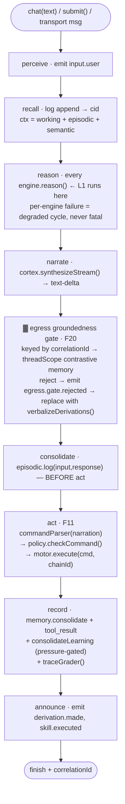

Opt-in phases: `createCapturePhase` (bot → F34), `createReflectPhase`. Both `bestEffort`.

**`act` is the only L2 phase reaching outside** — and it uses `PolicyEngine`, a *different*
authorization path from the `ActionGate`. Both exist; the ActionGate is the NAL-side one.

### 5.3 L3 — Focus/Game Tick `W`

`nar/src/focus/GameFocus.ts:353`. Nine named stages:

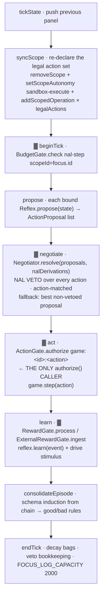

`syncScope` runs in the ctor and **after every successful step** (`:543`) — the allowlist tracks the
world's current legal set (a snake board's moves differ from a 2048 board's). Veto past
`GATE_LOG_CAPACITY` falls off the `BoundedMap`, after which the action faces the allow-list alone — a
declared degradation.

### 5.4 L4 — Focus Drivers `W`

| Driver | Shape | Budget |
|---|---|---|
| `FocusScheduler` | flat N-focus: weighted sample → 100-cycle budget → `stepFocusUnderDeadline` | `allocateBudget(focus, total)` by weight |
| `FocusTree` | tree, `maxDepth=3`, per-node `BudgetSlice`, optional `SchedulerAdapter` | slices propagate root→leaf |
| `stepFocusUnderDeadline` | one cooperative-yield primitive, `DEFAULT_FOCUS_DEADLINE_MS = 50` | wall-clock |

Never samples weight 0. `schedulerReward(report)` → `self-scheduler` domain.

---

## 6. The Four Gates ▓

All extend `KernelGate<TEvent>` (`kernel/gate-base.ts:30`): bounded 1000-ring, one
`decideAndRecord` funnel, one `recordPolicyViolation` mint path. All emit typed `CognitiveEvent`s.

### 6.1 PerceptionGate `W` — `KernelPerceptionGate.ts:58`

```
admit(input) ────────────┐
admitTask() ─────────────┼─→ confidenceCeiling(sourceQuality, {reputation, sourceKey, scaledBy})
admitFormalization() ────┘         │
                                   ├─→ parseObservation(raw)   ONE parse, TWO answers {term, taskType}
                                   ├─→ [S1] admitViaJudge()    SystemOne IngressJudge, 2000 ms deadline
                                   └─→ emitAdmitted()         THE single admission path
```

| Method | Path | Refusals |
|---|---|---|
| `admit(input)` | untrusted **string** | parse failure · judge veto (verbatim) · **judge fault/timeout** → `policy.violation{policyId:'systemone-ingress', violationType:'epistemic-firewall'}` |
| `admitTask(term,type,truth,source,cid)` | trusted **term** | `⊘` none — always admits; `source='derivation'` |
| `admitFormalization(batch, sq=LLM_PRIOR)` | LLM batch | `'Unparseable Narsese'` per candidate. **Skips `admitViaJudge`** — `decideTaskAdmission` is synchronous |

Side effects: `ambiguityFlag` → `driveManager.stimulate('curiosity', 1)`.
`admitFormalization` returns `TaskAdmittedEvent['payload'][]` — **it never writes memory**. Admission
is not storage.

### 6.2 ActionGate `P` — `KernelActionGate.ts:57`

> **Load-bearing finding:** `authorize(` has **exactly one production caller in the whole tree** —
> `GameFocus.ts:513` (F3). Narsese tool goals (F9) and model tool calls (F10) never reach it. The
> README's "four gates mediate every state mutation" holds for *perception*, *reward* and *budget*; for
> *action* it holds only on the focus/game path.

`authorize(input)` — first match wins:

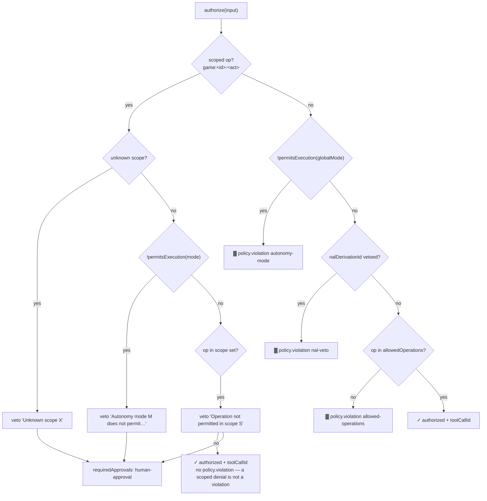

Autonomy ladder (`MODE_ORDER`, `LEGAL_TRANSITIONS` `:23`):

```
observe-only ──→ propose-only ──→ sandbox-execute ──→ low-risk-auto-merge ──→ human-approved-production
                        ↑                  ↑                    ↑                          │
                        └──────────────────┴────────────────────┴──────────────────────────┘
```

`requestModeChange` enforces transitions **and** an escalation guard: an `upgrading` move beyond
`sandbox-execute` authorized by `'system'` is refused. `setAutonomyMode` is an **unchecked** direct
write (escape hatch, no event).

### 6.3 RewardGate `W` — `KernelRewardGate.ts`

```
process({targetType, domain, …})
  1. targetType ∉ allowedTargets  → ⛔ firewall refusal + policy.violation epistemic-firewall
  2. domain ≠ 'external-reflex'   → accepted, mutationApplied:false, requiresProposal:true
  3. else                         → accepted, mutationApplied:true
```

`DEFAULT_ALLOWED_TARGETS = {attention-priority, policy-weights}` — trust/scheduling only, **never**
`Truth.frequency`/`confidence`. `outcomeOf` treats a *proposal requirement* as a restriction and meters
it as a denial. `SelfRewardGate` has an unbounded in-memory `queue` (`pending`/`drain`).

### 6.4 BudgetGate `W` — `KernelBudgetGate.ts:84`

One table, four dimensions. `BUDGET_RESOURCES` (`core/budget`) is the only place naming a dimension,
its ceiling key, and its `TerminationReason`.

```typescript
if (budgetAffords(budget, 'llmCalls', cost)) chargeBudget(budget, 'llmCalls', cost);
else budget.terminationReason = budgetRefusal(budget, 'llmCalls'); // 'llm-budget' | 'backpressure'
```

| Dimension | Default | Refusal reason |
|---|---|---|
| `cycles` | 1000 | `cycle-budget` |
| `depth` | 100 | `depth-budget` |
| `memoryOps` | 10000 | `backpressure` |
| `llmCalls` | 50 | `llm-budget` · `deadline` · `backpressure` |

| Operation | Cost | Scope (`BUDGET_SCOPES`) | Owner | Scope default |
|---|---|---|---|---|
| `nal-step` | cycles×1 | `derivations` | InferenceController | 100 |
| `lm-call` | llmCalls×10 | `premises` | InferenceController | 64 |
| `memory-op` | memoryOps×1 | `candidate-derivations` | RuleProcessor | 16384 |
| `derivation-depth` | depth×1 | `proposal-application` | LMProposalProducer | — |
| `systemone-judgment` | llmCalls×5 | `control-work` | System One | — |
| *(undeclared, cast-only)* | **0, granted** | `decision-derivations` | decision port | — |

`ControlBudgets.beginCycle()` re-opens every per-cycle scope at the top of L1.
`resetConsumption` zeroes counters, never ceilings. ⛔ `control-budgets`: declared scope ⇔ spent.

---

## 7. Inference Pipeline `W`

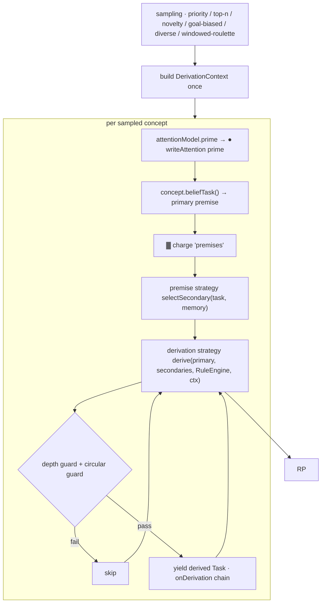

### 7.1 `InferenceController.cycle` (`reason/inference-controller.ts:108`)

| # | Step | Guard |
|---|---|---|
| 1 | `sampling.sample(memory, maxSampledConcepts)` | — |
| 2 | build `DerivationContext` once | — |
| 3 | per concept: `prime` → `● writeAttention` → `beliefTask()` | abort / `emitted≥max` / deadline |
| 4 | `▓ budgets.charge('premises')` | a population scan is unbounded work in a bounded step |
| 5 | `strategy.selectSecondary` | — |
| 6 | `derivationStrategy.derive` → `RuleEngine.processSync` | — |
| 7 | per derived: depth guard, circular detector (bounded 1000, FIFO, `stamp.id｜termKey｜f:c`) | skip |
| 8 | cooperative `sleep(paceMs)` when pacing | AIKR yield |

### 7.2 `RuleProcessor.applySyncRules` (`rules/impls/processor.ts:332`) — the hot path

```
1. premise identity resolved as termKey ONCE  (Narsese string is lossy → a rule could silence itself)
2. recorder.begin() only when isRecording
3. table.candidates(p1.term.kind, p2.term.kind)     dispatch cell = exact kind pair
4. lazy metaActive(matched) only if a matched rule is a meta-rule
5. per rule:
     ▓ charge 'candidate-derivations' → RETURN (not continue) when exhausted
     meta gate: metaActive && checkMetaBudget
     rule.apply([p1.term,p2.term], [p1,p2])       premises: terms · inputs: full RuleInput
     validateRuleOutput()  → fail: emit rule:output-rejected, continue
     reject self-conclusion (conclusion === p1k || p2k)
     limitConclusionGrowth && depth(result) > premiseDepth → skip
     buildResult(term, truthFn, p1, p2, priority)
     recorder.record(ruleId, p1, p2, result, truthFnName)
     emit rule:applied
   errors → handleRuleError (emit with ruleId context) — never swallowed
```

⛔ `dispatch:no-wildcard` — every rule declares **both** kinds. No catch-all bucket.
⛔ `gates:one-cycle-path` — one `InferenceController` construction site, one `.step(`.

### 7.3 Dispatch Cells — 44 declarations / 20 cells

Loaded data (`BUILTIN_DECLARATIONS`) @ rev 0, `artifactVersion builtin/1`. Projected by
`pnpm rule:matrix`; a rule cannot change without the README table changing in the same commit.

| Cell | n | Declarations |
|---|---|---|
| `inheritance:inheritance` | 12 | deduction, induction, abduction, similarity, exemplification, extended.analogy, extended.comparison, variableIntroduction, variableDependency, sameness, revisionWeak, extended.exemplification |
| `implication:implication` | 8 | equivalenceIntro, negationIntro, higherOrderDeduction, higherOrderAbduction, higherOrderInduction, contrapositionRule, implicationDeduction, equivalence |
| `conjunction:conjunction` | 3 | intersection, decompose, decomposition |
| `inheritance:similarity` | 2 | analogy, instantiation |
| `inheritance:setExt` / `:setInt` | 2 / 2 | instanceConversion+instanceDeduction / propertyConversion+propertyInduction |
| `implication:atom` | 2 | implicationElim, modusPonens |
| `implication:inheritance` | 1 | contrapositive |
| `disjunction:disjunction` | 1 | union |
| `conjunction:inheritance` | 1 | structuralInheritance |
| `disjunction:negation` | 1 | disjunctiveSyllogism |
| `implication:negation` | 1 | modusTollens |
| `inheritance:negation` | 1 | implicationIntro |
| `operation:operation` | 1 | proceduralChaining |
| `operation:sequence` / `sequence:operation` | 1 / 1 | operationToPredictive / proceduralDecomposition |
| `negation:negation` | 1 | negationElim |
| `conjunction:atom` | 1 | destruct |
| `equivalence:atom` | 1 | equivalenceElim |
| `atom:atom` | 1 | disjunctionIntro |

+ 5 meta-rules (`meta-*`): strategy-select · knob-tune · test-repair · schema-promote ·
capability-scaffold — all bounded `depth=2, 5/step, priority=0.1, threshold=0.6`.

### 7.4 Rule Table as Data

`RuleTableStore` (`rules/impls/rule-table.ts:165`) — the artifact is the authority, the index is a
projection.

| Operation | Semantics |
|---|---|
| `.empty(bodies)` / `.from(artifact, bodies)` | an empty table is a **runnable state**, not a crash |
| `.admit(decl, revision, parentRev, admitted)` | one committed transition; the **caller** supplies the revision the event stated; provenance `{kind:'proposal', proposalId, producer}` + `eventId` |
| `.revert(revision)` | rollback from the artifact alone |
| `.fromEvents(events, bodies, builtins)` | rebuild from `proposal.admitted` — *the log states the table* |
| `.index()` | stable **delegating** view → a holder never dispatches against a stale index |
| `unresolvedBody` | a name nothing implements is a **loud refusal**; `RuleTableError` carries every fault |
| `replace(next)` | resolve **all** → any fault throws → push history → **rebuild the whole `RuleIndex`** |
| `.diff(revision)` / `diffArtifacts` | added / removed / superseded / unchanged |

⛔ `rules:loaded-data` — nothing registers a rule by importing one.

### 7.5 Model Rules — off-cycle by construction `W`

Reached only from `LMProposalProducer.pump`, which L1 stage 5 calls **without awaiting**.

| Concern | Location |
|---|---|
| `ModelRule` contract (core vocabulary, 8 members) | `rules/types.ts:31` |
| `LMRule` implementation (structural match) | `lm/rule/LMRule.ts:55` |
| **Where the check happens** | `RuleProcessor.registerModelRule` (`processor.ts:159`) ← `facade/index.ts:107` |
| Selection context | `{maxRules, rotationIndex, conceptPriority, premiseCount, focusTerm}` |
| Stats | bounded execution ring + `CallTallySeries` — one write, two readers |
| `lm-graph` selector | **stateful** — graph edges + rule performance must survive `reconfigure` |

### 7.6 Ranking (the pressure valve)

```
score = confidence × |f − 0.5| × 2 − min(0.3, termLength / 2000)
```

`rankDerivations(out, {maxAdmissions=100, minScore=0})` — tautologies (f≈0.5) score ≤ 0 and drop
automatically. This decides **admission**; `query/relevance.ts` is read-path ranking over an unchanged
store. Knobs: `inference.ranking.{maxAdmissions,minScore}`.

### 7.7 Premise-formation pipeline

`PREMISE_SOURCES` (bag · concepts · links · taskArgs · graph) → `PREMISE_SCORER_REGISTRY`
(priority · linkWeight · edgeWeight · linear) → `PREMISE_FILTER_REGISTRY` (sharedAtoms · noStampOverlap ·
inheritanceOnly · inheritanceOverlap · highConfidence). Registries project into zod enums, so a
typo'd scorer is a *boundary validation error*. `PREMISE_SAMPLE_FALLBACK` is the declared default.

---

## 8. Ask / Query Flow `W`

Three separate paths. Only one consults a gate.

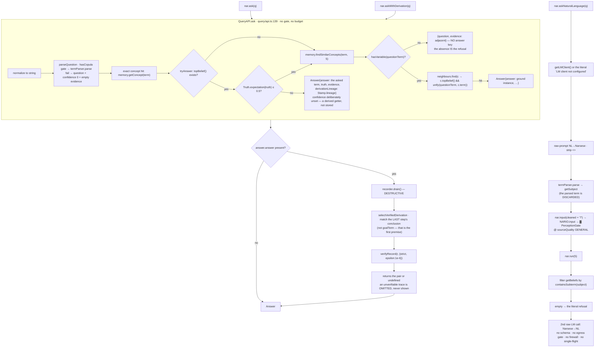

⛔ `answer:no-fabrication` — a ground question never unifies; the answer is the asked term, a ground
instance, or nothing.

`ReasoningTrace` (`query/trace.ts:49`): `trace` walks one concept's `beliefBag` +
`getRelatedConcepts`; `getDerivationPath` (`Stamp.lineage`) is the real lineage answer; `explain`
scrapes rules from `derivationHistory.get(stamp.id).rule` — populated only if `recordDerivation` was
called, and **no production caller invokes it**. So `explain` returns premises without rule names.

---

## 9. NL Ingress & Egress

### 9.1 Ingress — `NLUnderstandingService.understand` `W`

Three production sites, all cost-gated on `dialogue.captureAll === true`, all landing on a
`DialogueTurn` annotation rather than memory.

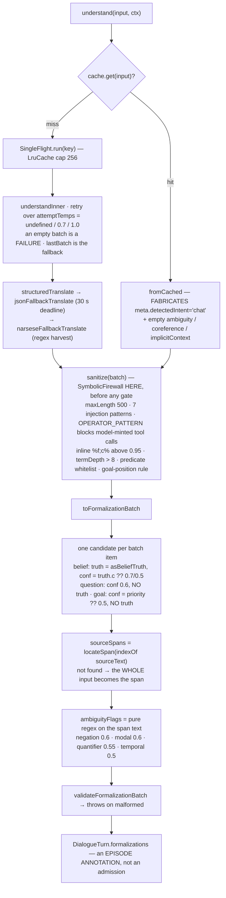

| Finding | Detail |
|---|---|
| **Shadow validation does not run here** | `ShadowValidator` is reached only via `lm/admit.ts admitTasks` (F22/F23). `admitFormalization` and `NARIO.input` both bypass it — so **no NL-formalized candidate is shadow-validated anywhere** |
| **`admitFormalization` is bench-only** `B` | callers are `scripts/fundamentals-bench.ts` and `.cache/e2e-demo.ts`. It also returns payloads, never writes memory |
| `ContextAssembler` `D` | its `NLContext` is the *second parameter* of `understand`; **no production caller assembles it** |
| Cache-hit path is lossy | `fromCached` fabricates `detectedIntent:'chat'` and empty ambiguity |
| Span forgery is not rejected | a `sourceText` absent from the input yields a **full-text** span, not a rejection |

### 9.2 Egress — three postures, and `NLGenerationService` is in **none** of them

| Posture | Where | Behaviour |
|---|---|---|
| **replace-after-the-fact** `W` | `phases.ts:133-145` | keyed by `correlationId` → `threadScope` contrastive memory. On `!grounded`: emit `egress.gate.rejected`, push an explanatory `text-delta`, then **replace** with `verbalizeDerivations()`. The un-grounded text was already streamed — appended-then-superseded |
| **per-delta filter** `W` | `bot.ts:153-161` | a **second, independent** gate over the same stream: writes `evt.text` or `'[filtered]'`. Also the only per-turn `SourceReputation.record` |
| **refuse** `W` | `query/api.ts:144` | the refusal path emits no narration at all |
| `NLGenerationService.generate` `D` | `nl/generation.ts:76` | **no production caller.** No `withDeadline` (unlike ingress) — egress could wait indefinitely. `fallbackGenerate` is its own narrator |

Three consequences worth naming:

1. `nl/` is a **complete, well-built, unwired alternative narration stack.** `core`'s `LLMCortex` is live.
2. `ContextAssembler.assemble` never touches `GenerationInput` — the type has no context field.
3. Groundedness threshold `0.7`, CLM contrastive fallback, `catch ⇒ {grounded:false, score:0}`.

---

## 10. Tool Execution — Three Paths, Three Authorizations

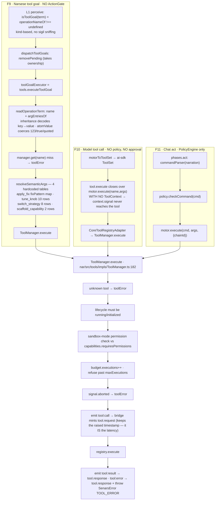

### 10.1 The tool surface

| Path | Tools |
|---|---|
| `core/src/motor/builtin-tools.ts` `W` | `send` `remember` `query` `episodes` `read_file` `write_file` `append_file` `search` `tavily_search` `brave_search` `web_fetch` `shell` `metta` `pin` `request_approval` |
| `core/src/motor/buildAgentTools.ts` | `know` `know_get` `know_list` `recall` `agent_instruct` `get_session_info` `delegate` |
| `nar/src/tools/impls` `W` | `explain` `sleep` (+ `goal.ts` `executeToolGoal`) |
| `nar/src/tools/adapters` | filesystem · codemod · code-exec · proc · test-gen · test-runner · vitest-run · vitest-json · web-search · rag-query · scenario-gen · scenario-execute · scenario-profiles · coverage-concept · aisdk-adapter · shadow-worktree · self-tools |
| `nar/src/tools/adapters/self` `W` | `apply-fix` `register-rule` `register-tool` `scaffold-capability` `switch-strategy` `tune-knob` `shadow-run` `context` |

Every outcome is built by `toolOk` / `toolError` (`@senars/util`) — `toolError` takes `unknown` and
coerces, so a rejected string or a thrown non-`Error` produces a tool failure rather than a second
throw inside the catch.

### 10.2 Reward feedback after a tool goal `W`

`nar-execution.ts:714-733`: success ⇒ `recordRLFPReward(0.7,'tool-goal-success')` +
`stimulate('competence', 0.1)` · `success:false` ⇒ `-0.3` / `-0.1` · throw ⇒ `-0.5` / `-0.15`.

### 10.3 Finding — the authorization asymmetry

| Path | Budget | Perception | **Action** | Policy | Approval | Sandbox |
|---|---|---|---|---|---|---|
| F9 tool goal | `lm-call` via `StreamReasoner` | — | **✗** | — | — | per-tool caps |
| F10 model tool | — | — | **✗** | **✗** | **✗** | per-tool caps |
| F11 chat act | — | — | **✗** | ✓ | optional | per-tool caps |
| F3 game action | ✓ `nal-step` | — | ✓ | — | — | — |

The `SymbolicFirewall`'s `OPERATOR_PATTERN` is the only thing stopping a model from *minting* a tool
goal at all — and it operates on the formalization string, before any gate.

---

## 11. Rule Admission from a Model Rule `D`

`nar/src/proposal/lm-rule-producer.ts`. The most interesting dormant path in the system.

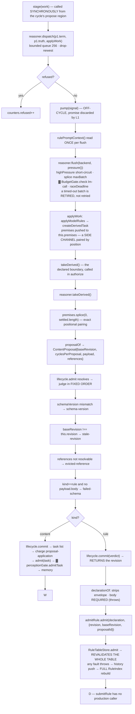

### 11.1 What makes a rule admission structurally different

| | content | rule |
|---|---|---|
| Target | `Memory` | `RuleTableStore` — **the reasoner itself** |
| Queue policy | **drop-oldest** (`pushCapped`, `contentDropped`) | **refuse-newest**, recorded as `proposal.rejected` (`rulesRefused`) — never silent |
| Consequence of loss | regenerable | the learned capability itself |
| Extra gate | none beyond the lifecycle | `body` required (twice: `judge` + `declarationOf`) + **whole-table revalidation** — one bad rule fails the entire admit |
| Post-commit | — | revision assigned by `commit`; index rebuilt; prior revision retained so `revert` is a lookup |
| Kernel gate | `perceptionGate.admitTask` | **none** — `RuleAdmission` is a direct method call; the *event log* is the audit |
| Rebuild from log | — | `RuleTableStore.fromEvents` replays `proposal.admitted` where `kind === 'rule'` |

> **The gap:** `LMProposalProducer.submitRule` (`:129`) — the only producer of a `RuleProposal` — has
> **no caller** in `src/`, `core/`, or `nar/`. The entire rule arm is implemented, wired into the
> producer, and unreachable. The design is complete; the trigger is missing.

---

## 12. `ModelRunner` & the Cortex `W`

`core/src/ModelRunner.ts:80`. The LLM orchestration loop.

```
ComposedRequest { system, messages, tools: ToolSet, ctxHash, snapshot, tier?, budget }
  budget { systemTokens, historyTokens, snapshotTokens, total, maxTokens }
  ← COMPUTED BY LLMCortex, NEVER ENFORCED BY ModelRunner

run(composed, signal):
  1. !modelProvider.available → empty record · no model for tier → 'No model available'
  2. hasTools = Object.keys(tools).length > 0
  3. ONE `outcome` object is the run's ENTIRE state
     (text · toolCalls · artifacts · errors · resumable messages · usage)
     → the finish path and both fault paths read the same state, so they cannot disagree
  4. streamText({ model, messages, instructions, tools,
                  stopWhen: hasTools ? stepCountIs(maxLoops=5) : stepCountIs(1),
                  ── maxLoops is only honoured WHEN TOOLS EXIST; without tools the run
                     is hard-stopped at one step
                  maxOutputTokens=2048, abortSignal, onStepFinish })
  5. onStepFinish: normalize toolCalls; each toolResult JSON.stringify'd, truncated at
     maxToolResultChars=8000, pushed as ReasoningArtifact{type:'tool_result', metadata{toolCallId}}
  6. consume stream.textStream → 'text-delta' per delta, BREAK on signal.aborted
  7. fold stream.usage (try/catch 'usage unavailable')
  8. stream.steps → flatMap(response.messages) → outcome.messages   (resumable, incl. tool traffic)
  9. replay toolCalls (capped maxToolResultEntries=20) then artifacts, correlated by metadata.toolCallId
  10. exits: aborted → 'finish' + fall through
              THROWN → outcome.text = errMsg(e) + early return — NO 'finish' on the fault path
              normal → 'finish' + result
```

`LLMCortex.synthesizeStream` (`core/src/cortex/LLMCortex.ts:44`) adds **no logic** — `#toChatEvent`
only renames: `tool-call`→`tool-call` · `tool-result`→`tool-result` · `finish`→`finish` ·
`tool-error`→`error`. When text is empty it emits `#fallbackResponse` **after the fact** as a
`text-delta`: `"I derived N result(s)."` or `` `[agent] ${text}` ``.

`⊘` `tool-error` is declared and mapped but **never yielded** — the ai-sdk `streamText` path reports
tool failures inside `onStepFinish` results, so the event kind is dead.

Tools reach the runner via `motorToToolSet`; each generated `execute` closes over
`motor.execute(name, args)` with **no `ToolContext`** — so `context.signal` never reaches a tool from
the model path. Only `phases.act` passes one (`{chainId}`, still no signal).

---

## 13. Memory & the Attention Economy `W`

### 13.1 Subsystems

| Subsystem | Structure | Bound / decay |
|---|---|---|
| Concept store | `TermMap<Concept>` keyed by `termKey` | `maxConcepts` 1000 |
| Per-concept bags | `beliefBag` 100 / `goalBag` 50 / `questionBag` 20 — all `Bag<T>` | `strategies.bag` slot |
| Working set | `memory/focus.ts:267` `Focus` — a bounded `TermMap` with **no priority copy** | `focusMaxConcepts` 50 |
| Links | `LinkManager` → layers (`structural` / `embedding`), per-layer decay | `BoundedMap`, forget-policy: priority/lru/fifo/random |
| Co-activation | `ConceptGraph` — trie-structured edges | `BoundedRing` |
| Archive | `LruCache<Term, Concept>` | `maxArchivedConcepts` 1000 |
| Episodic | JSONL ledger, daily rollover, **ULIDs** (causal order = mint order) | `pruneOldEpisodes` |
| Revision log | `BoundedRing(1000)` keyed by `termKey` | — |
| Interning | `LruCache<string, Term>` | 10000 |
| Concept index | `MemoryIndex` — only two lookup families: atomic by `atomKey`, temporal by admission second (1 s resolution) | — |

### 13.2 `Bag<T>` — the universal AIKR queue

`bag/Bag.ts:38`. Priority-descending `list` + `FenwickTree` (sized `capacity+1` once, stale-flag batch
rebuild). `version` increments on every structural mutation — consumers invalidate derived indexes.

| Method | Behaviour |
|---|---|
| `add(item)` | **refuses** at capacity (`shouldOverflow`) — does not evict |
| `sample()` | weighted pick, O(log n) |
| `sampleMany(budget)` | population sample under an `AIKRBudget` |
| `decay(rate?)` | with `retain` |
| `pressure()` | 0..1 vs `PRESSURE` {NEUTRAL .5, HIGH .7, ARCHIVE .8, CRITICAL .9} |
| `evict(strategy)` | `LRU` / `LowestPriority` / `Random` |

### 13.3 Four distinct meanings of "consolidation"

| Kind | Where | What | Status |
|---|---|---|---|
| Decay + eviction tick | `Memory.consolidate` | `attention.tick` → `decayAll(Δcycles)` → `evictUnderPressure` → `linkManager.applyDecay` → `updateAllFocus`. Interval 10. **The only place the clock advances** | `W` |
| Eviction policy | `memory/pressure/consolidation.ts` | 2-stage: archive idle lowest-value above ARCHIVE; forget above CRITICAL. `EvictionReport.reason ∈ {within-capacity, evicted, exhausted}` — a pass that freed nothing says so | `W` |
| Episodic consolidation | `episode-consolidator.ts` | per-type SALIENCE × recency × causal connections; `groupable` requires a same-signature peer so singletons are not drained. Output is a **summary episode** (append-only) | `W` |
| Dense-cluster abstraction | `findDenseClusters` + `createAbstractConcept` | BFS clusters → higher-order concept | `W` |
| Retrieval-verified promotion | `retrieval-verified.ts:55` | episodic → LM relevance ≥ 0.5 → embedding dedupe ≥ 0.9 → `promote()` | `B` — no `src/` caller |

**Decoupled decay**: `frequency`/`confidence` decay only on temporal invalidation or contradiction;
`priority` decays by LRU/access time. Different clocks, different tables.

### 13.4 Ports — the composition contract

Nine named contracts composed as `MemoryPorts`: `ConceptReader` · `ConceptWriter` · `TaskAdmission` ·
`BeliefTable` · `GoalEnumeration` · `LinkPort` · `StatisticsView` · `SymbolIndex` · `MemoryClock`
(+ `AttentionOwner`). `MemoryView` = the read surface the strategy layer takes. `Memory` implements
them — so can an array-backed store with no index (`tests/nar/todo29a-a5.test.ts`).

⛔ `memory:ports` — a cycle-path module naming `Memory` instead of a port is a red gate.

### 13.5 Pressure arithmetic & declared resources

Owned in one place — `state/statistics.ts`: `storePressure` (capacity = max(concepts, tasks)),
`tallyConcepts`, `calculateConceptStats` (single sweep + terciles). `config.ts`: `maxConcepts` 1000 ·
`maxTasks` **Infinity (deliberately declared)** · `activationDecayRate` 0.01 · `consolidationInterval`
10 · `focusMaxConcepts` 50 · `archiveMaxConcepts` 1000.

`RESOURCE_CONTRACTS` (`resources/contracts.ts:91`) declares every growing resource:
`memory.concepts` · `memory.tasks` (**marked `unbounded` explicitly** — "an unmeasured one is
dangerous rather than merely absent") · `memory.archive` · `memory.focus` · `memory.revision-log` ·
`memory.links` · `kernel.gate-logs` · `kernel.source-reputation` · `stream.reasoner-queue` + the
proposal / rule-table / QBelief records. `CapacitySource` **names the module + binding** rather than
copying the number. ⛔ `resource:policy` — owner · bound · retention · overflow · pressure, or an
explicit `null`.

### 13.6 Cross-memory recall `W` — `MemoryQuery.search(filter)`

`query/memory-query.ts:89`. One filter fanned across three optional legs, merged:

| Leg | Scoring | Bounded by |
|---|---|---|
| concept | `w.concept·priority + w.semantic·cosine` (substring via `findConcepts`, or `queryByTimeRange`) | injected clock |
| episodic | `episodePriority(episode, now)` | indexed `getEpisodes` |
| semantic | cosine over the embedding index | optional |

`:154 rankBy` with a deterministic `(tiebreak, localeCompare)` tiebreak and a hard
`DEFAULT_LIMIT = 20`. **Mutates nothing.** Every leg optional.

`episodeQualitySurface` maps reactions to `{accept:1, clarify:.5, redirect:.5, correct:0, reject:0,
abandon:0}`; `dialogue` episodes contribute `metadata.grounding.score`.

---

## 14. Terms, Truth, Canonicalization

| Layer | Property |
|---|---|
| `Term` | `AtomicTerm` / `CompoundTerm`; kinds **derived from the `OPERATORS` table**, not listed |
| Operators | arity / commutative / n-ary per operator; `product` is n-ary and **non-commutative** (`,` is its copula) |
| Interning | `compoundOf` sorts commutative args, keys on `termKey`, `getOrInsert`s a frozen record with a precomputed `_serialized`. Deliberately does **not** canonicalize — a reducer must be able to rebuild its own output without re-entering the pipeline |
| Canonicalization | `TERM_REDUCERS` (11) + `TASK_REDUCERS` (1). `MAX_PASSES` turns a non-terminating reducer into one loud error |
| Reducer obligation | `applies` is **false** for every canonical term; reducers commute to a fixed point |
| Direction choice | `(--x).f = 1 − f_x` — negation moves into the **frequency** only. 3 rules key on `kind==='negation'`; the hottest 21 key on `inheritance` |
| `Truth` | `{f, c}`; branded `Frequency`/`Confidence`; `normalizeTruth` (total) vs `createTruth` (validating) |
| Algebra | revision · deduction/induction/abduction (+`Weak`, +chains) · detachment · contraposition · analogy · comparison · intersection · union · subtract · diff · exemplification · sameness · conversion · negation · structural`* · damp/reinforce/contradict · attention=`f·c` · expectation=`c(f−.5)+.5` |
| Memoization | `TermFacts` `WeakMap` per interned term — one fact computed once per *object* |
| Unification | `nar/src/terms/impls/unifier.ts` delegates to `util`'s generic `Unifier<T>` over a `UnifierDialect<T>` — one Robinson unifier serves both Narsese and MeTTa |

⛔ `terms:canonical` · ⛔ `terms:no-bool-task` · ⛔ `narsese:literals` · ⛔ `primitives:grammar` ·
⛔ `env:grammar`.

---

## 15. Persistence, Provenance, Replay `W`

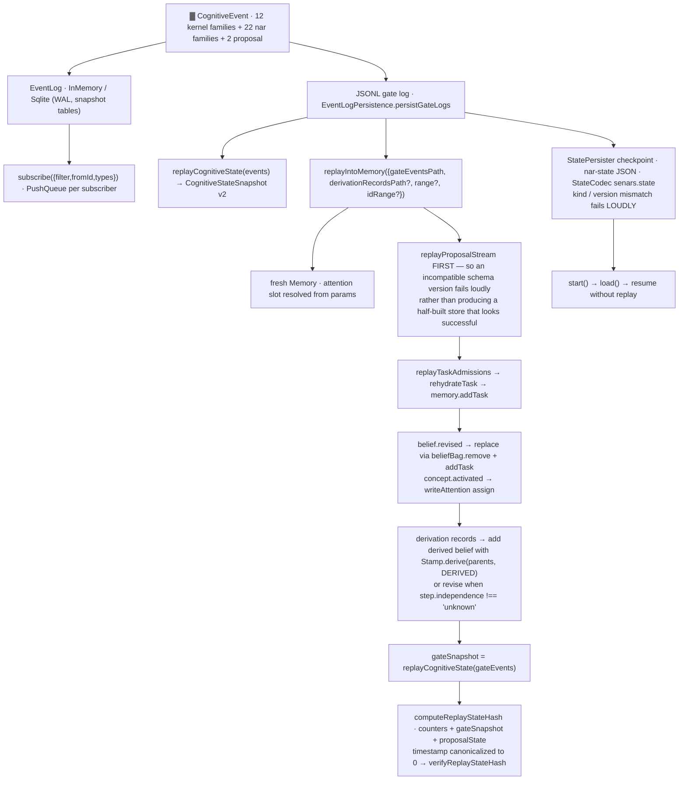

### 15.1 Event families

| Family | Types |
|---|---|
| Kernel (12) | `task.admitted` `derivation.accepted` `belief.revised` `concept.activated` `budget.exhausted` `policy.violation` `autonomy.mode.changed` `self-mod.proposal` `judgment.resolved` `egress.gate.rejected` `shadow.validation.dropped` |
| NAR (22) | `input.user` `derivation.made` `atom.derived/retracted` `belief.added/retracted` `drive.changed` `goal.achieved/failed` `skill.executed` `tool.request/response` `config.set/delete/schema` `kernel.ready` `backend.registered` `bootstrap` `cycle` `health` `conflict.detected` |
| Proposal (2) | `proposal.admitted` `proposal.rejected` |

`mintCognitiveEvent(type, {engine, correlationId, payload})` — `engine` stays **explicit**; timestamp
and correlationId are stamped by the minter. `CognitiveEventSchema` is the discriminated union.

`EventLog.append` validates, then stamps id + timestamp. `AbstractEventLog.assertAppendable` reuses
the serialization the append already did for the size guard. `SqliteEventLog` carries `#count`
forward rather than `SELECT COUNT(*)` per append, with a compile-once statement cache.

### 15.2 Standalone verifier

| Property | Detail |
|---|---|
| Recorder | opt-in, bounded **200 steps/record, 200 records**; `drain()` is destructive |
| Checkpoint arithmetic | `premiseTruths` · `evidenceLineage` (capped 16) · `independence` by ancestor-set intersection |
| Checker | `core/src/verify-derivation` → `verifyRecord(r, {strict, epsilon})` |
| Independence | `core` depends on `util` + its own schemas only. The truth table is **transcribed, not imported** |
| Drift | `tests/unit/core/verifier-drift.test.ts` pins known divergences → drift is *reported*, not accumulated |
| CLI | `scripts/verify-derivation.ts` · own CI job `.github/workflows/derivation-verify.yml` |

---

## 16. The Untrusted Proposer Layer ░

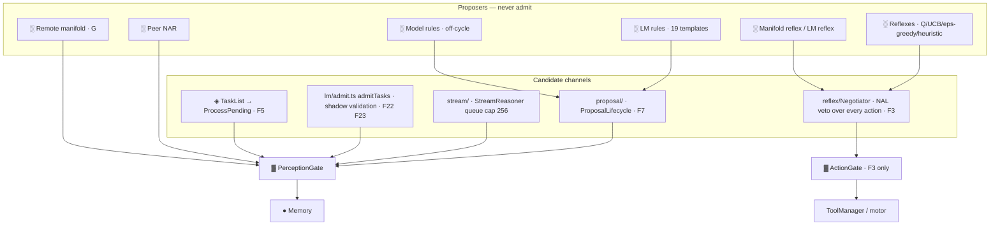

### 16.1 Cortex ladder (System One on/off)

| Tier | Engine | Role | On failure |
|---|---|---|---|
| 1 | `JudgmentManifold` (local heads) | judge everything, admit with calibrated truth | abstain → mask/floor passthrough |
| 2 | `LMServiceCortex` (GBNF-constrained) | `proposeAndJudge` Narsese candidates | retry at temp+0.2 → `null` |
| 3 | Symbolic stub | `symbolicFallbacks` (`rule-templates/fallbacks.ts`) | never crash |

`systemOne.enabled: false` ⇒ the path is **byte-identical**.

### 16.2 LM rules — 19 templates `W`

| Family | n | Rule ids |
|---|---|---|
| Belief | 11 | `lm-narsese-translation` `lm-belief-revision` `lm-hypothesis-generation` `lm-explanation-generation` `lm-analogical-reasoning` `lm-meta-reasoning` `lm-uncertainty-calibration` `lm-schema-induction` `lm-temporal-causal` `lm-variable-grounding` `lm-concept-elaboration` |
| Goal | 1 | `lm-goal-decomposition` |
| Question | 2 | `lm-curiosity-question` `lm-interactive-clarification` |
| Meta (V2) | 5 | `lm-v2-hypothesis` `-explanation` `-analogy` `-causal` `-schema` |

Pipeline: `getRuleDef(id)` → `createRule(lm, def)` → `new LMRule` → `registerModelRule` (structural
check). `createRule` prefixes a shared Narsese operator preamble; **builders never look a definition
up** — that inversion is what closed the cycle. Every template declares `grammar?` · `schema?` ·
`budget?` · `activationCondition?` · `constitutionAware?` · `fallback?`.

Symbolic fallbacks — 10 bound functions, 7 bound to `noSymbolicEquivalent`:
`templateTranslation` (regex `X is a Y` → `(X --> Y)`) · `similarityFallback` · `abductionFallback` ·
`conjunctionDecomposition` · `curiosityQuestionFallback` · `causalFallback` · `elaborationFallback` ·
`clarificationFallback` · `groundingFallback` · `noSymbolicEquivalent` (= `null` — "declares no
symbolic equivalent" rather than guessing).

GBNF grammars: `narsese-term` (copulas `-->` `<->` `==>` `<=>`) and `single-word`, applied as an
**async-scoped transport concern** via `AsyncLocalStorage` and injected into the llama-server body.
Users: `lm-hypothesis-generation` (`narsese-term`), `lm-analogical-reasoning` (`single-word`,
`maxOutputTokens: 8`).

⛔ `rule:has-fallback` — every model-backed rule declares a symbolic body **and it runs**.
⛔ `core:no-lm` — the cycle path never imports `nar/src/lm/` (relative, subpath, static, dynamic,
value, or type). It names `ModelRule`, `TextGenerator`, `EmbeddingRuntime`, `ModelRuleSelector`.

### 16.3 Provider resolution

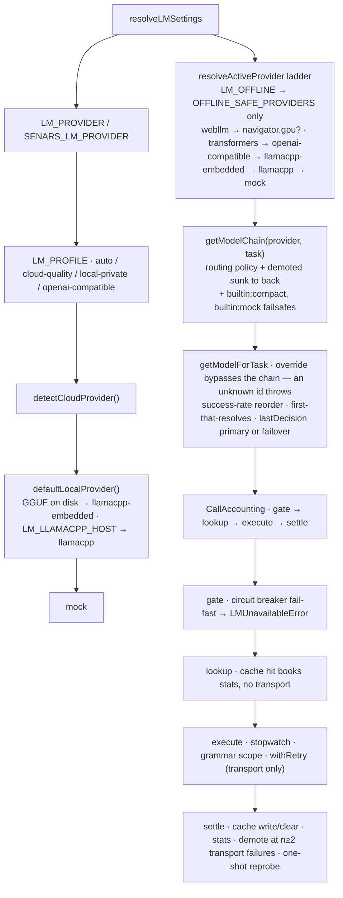

| Component | Contract |
|---|---|
| `ILMService` | `generateText` · `tryGenerateText` (attempt → temp+0.2 → `null`) · `generateObject` · `stream` · `getModel(task, override?)` · `getSpend` · `getCircuitBreakerStatus` |
| Registry | AI-SDK `createProviderRegistry` keys `cloud / llamacpp / llamacpp-embedded / webllm / builtin`. **Unavailable slots are omitted, not mocked** → routing fails over instead of admitting a placeholder |
| Task slots | `quality · fast · structured · compact` |
| Spend | `ProviderSpend{tokensIn,tokensOut,calls,costMilli}` from `MODEL_CAPABILITIES[modelId].costPerMTok`. `LM_MAX_SPEND_USD` throws with remediation. Billed on **every** path including streaming |
| Cache | `buildCacheKey` = fixed-order join of prompt/task/temp/maxTokens/grammar/model, `djb2→base36`; `LruCache` 60 s TTL, expired-sweep on write, injectable `now`; cleared on failure unless the stream committed bytes |
| SingleFlight | `nl/singleflight.ts:12` — `LruCache`-backed, cap 256; past cap the oldest key drops and a duplicate re-issues |
| Breakers | 2 levels: per-provider (`ProviderRuntime.circuitBreakers`; failureThreshold 3 cloud / 5 openai-compatible / 10 llamacpp / 20 transformers+webllm / 100 mock) and per-rule (`LMRule`: 5 / 60 s / 1, `quiet`) |
| Demotion | `n ≥ 2` consecutive **transport** errors. A rejected response says nothing about reachability. Per-model stats bounded at 256 (the key set comes from a remote catalogue) |
| Local models | `stripUnsupportedToolChoice` middleware — local models cannot honour tool directives, so spoofed function-call payloads are blocked |
| Structural output | native `generateObject` → else `generateObjectViaText` (schema in prompt → first JSON object → zod validate) |

### 16.4 Shadow validation `P`

`ShadowValidator.validate(candidate, beliefs)` — reject when a same-term belief diverges in frequency
by `> 0.3`. `validateWithHead` adds the System One `conflict` head **only when
`verdict.fitted === true`** (hash scorers are not load-bearing). Every verdict is labelled into the
distillation dataset. A drop mints `shadow.validation.dropped` — user-visible, never silently swapped.

**Reached only through `admitTasks`**: `ProactiveEnricher` (F22) and `BidirectionalFeedbackLoop` (F23).
**Not** by `admitFormalization` (F18) and **not** by `NARIO.input` (F5).

---

## 17. System One — The Judgment Manifold

### 17.1 `judgeBatch` — the single hot path

`nar/src/lm/system-one/manifold.ts:105`. Every consumer goes through it.

```
1. throw if queries.length > maxBatchSize           ← never silently truncate
2. validateBatchQueries(queries)                    ← AlgebraPurityError
3. embeddingCache.read(sharedContext)               ← throw if the pointer is absent
4. take rolling ECE ONCE for the whole batch
5. per query:
     rubricOf → head lookup
       no head AND no CLM exemplar   → throw
       head throw                    → {score:0.5, abstained, abstainReason:'timeout'}
       no head but CLM has the rubric → contrastive.score(embedding, rubric)   [cosine fallback]
     composeProposition(query, {queryId, backendId, modelDigest, calibration, latencyMs, cost,
                               tier:1, abstained, abstainReason})
     onProposition(prop, query)   ← how events + Prometheus leave without importing the event system
6. post-batch: health(latency) · updateCalibration · ++cycleCounter · checkDrift · refresh rollingEce
```

`consensus(ctx, query, k, budget)`: fan-out `min(k,3)` salted with zero-width spaces (heads are
deterministic, so naive self-consistency would read 1.0). Agreement = `1/|unique(topOptions)|` for
classify, `1 − 4·variance` for evaluate.

Port: `nar/src/decision/types.ts:298` — `judgeBatch` · `consensus` · `health`. Alternate implementers:
`constant-manifold` · `remote-manifold` (bounded fetch) · `wasi-runtime` (sandbox wrapper) ·
`policy.ts` (cascade composition).

### 17.2 19 heads

`HEAD_SPECS` at `head-ontology.ts:34`, typed `as const satisfies Record<RubricId, HeadSpec>` — a rubric
with no head is a **compile** error.

| Group | n | Heads | Stage | Axis |
|---|---|---|---|---|
| `ingress` | **6** | `task_type` · `illocution` · `injection` · `ambiguity` · `tense` · `source_quality` | input judgment | epistemic |
| `action` | **5** | `tool_dispatch` · `risk` · `feasibility` · `strategy` · `reflex_value` | action arbitration | teleological |
| `synthesis` | **5** | `candidate_select` · `plausibility` · `assertion` · `conflict` · `groundedness` | candidate judging | candidate/teleological · rest epistemic |
| `memory` | **3** | `relevance` · `episodic_match` · `novelty` | recall | epistemic |

**10 classify / 9 evaluate.** Ship by default: `plausibility` (Jev `Noul`) + `assertion` (safety
floor). Classify heads judge over the **query's declared space** — a `candidate_select` ranking is
judged in the candidate-selection space, never forced to `task_type`.

### 17.3 Live ingress (adopted, not discarded) `W`

```
nar.input("the robin is a bird")
 └─▶ ▓ PerceptionGate.admit(raw utterance, not the parsed term)
       ├─ Tier-0 parse (Narsese heuristic — unchanged)
       ├─ EmbeddingCache (O(1), alias-free, the single caching layer)
       └─ ONE joint judgeBatch: task_type · illocution · injection · ambiguity · tense · source_quality
            ├─ ambiguity abstain  → inject a clarification Question + stimulate curiosity
            ├─ tense              → occurrenceTime anchor on the admitted task
            └─ source_quality     → seedTruth ceiling (LLM_PRIOR default)
```

The gate's calibrated truth and task type are **adopted** — ingress judgments are never computed and
thrown away.

`seedTruth` (`seed.ts:16`): `confidenceCeiling(sourceQuality, {reputation, sourceKey, atMost:
calibrateAuthority(rollingEce)})` then `Truth.normalize(f, ceiling)`. `calibrateAuthority` returns
0.6 / 0.55 / 0.5 by rolling ECE, so the **lower** of the two wins.

### 17.4 Distillation flywheel `W`

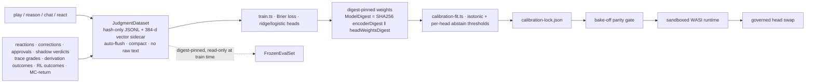

| Mechanism | Detail |
|---|---|
| Weight pinning | swapping the encoder without re-pinning ⇒ `DigestMismatchError` (fail closed) |
| Runtime | SHA256-verified, WASI bundles, zero-import deny-by-default |
| Honest calibration | until fitted, heads report `calibration.fitted: false` and mask/floor **pass through** rather than acting on untrained scores |
| Policy utilities | `truthProbability` (Jev `Noul` analog) · `ConfidenceRouter` (act/review/block, **monotonic** — a router may only restrict) · `compositeScore` · `judgeCascade` · `createWakeGate` |
| Legends | evaluate heads emit a per-level `legend` (triangular kernel over level anchors, normalized to 1) so weighted position ≈ calibrated scalar |
| Drift | `RollingECEMonitor` + `DriftDemotionManager` demote heads whose ECE degrades |
| Scaling | `suggestHeadSize(labelCount, dim=384)` |
| Brier/ECE | **one** implementation, in a leaf module so scorers share it |
| ⛔ `config:model-matrix` | S / S+J / S+P / S+J+P are **four complete systems** |

Label sources: corrections · derivation outcomes · approvals · shadow verdicts · human clarification
pairs · agent-trace grades (groundedness/risk per cycle) · **RL outcomes** · MC-return (folded
discounted returns over episode ticks). Reaction-sourced rows are excluded from the frozen eval set
**by construction**.

### 17.5 Dialogue flywheel `G` (default **off**)

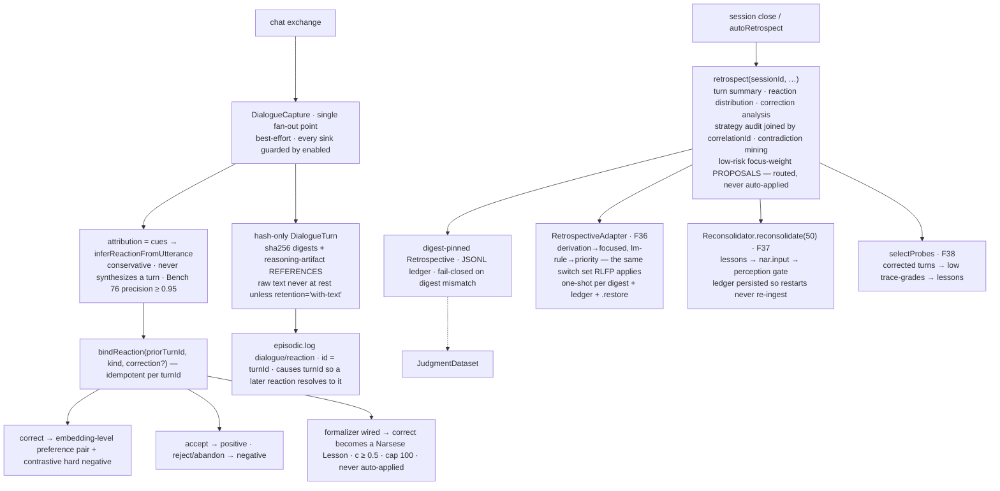

MCP surface: `dialogue_react` · `dialogue_turns` · `dialogue_retrospect` · `dialogue_probes`.
Below `minTurns`/`minReactions` the retrospective degrades to a skeleton with no strategy audit.

---

## 18. Reward Economy — One Substrate, Three Domains

Shared substrate: `Bag<T>` · `Focus` · `FocusBag` · `Game` · `Reflex` · `▓RewardGate`.

| Application | Reward source | Acts on | Containment | Status |
|---|---|---|---|---|
| General-purpose RL | external `Game.step` | reflex Q-tables, focus weights | Negotiator veto + gates | `W` |
| RLFP | preferences, derivation outcomes | attention priorities, policy weights | `▓RewardGate` firewall | `W` |
| Autonomous self-improvement | task outcomes (extrinsic + intrinsic) | `SelfImprovementProposal` **only** | governance + human approval | `W` |

### 18.1 Domain split

| Learner | `domain` | Mutates | Risk |
|---|---|---|---|
| `ReflexLearner` | `external-reflex` | reflex Q-table / policy weights | Low |
| `SchedulerAdapter` | `self-scheduler` | `FocusBag` focus weights | Low |
| `PreferenceRanker` | `self-explanation-rank` | explanation ranking | Low |
| `ConfigOptimizer` | `self-config-proposal` | `knob-tune` **proposals** (never direct) | Medium |
| `PatchSelector` | `self-patch-score` | `patch-apply` proposals → human approval | High |

`LearnerRegistry.dispatch(event)` routes by `event.domain`; unknown ⇒ `CrossDomainError` (fail-closed).

### 18.2 Primitive contracts

| Primitive | Surface | Built-ins |
|---|---|---|
| `Reflex` | `propose(state)`, `learn(event)` | `TabularQReflex` `EpsilonGreedyReflex` `UCBReflex` `BanditReflex` `ManifoldReflex` `LMReflex` + `forwarding`/`recording`/`vetoAware`/`wrap` |
| `Game` | `observe()` `step(action)` `legalActions(state)` | **the only** environment interface |
| `Negotiator` | `resolve(proposals, nalDerivations)` `createLearningEvent()` | NAL retains veto; `WeightedQuorum`; `NalVetoArbitration` |
| `MetaGame` / `SelfMetaGame` | `^focus_weight`, `^knob_set` | self-as-environment |
| Registry | `createArcadeRegistry()` | 9 shipped: snake · tetris · 2048 · tictactoe(+minimax) · gridworld · bandit · catch · arithmetic · rps. + `registerReasoningGames` |
| `GameSpec` | name, description, action legend | adding one = `Game` + one `GameSpec` |
| `Sensor`/`Action`/`Reward` registries | `DEFAULT_SENSORS` `DEFAULT_ACTIONS` `DEFAULT_REWARDS` `composeReward` `failClosed` | tier + scope gating |

RL adapters: `QBeliefStore` (Q/SARSA/TD round-tripping through `Truth.revision`) ·
`RewardBeliefAdapter` · `BeliefPerceptionAdapter` · `GoalActionAdapter` · `RLParityHarness` ·
`ManifoldRLAgent` (UCB/QTable over manifold judgments, NAL nowhere).

### 18.3 Arcade `W`

`pnpm arcade` — many games, one kernel-gated harness, arms: `heuristic | random | manifold | lm |
replica | nal`. Every tick rendered; every decision Brier-scored into `.reports/arcade.{json,md}`.

| Mode | Behaviour |
|---|---|
| `--mode cognitive` | seeds rules as Narsese beliefs so the Negotiator's veto shapes play; per-tick thought-stream panel; recorder-verifiable justification on every veto |
| `nal` arm | cognitive mode regardless of `--mode`, so it is always a comparable row. Veto **action-matches**; falls back to the best non-vetoed proposal instead of stalling. A seeded trap rule prevents the trap; rule-free play is veto-free (Bench `todo17b-nal-arm`). G2 schema induction grows advisory good/bad rules from episode experience |
| `--distill` | teacher→student: `lm` arm records decisions, `manifold` arm learns |
| `--resume` | checkpoints per (arm, game) |
| fail-closed | missing LM model / replica endpoint ⇒ explicit skip note |
| parity | ECE ≤ 0.07 · P50 ≤ 15 ms · arms ≥ random · **one** batched judgment per decision |

### 18.4 RLFP `W`

```
trajectory logging → feature extraction → reward model → policy/knob optimization
RLFPLearner · PolicyOptimizer · RewardModel · PreferenceCollector
ReasoningTrajectoryLogger · TrajectoryStore · createKnobSet · KNOB_SPECS

reward = clamp( 0.5·passRate + 0.3·clamp(baseline/current,0,2)/2 + 0.2·coverageDelta − AIKR penalties
              + 0.3·( 0.4·depthReduction + 0.3·selfModelAccuracy + 0.3·contradictionReduction ), −1, 1 )
```

`ParameterTable` — one owned-parameter table, `ParameterScope = 'system' | 'game:<id>'`, every
`ParameterSpec` carrying `{name, scope, min, max, value, owner, actuate?}`. `ParameterLedger` is
append-only and **never decides**.

### 18.5 Cognitive Treadmill `W`

`imagination/`: `CognitiveTreadmill` · `ScenarioGenerator` · `HiddenModelOracle` · `HiddenRule` ·
`Scenario` · `DegradationCurve` · `StressMetrics`. Generates scenarios against a hidden rule model and
measures degradation curves — counterfactual play against a rule set the agent does not see.

---

## 19. Self-Improvement, Governance, Policy, Capability

### 19.1 The loop `W`

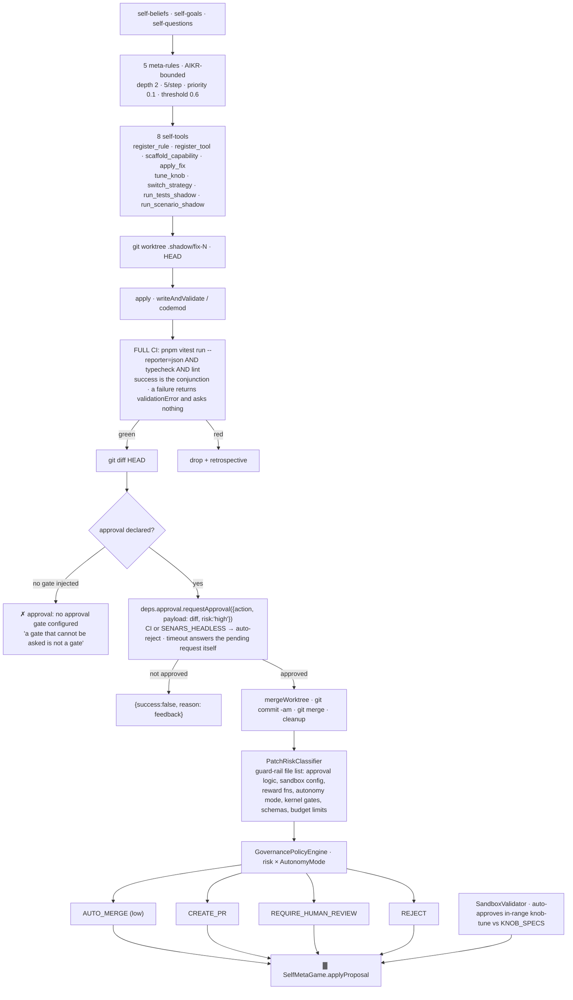

> **Finding (`P`):** `initializeTools` calls `createSelfTools({workspaceRoot, nar, rlfpLearner,
> cognitiveController, toolManager, ruleProcessor})` — **`approval` is not passed**. On the NAR facade
> path, every mutating self tool that declares an approval returns `'…: no approval gate configured'`.
> The `ApprovalService` exists on `Agent`; the tools do not receive it. This is the single largest
> `W`→`D` seam in the governance chain.

### 19.2 Homeostatic drives `W`

| Drive | Goal | Decay/cycle | Replenished by |
|---|---|---|---|
| `curiosity` | `(self --> curious)!` | 0.02 | `generate_scenarios`, `coverage_concepts` |
| `competence` | `(self --> competent)!` | 0.015 | green `run_tests`, `tune_knob` reward ↑ |
| `coherence` | `(self --> coherent)!` | 0.01 | `resolve_contradiction`, schema promotion |
| `social` | `(self --> social)!` | 0.05 | human interaction (CLI/IRC) |

`DriveManager` holds the one write path back into the NAR: `INarInput{input(input, type, truth)}` — a
*function*, not the facade.

### 19.3 Metacognition `W`

`MetacognitiveMonitor` (`recordReasoningStep` · `recordError` · bounded trace · `analyzePerformance`) ·
8 analyzers (`capabilities` `corrections` `performance` `policy` `quality` `reasoning-patterns`
`resources` `term-patterns`) · `ReasoningAboutReasoning` (`performMetaCognitiveReasoning` ·
`performSelfCorrection` · `analyzeReasoningGaps` · `assessQuality` · `querySystemState`) ·
`SchemaInductor` · `CognitiveController.adapt()` (every `adaptationInterval` = 50, with `onAdapt`
callbacks) · `counterfactual(term, negate, host, steps)` with `COUNTERFACTUAL_DAMPING = 0.5`.

### 19.4 Approval & policy — four unconnected layers

| Layer | Type | Wired where | Status |
|---|---|---|---|
| **A. `ApprovalService`** `core/src/ApprovalService.ts:91` | `result: Promise` is the **only** channel — no rejection channel, because a rejected `result` with no handler is a process exit from inside a gate that was only declining. `CI`/`SENARS_HEADLESS` ⇒ auto-reject (a decline, not an error). On timeout it **answers the pending request itself** so `pending` cannot grow by one per timeout | `Agent`; the `request_approval` model tool; `CapabilitySpace`; self-tools (**approval not injected**) | `W` on 3 of 4 |
| **B. `PolicyEngine`** `core/src/PolicyEngine.ts:32` | deny-list first, then a non-empty allowlist as a **closed world**. `checkFileAccess` resolves **both** sides then applies one containment predicate — which is what closes `./sandbox-evil` and `./sandbox/../../etc/passwd` that a raw `startsWith` admitted | `checkCommand` from `phases.act` only. `checkFileAccess`/`checkShell` have **no production caller** — the fs tool uses `containsPath` directly | `P` |
| **C. `CapabilityPolicy`** `capability/space.ts:13` | one-method structural interface, deliberately the **same shape** as `PolicyEngine.checkCommand` so a `PolicyEngine` satisfies it by assignment | `CapabilitySpace` is constructed with **no policy at every call site** ⇒ inert | `D` |
| **D. `ToolRegistry.execute`** `core/src/motor/ToolRegistry.ts:104` | `context?.signal?.aborted` first, then the delegate. `executeLocal` **does** forward the context to the tool | signal only ever supplied by `phases.act` (`{chainId}`, no signal) and `chat.ts` | `W` |

**The approval flows that exist, and what each misses:**

| Flow | Asks for | Misses |
|---|---|---|
| self-mod landing `F12` | the full diff, risk `high` | the approval gate is not injected on the NAR path |
| capability sandbox `F13` | `JSON.stringify(args)`, risk from the def | `importFrom` **drops `risk`** — an imported tool always executes at `risk: undefined` and skips the branch entirely |
| LLM model call `F10` | nothing | `request_approval` is a *model-visible* tool — the model can ask; nothing forces it |

### 19.5 `CapabilitySpace` & WASI `W`

```
CapabilitySpace.execute(name, args):
  1. unknown name                          → recorded failure
  2. policy?.checkCommand(name)            → deny  (⊘ policy absent at every call site)
  3. risk && risk !== 'low' && approval    → requestApproval → refusal recorded with feedback
  4. sandbox(() => capability.execute(args))   ← the ONLY isolation
  5. record into the 1000-ring {name, success, at}
  ⊘ validateDiff(diff) — membership test on allowedMutations — NO CALLERS
```

`DEFAULT_MUTATIONS` (10): `add-rule` `tune-knob` `register-tool` `apply-fix` `modify-code` `add-test`
`remove-test` `modify-config` `promote-schema` `scaffold-capability`.

`CapabilityOntology.register` **throws** on: duplicate `id` · an unregistered prerequisite (so cycles
are impossible and forward references fail) · an empty `derivationChain` string · a missing
`parentId`. It carries `risk` through to `space.register`, so ontology-registered capabilities *do* hit
the approval branch — unlike imported ones.

| Ontology path | Detail | Status |
|---|---|---|
| `registerTool(tool, …)` | id `tool:<name>`; digest `shortSha256Hex(tool:<name>:<Date.now()>)` — **non-deterministic by construction** | `W` |
| `registerBuiltin(kind,…)` | one row per kind in `BUILTIN_KINDS`: metta (medium, 500) · rule (low, 50) · skill (medium, 200) | `W` |
| `registerLearned(11 positional args)` | carries `proofRef` + `derivationChain` + `parentId` | `D` |
| `registerScaffolded` | **does not exist**; `'scaffolded'` is a legal `Provenance.source` with no producer | `⊘` |
| `execute(id, args)` | cannot enforce prerequisites — a `metta:` skill is as executable as its parent | `W` |
| `getDelegatable()` | `risk === 'low' && prerequisites.every(exists)` | `D` |
| `getProbes()` | `type === 'skill' \| 'rule'`; the retrospective grade filter is admitted unimplemented | `D` |

**How a scaffolded capability is actually built — and where it stops:**

```
resolveSemanticArgs normalises args.templateId (2-row identity map)
  → scaffoldTemplates(capabilityId, parameters)   STRING TEMPLATES EMITTED AS SOURCE TEXT
      tool_template → tool({description, inputSchema: z.strictObject({...})}) + a TODO body
      rule_template → RegisteredRule{pattern implication:implication, apply → undefined, truthFn .7/.8}
  → writeAndValidate(ctx,'scaffold', existingId, {file: capabilities/<id>.ts, merge:true})
      → shadow worktree → write → FULL CI → diff → approval → merge
  → ● REGISTRATION STOPS AT THE FILESYSTEM
     ToolManager.register is never called · discoverTools does not scan capabilities/
     the tool reports 'Capability scaffolded and merged' — true of the file, silent about the runtime
```

`register_rule` and `register_tool` follow the same file-only honesty rule
(`'not-supported: … rule was not registered'`).

WASI: `createWasiSandbox` / `createWasmModuleSandbox` / `createNodeVMSandbox` (deprecated, warns once;
"trusted-but-faulty code isolation", never for untrusted code). Deny-by-default: explicit `env` only
(default `{}`, **no `process.env` spread**) · `sanitizePreopens()` normalizes and drops `..` escapes ·
`assertWasmPathContained` guards sibling-prefix confusion · `DEFAULT_SANDBOX_TIMEOUT_MS` 30 000 via
`withTimeout` → `SandboxTimeoutError`. `CapabilityOntology`'s ctor passes **no sandbox by default** at
the ontology call sites.

---

## 20. Proof Stream, Cooperation, Remote Manifold, Knowledge

### 20.1 Proof stream `W`

```
nar.#proofRing = ProofStreamRing<readonly Task[]>(cap 256)
  onDerivation(chain) → #recordDerivationChain: copy → ring.push
      push writes the BoundedRing THEN listeners.emit  → ZERO COST WHEN NOBODY SUBSCRIBES
      stream(signal): PushQueue seeded from current ring contents, then fed live
                      → each subscriber is an independent tee that replays history before going live
                      → signal abort and iterator return both unsubscribe and close every waiter
```

Two distinct streams, easy to conflate:

| Stream | Contents | Readers |
|---|---|---|
| **task-chain ring** `nar.getProofStream` | `readonly Task[]` = `[primary, …secondaries, derived]` | `SchemaInductor.onDerivation` (F25) |
| **recorder drain** | `DerivationRecord` (from `getRecorder().drain()`) | `ProofMettaProposer` (F26) |

`SchemaInductor` `W`: gated on `enableSchemaInduction` + non-empty chain; `#seenSignatures` LRU 4096
dedupe by `chainIdentity`; admits at `priority = chain.length`. `induceIfPressured` is **inert below
pressure 0.7**, driven from `consolidateLearning`; `induceNow` is the explicit CLI drain that bypasses
the gate. Results become `SelfImprovementProposal{kind:'schema-promotion'}` → `GovernanceResolver`.

`ProofMettaProposer` `W`: 512-slot ring → `extractPatterns` → per step `generalizeStep` (any atom
appearing **more than once** becomes `$1, $2, …`) → `serializePattern` keyed by `termKey` (not
`serializeTerm`, which collapses 1-arg n-ary terms and could collide two distinct patterns) → a pattern
with `count ≥ 3` and `confidence ≥ 0.7` becomes a `MettaRule` → `adoptLearnedMettaRules` →
`SelfImprovementProposal{kind:'metta-rule-adoption'}` → `GovernanceResolver`.

> Two honest gaps: `applySchemaPatch` is a **no-op stub**, so even on `decision.applied` nothing is
> written into the rule table. And the MeTTa tool absent ⇒ **symbolic fallback**, rules stay in the
> proposer only.

`ProposalBag` (`meta/proposal-bag.ts`) is a third stream — `SelfImprovementProposal`s accumulated as an
AIKR bag and drained under pressure into governance. `admit`/`drain` have **no production caller**.

`DialogueCapture` derivation-chain capture is distinct from all three: it is a `MacroPhase`
(`createCapturePhase`, installed at `bot.ts:362-365`) and is the *only* stream keyed by `correlationId`.

### 20.2 Thread scope / correlation `W`

Three layers joined only by the `correlationId` string.

| Layer | Type | Note |
|---|---|---|
| kernel | `ThreadScope` `kernel/thread-scope.ts:22` | LRU **1024**, evicting a thread **whole** — "a half-evicted scope would reintroduce exactly the context bleed this class exists to prevent". `ThreadScopeState {contrastiveMemory?, sourceKey?}` |
| core | `CorrelationScopeStore` `core/src/agent/types.ts:23` | one-method reader, deliberately duplicated in shape so `core` only needs to *name* the reader. **No `MacroPhase` reads it** |
| focus | `GameFocus.syncScope` `:224` | a different axis — **action**, not correlation (see §5.3) |

```mermaid
flowchart LR
  T1["transport handler mints correlationId = makeId()"] --> T2["input.user with the same cid"]
  T2 --> T3["recall · log.append + working/episodic/semantic ctx"]
  T3 --> T4["reason (L1) + narrate → narrativeText"]
  T4 --> T5["▓ egress gate keyed by cid<br/>→ threadScope.get(cid) → ContrastiveMemory"]
  T5 --> T6["consolidate · episodic.log with cid"]
  T6 --> T7["act · tool.request with cid + causationId = state.cid.id"]
  T7 --> T8["record · consolidateLearning + traceGrader({…, correlationId, egress})"]
  T8 --> T9["announce · derivation.made + skill.executed with cid"]
  T9 --> T10["createCapturePhase → DialogueCapture.onExchange<br/>cid IS the session id · turnId = cid:seq · capped by maxTurnsPerSession"]
```

The bleed it fixes: "one user's `.react correct` shifts every other user's manifold judgments."
`⊘` `threadScope.delete` has no caller; `CorrelationScopeStore.sourceKey` is read by nobody; a
1025-thread turn loses its contrastive memory silently.

### 20.3 Source reputation `P` — 2 write sites, 3 unwired claims

`SourceReputation.record(key, outcome)` (`kernel/source-reputation.ts:78`) bumps an LRU (cap 10 000)
and appends to the JSONL ledger. **Trust-not-truth**: the multiplier adjusts the *ceiling* only.

| # | Site | Key | When |
|---|---|---|---|
| 1 | `bot.ts:232` | `'llm-narration'` + `'provider:<name>'` | the **per-delta groundedness gate** (`collectChat`). Keys resolved once per turn by `narrationKeys()`; a settings-read failure degrades to the bare key |
| 2 | `src/bin/commands/dialogue.ts:93-94` | literal `'user'` | `.react <kind>` — `correct`/`reject` ⇒ `'contradicted'`, else `'confirmed'` |

| Claimed in the header | Actual |
|---|---|
| "egress-gate rejections" | only the bot's **separate** per-delta gate records; the nar-side `groundedness-gate` returns a verdict and records nothing; `phases.reportEgressRejection` mints the event and records nothing |
| ".react corrections" | ✓ |
| "peer shadow-validation failures" | **not implemented** — `admit.ts` mints the event, no `SourceReputation` reference anywhere |
| `domain:<host>` key | used **only as a lookup** — nothing ever records under a `domain:` key, so URL-sourced ingress always reads neutral `1.0` |
| `seedTruth`'s `reputation`/`sourceKey` | **passed by no caller** — `dispatcher.ts:347` and `distill.ts:42` call `seedTruth(p)` bare |
| `cognitive-agent.ts:161` | reads `multiplier('nar-api')` — a key nothing records |

Read side: `KernelPerceptionGate` (via `confidenceCeiling`) · `selectProbes` (boosts low-reputation
sources, capped 2×) · `GateRegistry.setReputation` · `.status`.

### 20.4 Cooperation & multi-agent `W` / `D`

`CognitiveTaskDelegation {taskId, taskType, narseseContext, callbackEndpoint, judgment?}` —
`judgment` present **iff** `taskType === 'judgment'`, carrying `{contextEmbedding: number[],
queries: JudgmentQuery[]}`.
`CognitiveTaskResult {taskId, resultNarsese[], success: boolean, error?}` — `success: boolean` alone
hides causes.

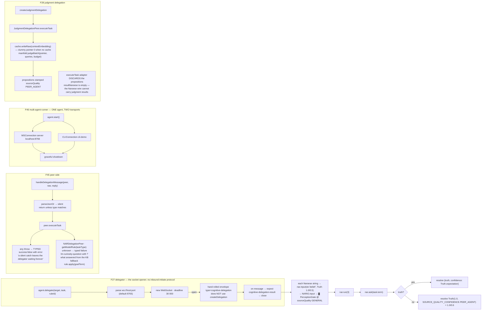

| Finding | Detail |
|---|---|
| **`PEER_AGENT` is nearly unreachable** | `admitFormalization`, `agent.delegate`'s actual admission, and every `seedTruth` site default to `LLM_PRIOR = 0.5`. `PEER_AGENT = 0.6` applies **only** on the "no truth found" fallback |
| **F46 is not a mesh** | one agent + a WS server + a CLI. `multi-agent-runner.ts` never mounts the delegation handler — a message on 8766 goes straight to `agent.chat` |
| **`cooperation/` is unexported** | not in `nar/src/index.ts` nor `nar/package.json` exports. `JudgmentDelegationPeer`, `createJudgmentDelegation`, `createDelegation` have **no production caller** (`D`) |
| The server wiring that *does* exist | `nar/src/agent/index.ts:338-372` — `WSConnection` on `config.transport.ws` (default 8765), a delegation-aware `onMessage` replying **directly to the originating socket**, anything else falling through to `agent.submit` |

### 20.5 Remote manifold `G` / `B`

| | `http` dialect | `open-systemone` dialect |
|---|---|---|
| Selection | `provider:'http' && endpoint` | `provider:'open-systemone'` |
| Identity | `backendId 'http-remote'` — its own identity because the local digest is meaningless for a remote judge, so digest-pinned governance stays local | `modelDigest 'open:<model>'`, `calibration.ECE = -1` (sentinel = uncalibrated) |
| URL | `${endpoint}/v1/systemone` | fixture server |
| Request | `{contextEmbedding, queries, trusted: false}` — the embedding is read **locally**; the remote never sees text. A missing pointer **throws** | `{state: canonicalState(embedding), questions}` — embedding rounded to 4 dp |
| Response | `{propositions, sourceQuality?}`, `z.loose()` base but requires `axis, queryId, backendId, modelDigest, calibration{version,ece}, latencyMs, cost, tier, abstained`; union arm by `kind`. `responseSchema.parse` ⇒ **fail-closed** on malformed | a missing answer becomes an **abstained** proposition with `abstainReason:'low-confidence'` |
| Failure | non-2xx ⇒ throw; **any** throw ⇒ `health.ready = false; breakerOpen = true; rethrow` — nothing short-circuits the next call | same |
| `consensus` | one batched pass, `k` ignored, `agreement: 1, independent: false` | — |
| `health()` | returns a copy; `rollingEce` and `queueDepth` are always `0` | — |
| Ceiling | `LLM_PRIOR = 0.5`, further lowered by `calibrateAuthority(rollingEce)` ∈ {0.6, 0.55, 0.5} — the **lower** wins | — |
| Server side | answers `sourceQuality: trusted === true ? 'GENERAL' : 'LLM_PRIOR'`. **The client always sends `trusted: false`**, so a SeNARS-to-SeNARS pair always answers `LLM_PRIOR`. `GENERAL = 0.55` is reachable only if *some other* client sets `trusted: true` | — |
| Telemetry gap | the `judgment.resolved` callback is installed only when `'setPropositionCallback' in manifold` — true for the local manifold, **not** for the remote object literal. Remote propositions never reach `emitJudgmentResolved` | — |

### 20.6 Knowledge — five components, one name that does not exist

> There is **no `KnowledgeManager`, `KnowledgeBase`, or `knowledgeManager` symbol anywhere** in
> `core/src`, `nar/src`, `src/`, `util/src`, `io/src`, or `metta/src`. It survives as one orphaned
> JSDoc in `core/src/index.ts:125` and two README lines. The concern is split:

| Concern | Component | Status |
|---|---|---|
| cross-memory **read** | `MemoryQuery.search(filter)` — one filter fanned across concept + episodic + semantic, merged with a deterministic tiebreak and a hard limit. Mutates nothing | `W` |
| cross-memory **write** | `consolidateEpisodes` `retrieval-verified.ts:55` — episodic → LM relevance ≥ 0.5 → embedding dedupe ≥ 0.9 (unit length computed once per candidate, so the scan is a dot product) → `promote(content, provenance)` | `B` — no `src/` caller |
| Narsese read | `QueryAPI` | `W` |
| structural | `ConceptGraph` / `CausalIndex` / `associative.ts` / `similarity.ts` | `W` |
| procedural | `motor.getAllFeedback` (T3) | `W` |

---

## 21. Transports, Protocol, UI `W`

```mermaid
flowchart LR
  CM["ConnectionManager<br/>factories by type · connections by id"] --> CL["CLI · stdin lines, 'senars> '<br/>dot-commands BYPASS the message path (BoundedRing 1000)"]
  CM --> IRC["IRC · RFC1459 · flood 2 s / 2 pending · join warmup 5 s"]
  CM --> WS["WS · JSON frames · heartbeat 30 s · subscribe/unsubscribe are control"]
  CM --> HTTP["HTTP · one message/request · 1 MiB cap<br/>pending BoundedMap 256 / 30 s → 408"]
  CM --> MCP["MCP · stdio / sse / http / in-memory<br/>tools are NOT messages: callTool / getTools / importIntoRegistry mcp_"]
  CM --> PLUG["◇ Plugin TransportFactory"]
  CL & IRC & WS & HTTP & MCP & PLUG --> BB
  BB["bindAgentToConnection · installs exactly ONE onMessage handler · returns an unsubscribe closure"] --> MW["onion: auth → command interceptor → session binder → agent dispatch"]
  MW --> AG["agent.chat() → text-delta stream → aggregateChatResponse"]
  AG --> RW["resolveReplyTarget · IRC → channel, else → sender"]
```

`BaseConnection` is the *one* place the connect/disconnect state machines exist
(`idle → connecting → connected → disconnecting → disconnected`, + `error`). Message fan-out runs
handlers through `SerialLanes` keyed by `message.origin` — one slow origin cannot delay another's.
`MessageRouter` delegates to `util`'s `dispatch`, so double-`next()` and `use`-during-dispatch are
impossible.

`AuthManager.checkAuth` returns `allow | auth_bound | ignore`; a secret per connection, `.auth
<secret>` binds the sender. `createRateLimiter` (1 msg/s/transport) and `createErrorBoundary` are
**optional, not installed by default**.

| Env | Auto-connects | Default |
|---|---|---|
| `ENABLE_IRC` | IRC | `irc.libera.chat:6697` TLS, nick `senars-bot`, `#senars` |
| `ENABLE_WS` | WS | 8765 |
| `ENABLE_HTTP` | HTTP | 3000 |
| `ENABLE_MCP` | MCP | stdio |
| `ENABLE_WEB_UI` | UI | 3000 |

### 21.1 UI WS protocol (`core/src/protocol/unions.ts`)

| Client → Server | Server → Client |
|---|---|
| `chat.user` | `chat.agent.stream` / `chat.agent.complete` |
| `config.set` | `config.schema` |
| `sync.request` | `state.snapshot` |
| `lens.define` | `lens.list` / `lens.defined` / `lens.fields` |
| `viewport.set` `focus.set` `object.set` `node.set` | `cognitive.delta` (`GraphOp[]`) |
| `node.history.request` `lm.status.request` | `node.history` `lm.status` `telemetry` |

`derivation.made` → `UnifiedGraphProjection.applyDelta`; Narsese conclusions decomposed to edges via
`termParser.parse` + `parseTermToEdges`; premises become `derivation` edges; deduped by `seenTerms`.
Lens AST ops: `const` · `field` · `channel` · `when` · `union`. `lm.switch` is provider-allow-listed.

### 21.2 MeTTa as a tool, not an engine `W`

`core/src/metta-port.ts:16` declares `MettaPort{parseCommands, query, loadProgram}`;
`metta/src/agent/port.ts:12` implements it over one **memoized** `createMeTTa()` (the runtime holds
spaces and `bootstrapStdLib` mutates a process-global op table). Injected at `.withMetta(...)`,
consumed as builtin tool `metta`. `MettaEngine` exists as a `BaseEngine` but only answers stimuli
prefixed `metta:`.

**Arbiter pattern**: NAR and MeTTa never share memory. They emit `EngineResult` proposals to the kernel.
The e-graph must **never** union nodes on a NAR similarity score — exact `definitional-equality` vs
uncertain `equivalence` is a hard boundary.

| Subsystem | Surface |
|---|---|
| runtime | `createMeTTa()` · `evaluate(atom, ctx)` · `MeTTaContext{maxSteps, timeout, memoryLimit}` · `MeTTaBuilder` |
| parser | hand-written tokenizer + recursive descent; `$var`, numbers, symbols, `Nil` for `()` |
| spaces | `ArraySpace` / `InMemorySpace` / `PersistentSpace` (JSON + `periodic` autosave) |
| e-graph | `EGraph` + `RewriteRule`, immutable maps, bounded saturation (1000 steps / 10k nodes) |
| types | Π/Σ, `TypeChecker`, `unifyTypes`, occurs check, fresh vars, `composeSubst` |
| stdlib | arithmetic · comparison · `MATH1` · cons/eq · normalization · subterm pre-reduction |
| ipc | valibot `IPCMessageSchema` + `SharedMemoryQueue` (SharedArrayBuffer ring, Atomics head/tail) |
| perf | `globalJIT` (LRU on `atomKey`) · `parallelMap` / `parallelReduce` |

⛔ `todo28-metta-seam` — the port is what lets `nar` sit below `metta`.

---

## 22. Observability & Control Surfaces `W`

| Surface | Where | Exposes |
|---|---|---|
| `CycleTrace` | `proposal/cycle-trace.ts:36` | bounded ring `{cycle, stage, phase, at, correlationId}`; `findStageOverlaps` asserts `propose` never opens inside `reason` |
| `PhaseTimerSummary` | `trace/` | per-phase timing + flame chart string |
| OTel | `otel/` | `initOtel` · `getTracer` · `withSpan` · `decisionSpan` · OTLP HTTP batch. Correlation id rides the **span**, never a label |
| Prometheus | `metrics/` | `systemone_*` judgments/ingress/reflex · `lm_spend_tokens{provider}` · `lm_spend_cost_milli{provider}` · `gate_decisions_total` · `gate_vetoes_total` · `bag_pressure` · `schema_promotions_total` · `handovers_total`. Served `GET /metrics` (text) + `/metrics.json` |
| Health | `health/runHealthChecks` | LM reachability · schema-store write · gate init · event-log append |
| Cognitive state | every 10 cycles | `{cycle, active_drives, active_meta_goals, pending_tool_executions, aikr_pressure, rlfp_reward_avg, self_quality}` |
| `pnpm status` | — | manifold health · per-head ECE + abstain thresholds · circuit breakers · LM spend · dataset/lock paths · governance queue depths (`--json`) |
| `pnpm doctor` | — | credentials · LM API probe · effective LM/routing matrix |
| `pnpm replay` | — | deterministic replay + state-hash verification |
| REPL core | `src/cli/commands.ts:71` | `help quit stats beliefs concepts attention episodes know recall sessions session throttle tier status clear` |
| REPL groups | `src/bin/commands/index.ts:37` | connection · profile · memory · lm · dialogue (`react turns parameters retrospect retrospectives schemas-induce`) · **systemone** (689 LOC: manifold calibrate distill ground trace provisional drive) · diagnostics · runtime · config |
| Remote commands | `io/src/commands` | `/connections /connect /disconnect /enable /disable /reconnect /auth` |
| MCP | `src/bin/lib/mcp` | 19 tools · 4 dialogue tools · 5 prompts · resources · `JobManager` |
| UI test endpoints | `/test/*` | `reset seed-graph inject-chat inject-derivation pre-bootstrap state session-save session-load import/export-beliefs` |
| Event bridge | `nar/src/events/bridge.ts` | 10 NAR→kernel event mappings; every mint pins `engine:'nar'`; tool events keep their own timestamp (latency measurement); subscribed/unsubscribed as a paired unit via `DisposalRegistry` |

---

## 23. Red Gates & Falsification Benches ⛔

### 23.1 The gate list

`scripts/lib/gates.ts` — **one** list, so a gate in CI without a local entry point is impossible. The
runner asserts every gate has a `pnpm` script **and** appears in `ci.yml`.

| Gate | Invariant |
|---|---|
| `core:no-lm` | the cycle path never imports `nar/src/lm/` (rel, subpath, static, dynamic, value, type) |
| `memory:ports` | the cycle reaches memory through ports, not the `Memory` facade |
| `dispatch:no-wildcard` | every rule declares **both** kinds; dispatch is a port |
| `rules:loaded-data` | the rule set is versioned, enumerable, revertable data |
| `control-budgets` | declared scope ⇔ spent, both directions |
| `resource:policy` | every growing resource: owner · bound · retention · overflow · pressure (or explicit null) |
| `proposal:protocol` | the eight proposal decisions, each with a named rejection reason |
| `attention:write-surface` | one writer for `Concept.priority`; one decay caller; read paths contain no write |
| `rule:has-fallback` | every model-backed rule declares a symbolic body **and it runs** |
| `gates:one-cycle-path` | one `InferenceController`, one `.step(` |
| `cycle:no-provider` | provider **dependency** detection, not mere presence |
| `terms:canonical` | operator table = grammar = serialiser; reducer fixed point |
| `terms:no-bool-task` | a Bool atom cannot name a Task |
| `narsese:literals` | every Narsese literal in `nar/src`, `src/`, `scripts/`, `examples/` round-trips |
| `answer:no-fabrication` | `ask()` answers the asked term, a ground instance, or nothing |
| `relevance:measured` | relevance narrowing is a measured number |
| `induction:inventory` | in-cycle induction behaviours with `noticedBy` dispositions |
| `config:model-matrix` | S / S+J / S+P / S+J+P are four complete systems |
| `env:grammar` · `primitives:grammar` | one way to read the environment · one arithmetic vocabulary |
| `replay:proposal` | a recorded proposal stream is a sufficient fixture; stale at R+1 |
| `exports:audit` · `exports:check` · `exports:barrels` | no export without a consumer · every subpath resolves · one barrel per dir |
| `deps:gate` · `deps:direction` | cycle **budget** vs baseline · layering-direction inversion |
| `complexity:budget` | per-file ceilings + the global ratchet |
| `e2e:pipeline` `persistence:replay` `derivation:verifiable` `reward:policy-only` `derivation:clean` `egress:invariant` | one sub-mode per milestone (M1/M3/M6/M7 · M4 · M8 · M5 · M9 · M2) |
| `docs:drift` | the README rule matrix is generated from the loaded table |

`slow` tier: `test:determinism` · `test:hermetic` · `test:load-sensitive`.

### 23.2 CI jobs

| Workflow | Job | Contents |
|---|---|---|
| `ci.yml` | `gates` | ~45 sequential steps: 3 typechecks · lint · 2 grammars · 2 layering · 17 TODO29.a gates · 4 surface/docs · `test:unit` · 6 milestone gates |
| | `determinism` | `test:determinism` (no ambient entropy on seeded-RNG paths) + `test:hermetic` (`Math.random` **and** `crypto.randomUUID` throw for the duration, so an unthreaded component fails the build rather than passing an unreproducible trace) |
| | `systemone-slo` | `test:load-sensitive` (8 `@load-sensitive` files) |
| | `systemone-benches` | `todo16c-*` (benches 15–28) · 3 CI-smoke examples · `bench:system-one` |
| | `arcade-benches` | `todo17-*` (29–35) · `pnpm arcade -- --games snake,tictactoe --arms heuristic,random --episodes 2` |
| `derivation-verify.yml` | `verify` | the standalone verifier on every change |

`workflow_dispatch` only — automatic push/PR triggers are commented out.
**`todo17b-*` (benches 36–40) have no dedicated CI job** — they run only via `test:unit` /
`test:load-sensitive`.

### 23.3 Bench inventory (file → bench number)

| Range | File prefix | Benches |
|---|---|---|
| 1–14 | `todo16-*` | 1 algebra-purity · 2 zero-copy · 3 teleological-purity · **5** provisional-decay · 7 evidence-laundering · 8 adversarial-monotonicity · 9 drift-demotion · 10 distillation-parity · 11 teleological-transduction · 12 AIKR-resource-accounting · 13 thermodynamic-fallback · 14 sabotage |
| 15–28 | `todo16c-*` | 15 live-ingress · 16 cortex-ladder · 17 cache-at-scale · 18 reflex-activation · 20 manifold-RL · 21 RL-distill · 22 calibration · 23 Jev-policy · 24 train-round-trip · 25 head-specs · 26 encoder-digest · 27 model-override · 28 charge-flow |
| 29–40 | `todo17-*` `todo17b-*` | 29 scheduler-fairness · 30 arbitration · 31 games · 32 LM-reflex · 33 open-replica · 34 arcade · 35 SOTA-parity · 36 fail-closed · 37 async · 38 bounded · 39 provider · 40 surface |
| 41–46 | `todo19-*` | 41 builder-assembly · 42 gate-isolation · 43 component-contracts · 44 reasoning-game · 45 learning-closure · 46 profile-deployment |
| 61–70 | `todo20-*` | 61b kernel-layering · 62 monoliths · 63 determinism · 64 errors · 65 otel · 66 config · 67 exports · 68 security · 69 perf · 70 docs |
| 71–76 | `todo24-*` | 71 reactions · 72 capture · 73 retrospect · 74 e2e · 75 narsese-corrections · 76 heuristic-attribution |
| 77–80 | `todo25-*` | 77 adapt · 78 reconsolidate · 79 curriculum · 80 derivation-capture |
| 81–93 | `cli/` + `refactor*` | 81 bot-command-primitives · 82 parameter-ledger · 83 aikr-induction/contrastive · 84 timeline · 85 source-reputation · 86 residual-causal · 87 episode-consolidator · 88 memory-query · 89 proposal-mining-bags · 90 strategy-consensus · 91 hygiene · 92 episode-graph · 93 consensus-proof |
| 96–99 | `refactor4-*` | 96 ledger · 98 bounded-aikr · 99 budget |
| 100–117 | `todo27-*` | 100 dead-composition · 101/101b resolution · 102 validation · 103 composition · 104 associative-write · 105 premise-config · 106 bounded-memo · 107 bag-slot · 108 weighted-attention · 109 north-star · 110 seeded-sampling · 111 fundamentals-gate · 112–117 primitives (six blocks, one file) |
| — | `todo29a-a0…a12` | A0–A12, gate-failure-first (the TODO29.a acceptance items) |

**Bench numbers with no test file:** **4**, **6**, **15**, **19**, **47–60**, **94**, **95**, **97**.
Benches 4 and 6 are specified with file names (`todo16-ceiling`, `todo16-abstention`) that do not
exist. Bench 19's obligation was deliberately reassigned to the restored `tests/nar/rl/parity/` suites.

---

## 24. Complete Component Inventory

### 24.1 `util/src` — 79 files, the leaf

**`utils/` (29) — the primitives everything else derives from**

| File | One line |
|---|---|
`assert.ts` | `invariant` / `assertDefined` — for programming-error lookups |
`async.ts` | `TimeoutError` `sleep` `monotonicNow` `stopwatch` `boundedDeadline` `withDeadline` `withTimeout` `periodic` `deadline` `deferred` `raceDeadline` `debounce` `boundedFetch` `readBytesBounded` **`SerialLanes`** **`SerialQueue`** |
`bandit.ts` | `QEntry` `QTable` `ucb` `meanUpdate` `lerpUpdate` `isYoung` — the one bandit implementation |
`bounded-map.ts` | `BoundedMap` + `EvictionOrder` + `BoundedContainer` — the capacity+TTL primitive |
`cli.ts` | `Flags` / `parseFlags` over `--flag value` |
`clock.ts` | `Clock` / `systemClock` / `fixedClock` — injectable time |
`collections.ts` | 714 L, the biggest leaf: `chunk` `joinKey`/`splitKey` `selectTopN` `rankBy` `sortBy` `insertByScoreDesc` `pushCapped`/`trimCapped` `getOrInsert` `groupBy` `buckets` `mapToRecord` `KeyedStore` `ReadOnlyLookup` |
`diagnostics.ts` | `SchemaIssue` / `formatIssues` — one rendering of a zod failure |
`disposal.ts` | `DisposalRegistry` — the single teardown-record path |
`error.ts` | `errMsg` `toError` `degrade` |
`eval.ts` | `evaluateExpression` — closed-grammar arithmetic, **no `new Function`** |
`format.ts` | `pct` `divider` `section` `percentile` `utcDate` `bar` `formatDuration` `formatBytes` |
`fs.ts` | `ensureDir*` `parseJsonOr` `appendJsonl*` `writeJsonl` `readJsonl*` `iterateJsonl` `ALL_ROWS` |
`guards.ts` | `isNil` `ensureArray` `compact` `isPlainObject` |
`hash.ts` | `mul32` `fnv1a` `fnv1aCombine` `djb2` `sha256Hex` `sha256Prefixed` `SHA256_PINNED` |
`id.ts` | `IdSource` `installIdSource` `sortableIdSource` `sequentialIdSource` `generateId` — the seam that lets a deterministic run replace `crypto.randomUUID` |
`json.ts` | `extractJsonObject` (brace-balanced scan, not a greedy regex) `parseJsonObject` `stableStringify` |
`lru-cache.ts` | `LruCache` — the recency specialization of `BoundedMap` |
`numeric.ts` | 330 L: `CHARS_PER_TOKEN` `estimateTokens` `clamp*` `occupancy` `sigmoid` `lerp` `saturationRamp` `decayCurve` `anneal` `forget` `safeRatio` `normalizeToSum` `softSquash` `softmax` `mean` `variance` |
`object.ts` | `deepMerge` `getNested`/`setNested` `deepFreeze` `deepEqual` |
`prompt.ts` | `extractLastUserMessage` — AI-SDK prompt → text |
`random.ts` | the one PRNG: `RandomSource` `seededStream` `mulberry32` `rngFrom` `createLCG` `SeededRNG` `shuffleInPlace` `holdoutSplit` `weightedSample` |
`rate-limit.ts` | `SlidingWindowRateLimiter` — `BoundedRing` sliding window, O(1) hot path |
`result.ts` | `Result`/`Ok`/`Err` `ok` `err` `map` `flatMap` `getOrElse` `match` `unwrapOrThrow` `attempt` `attemptAsync` |
`retry.ts` | `withRetry` + backoff — LM transport and io only |
`shutdown.ts` | `setupGracefulShutdown` — the one signal→shutdown path |
`stats.ts` | `weightedMean` — 10 L; exact-mean and decayed-window are the same call |
`tally.ts` | `CallTally` `recordCall` `CallTallySeries` — the attempt tally |
`text.ts` | `truncate` `truncateBytes` `limitList` `splitWords` `escapeRegExp` `tokenizeWords` `TERM_SEPARATORS` `overlapCount` `extractTerm` `isNarsese` |
`unify.ts` | `Unifier<T>` over `UnifierDialect<T>` — one Robinson unifier for Narsese *and* MeTTa |
`witness.ts` | `Witness` `witnessHolds` `witnessFiles` — text-anchored source claims for gates |

**`config/` (13)** — `bounds.ts` (the bound-table projection: `flatBounds` / `nestedBounds`) ·
`cognitive-bounds.ts` · `nar-core-bounds.ts` · `system-one.ts` (270 L) · `dialogue.ts` ·
`lm-schema.ts` · `env.ts` (`SENARS_ENV_MAP` + typed readers + `readEnvOverrides`) · `paths.ts`
(`CACHE_DIR` / `cachePath`) · `scalars.ts` (`unitInterval` / `signedUnitInterval`) · `types.ts` ·
`validation.ts` · `index.ts`

**`types/` (12)** — `cognitive.ts` (`ENGINE_ORIGINS` `BANDS` `COGNITIVE_AXES` `JUDGMENT_SHAPES`
`CognitiveStimulus` `Context` `Derivation` `EgressVerdict` `ChatStreamEvent`) · `engine.ts`
(`EngineId` `ToolResult` **`toolOk`/`toolError`**) · `truth.ts` (193 L: branded `Frequency`/
`Confidence`, `TermTruthSchema`, `BeliefTruthSchema`, Narsese parse/format/strip) · `llm.ts`
(`LM_TASKS` `LMService` `LMRuleConfig` `CIRCUIT_STATES` `createLMStats`) · `transport.ts`
(`ConnectionState` `IOMessage` `Connection` `ConnectionFactory` `ConnectionDeps`) · `agent.ts` ·
`tools.ts` · `memory.ts` (`MESSAGE_ROLES` — one speaker table for wire + ledger + session) ·
`episodic-memory.ts` (`EPISODE_TYPES` `Episode` `EpisodicMemory`) · `lifecycle.ts` (`BaseComponent`
`ComponentState` `ScopedLogger`) · `health.ts` · `capability.ts` (`CAPABILITY_RISKS`) · `events.ts`

**`events/` (5)** — `event-bus.ts` (`EventBus`, name-keyed `Map` of subjects) · `signal.ts` (`Signal`,
one subject without the map cost) · `listener-bag.ts` (the unnamed-listener set both share) ·
`push-queue.ts` (the single `notify` → `for await` bridge) · `index.ts`

**`errors/` (8)** — `senars-error.ts` (`ErrorCode` union + `SenarsError` + `codedError`) · `config.ts` ·
`engine.ts` · `tool.ts` · `nar-errors.ts` (`ValidationError` `ConfigurationError` `OperationError`) ·
`policy.ts` (`PolicyViolation` — the only hand-written subclass) · `transport.ts` · `index.ts`

**`memory/` (1)** — `in-memory-session-manager.ts`: `SessionStore` (500 sessions / 100 messages) ·
`createSession` `abortSession` `InMemorySessionManager`

**`commands/` (3)** — `registry.ts` (`CommandRegistry`) · `types.ts` (`CommandContext` carrying the
`nar` handle for `nar/*` groups, `QUIT_SENTINEL`) · `index.ts`

**`feedback/` (1)** — `ToolFeedbackObserver.ts`: `ToolFeedback` `SkillFeedback` `toSkillFeedback`
`DefaultToolFeedbackObserver`

**root (4)** — `index.ts` (508 L, the single public barrel) · `logger.ts` (`createLogger`
`defaultLogger` `silentLogger` `registerLogEnricher`) · `ledger.ts` (532 L: `BaseLedgerEntrySchema`
`RolloverPolicy` `Ledger` `createLedger` — the generic append-only JSONL primitive) ·
`middleware.ts` (22 L: `Middleware<C>` + `dispatch` — the one onion loop, with a double-`next()` guard)

### 24.2 `core/src` — schema families and remaining modules

**`schemas/` (14 files, one vocabulary per module)**

| File | Key exports |
|---|---|
`truth.ts` | `TruthValueSchema` `SourceQualitySchema` **`SOURCE_QUALITY_CONFIDENCE`** `CeilingReputation` `CeilingLimits` **`confidenceCeiling`** |
`task.ts` | `TASK_TYPES` `TaskTypeSchema` `TASK_BAG_KINDS` `TASK_PUNCTUATION` `taskTypeForPunctuation` |
`reasoning-budget.ts` | `BUDGET_SCOPE_IDS` `TerminationReasonSchema` `ConsumedBudgetSchema` `BUDGET_TYPES` `zeroConsumed` `ReasoningBudgetSchema` |
`governance.ts` | `AutonomyModeSchema` **`permitsExecution`** `RISK_LEVELS`/`riskLevelOf` `PatchProposalSchema` `SelfImprovementProposalSchema` `proposalRisk` `RiskAssessmentSchema` `GovernanceDecision/EventSchema` |
`gate-io.ts` | the four gate `Input`+`Output` schemas side by side · `BudgetOperationSchema` `GateName` `Verdict` `GateOutcome` |
`cognitive-events.ts` | 12 kernel variants + the discriminated union + **`mintCognitiveEvent`** `validateCognitiveEvent` `isNarEvent` `isEventType` |
`nar-events.ts` | 22 `engine:'nar'` variants + the `NarEventSchemas` array |
`proposal.ts` | `PROPOSAL_SCHEMA_VERSION` `PROPOSAL_KINDS` `ContentProposalSchema` `RuleProposalSchema` `ProposalSchema` `PROPOSAL_REJECTIONS` `ProposalRejected/AdmittedEventSchema` `validateProposal` |
`rule-table.ts` | `RULE_TABLE_SCHEMA_VERSION` `RuleProvenanceSchema` `RuleDeclarationSchema` `RuleArtifactEntrySchema` `RuleTableSchema` `RuleTableDiff` `RULE_TABLE_REJECTIONS` |
`formalization.ts` | `AMBIGUITY_TYPES`/`AMBIGUITY_SEVERITIES` `ambiguitySeverityOf` `AmbiguityReportSchema` `SourceSpanSchema` `FormalizationCandidate/BatchSchema` `DETECTED_INTENTS` |
`derivation-records.ts` | `DerivationStepSchema` `DerivationRecordSchema` `validateDerivationRecord` — the dependency-free proof input |
`common.ts` | `RulePatternSide/Schema` `BudgetSchema` `INDEPENDENCE`/`IndependenceSchema` |
`event-base.ts` | `EngineOriginSchema` `CognitiveEventBaseSchema` `PROPOSER_ORIGIN` |
`index.ts` | 226 L barrel |

**Remaining `core/src` modules**

| File | One line |
|---|---|
`Agent.ts` | the macro-cycle host — `cycle` `submit` `chat` `mount`/`unmount` `health` `capabilities` `on`/`off` `getRecentDerivations` |
`Lifecycle.ts` | `BaseComponent` — the state machine over `VALID_TRANSITIONS` (the lifecycle layer is a file, not a dir) |
`ModelRunner.ts` | the LLM orchestration loop (§12) |
`PolicyEngine.ts` `ApprovalService.ts` | guardrails / HITL |
`budget.ts` | 417 L: `BudgetLimits` `AIKRBudget` `BudgetSlice` `createBudgetSlice` `sliceBudget` **`BUDGET_RESOURCES`** `chargeBudget` `chargeAllocation` `mergeConsumed` `pressure` |
`budget-otel.ts` | `announceBudgetTrace` — gated on `hasDomainEventSink` so nothing allocates pre-`initOtel` |
`cognitive-thread.ts` | 350 L: `CognitiveThread` `ThreadPool` — `spawn` enforces Σ(child) ≤ parent.remaining, `join` returns unconsumed budget, `ThreadMailbox` `createRootBudget` |
`lens-schema.ts` | `ModulationSpec/Schema` `LensSpecSchema` `BUILTIN_LENS_IDS` `builtinLensSpecs` `lensSpecToJsonSchema` |
`event-sink.ts` | the domain-event seam — exists so nar's otel exporter does not invert layering |
`metta-port.ts` | the MeTTa seam (§21.2) |
`Transport.ts` | 20 L pure re-export, kept as a module path for existing imports |
`knowledge/` `lifecycle/` `stats/` | **do not exist** — see §20.6 |
`cortex/` `motor/` `eventlog/` `engine/` `agent/` `plugins/` `protocol/` `bridge/` `memory/` | §1 and §21 |

`motor/` detail: `ToolRegistry` (local map *or* a `ToolRegistryDelegate` installed by `setDelegate`) ·
`builtin-tools.ts` (15 tools) · `buildAgentTools.ts` (7) · `dispatch.ts` (`dispatchToolCalls` — the
canonical dispatcher, re-exported by `@senars/nar/agent`) · `toToolSet.ts` · `web-search.ts` (Tavily →
Brave → DuckDuckGo registry) · `workspace.ts` (`WORKSPACE_ROOT` `withinWorkspace`)

`eventlog/` detail: `EventLog.ts` (the contract) · `AbstractEventLog.ts` (shared append/subscribe) ·
`InMemoryEventLog.ts` (backwards scan, stops at `limit`) · `SqliteEventLog.ts` (WAL, snapshot tables)

### 24.3 `nar/src` — kernel, reasoning, periphery

| Dir | Components | Status notes |
|---|---|---|
`kernel/` | 4 gates · `GateRegistry` · `ControlBudgets` · `BUDGET_SCOPES` · `EventLogPersistence` + `replayCognitiveState` · `replay.ts` · `SourceReputation` · `ThreadScope` · `IngressJudge` port | ▓ trusted |
`cognitive/` | `CognitiveController` · `CognitiveRegistry` (3 resolution tiers) · `DEFAULT_REGISTRATIONS` · `MetacognitiveMonitor` · 8 analyzers · `counterfactual` · `composition` helpers | executive |
`proposal/` | `CYCLE_STAGES` · `CycleTrace` · `ProposalLifecycle` (8 decisions) · `LMProposalProducer` · `replayProposalStream` | the propose/admit seam |
`decision/` | `JudgmentManifold` port · `JudgmentQuery` families · `ResourceCost` · `DECISION_CALL_SITES` (2) · `EmbeddingCache` · `ProvisionalStamp` | typed judgment vocabulary |
`focus/` | `Focus` · `FocusBag` · `GameFocus` · `MetaFocus` · `FocusTree` · `FocusScheduler` · `weight-allocation` · `step` · `nal-ab` · `episode-schemas` · `schema-store` · `belief-seeding` · `scheduler-reward` | L3/L4 |
`bag/` | `Bag<T>` · `PriorityBag` + `FenwickTree` · `registration` (bag slot) | the universal queue |
`task/` | `TaskManager` (lifecycle + gate admission) · `InputProcessor` · `record` (`rehydrateTask` · punctuation) · `classify` (`classifyTask` → drive signals) | input/queue |
`events/` | `bridge.ts` — 10 NAR→kernel mappings, `engine:'nar'` pinned, `DisposalRegistry`-paired | bridge |
`state/` | `codec.ts` — `StateEnvelope` `encodeState` `decodeState`; kind/version mismatch **fails loudly** | snapshot codec |
`types/` | `primitives.ts` (branded `Timestamp`/`Duration`, `DEPTH_MAX=10`, `RandomSource`) · `core.ts` (`Task` `CoreConfig` `createTask` `TermFilter` — only the 4 fields `applyFilters` honours) · `events.ts` (`NarEventBus` `NAREventMap`, channel prefixes `ui:` `nar:` `lm:` `system:`) | — |
`utils/` | `circuit-breaker.ts` (the one closed→open→half-open state machine) · `divergence.ts` (`DEFAULT_DIVERGENCE_GAP = 0.3`, shared by contradiction detection *and* hard-negative mining) · `similarity.ts` (`jaccard` `cosine` `cosineUnit` `l2Normalize`) | — |
`errors/` | `BuilderError` `GateError` + `Perception`/`Action`/`Budget`/`RewardGateError` — typed, grep-able context. **None is thrown by the gates themselves** (they report typed results) | — |
`resources/` | `contracts.ts`: `CapacitySource` `Retention` `ResourceContract` `RESOURCE_CONTRACTS` `RESOURCE_IDS` | declared growth |
`config/` | `CognitiveParameters` (6 slots) · `PARAMETER_SPACE` · `validateParameters` · `ParameterTable` · `ParameterLedger` | tuning surface |
`capability/` | `CapabilitySpace` + `CapabilityPolicy` + `CapabilityOntology` + WASI sandboxes | §19.5 |
`governance/` | `PatchRiskClassifier` `GovernancePolicyEngine` `SandboxValidator` `ProposalRouter` `GovernanceResolver` | §19.1 |
`facade/` | `config.ts` `games.ts` (`GameManager`) `system-one.ts` (`SystemOneRuntime`) `persistence.ts` (`StatePersister`) `optional-subsystems.ts` `index.ts` (NAR's helpers) | NAR's extracted subsystems |
`agent/` | `NARBuilder` (20 `with*`) · `CognitiveAgent` · `NAR_PROFILES` (5) · `recallEpisodes` · compaction prompts · `NARDelegationPeer` | product assembly |
`engine/` | `NAREngine extends BaseEngine` — `reason` routed by `dispatchNarseseIntent` | core adapter |
`nar-io.ts` `nar-lm.ts` `nar-execution.ts` `nar.ts` `nar-presets.ts` | the facade's four delegates + `createNAR` + `createBotNAR` / `createMinimalNAR` / `createTestNAR` | — |
`terms/` `rules/` `reason/` `strategies/` `memory/` `query/` `learning/` | §7, §13, §14 | — |
`lm/` | §16 | ░ |
`lm/system-one/` | §17 | — |
`nl/` | §9 | — |
`tools/` | §10 | — |
`stream/` | `StreamReasoner` — **only** the LM batching queue (cap 256, drop-newest, retired-not-retried on timeout). The inference pipeline that used to live here is gone | — |
`reflex/` `rl/` `rlfp/` `self/` `game/` `imagination/` `eval/` `meta/` `cooperation/` `dialogue/` | §18, §20 | — |
`commands/` | `core` `memory` `nar` `self` `rlfp` `lm` `episodes` command groups over a shared `NarCommandContext` | CLI surface |
`health/` `otel/` `telemetry/` `metrics/` `trace/` | §22 | — |

### 24.4 `io/src`, `metta/src`, `ui/src`, `src/`

| Path | Contents |
|---|---|
`io/src` | `connection-manager.ts` (`ConnectionManager`) · `connections/{base,cli,irc,ws,http,mcp,reply-target}` · `bridge/{ConnectionBinder,MiddlewarePipeline,ConfigFromEnv,index}` · `router.ts` (`MessageContext` `MessageRouter` `createRateLimiter` `createErrorBoundary`) · `auth.ts` (`AuthManager`) · `commands/{registry,auth,connection}` · `utils/{http,websocket}` |
`metta/src` | `runtime/{builder,context}` · `parser/runtime` · `core/{space,ops,hash,stamp,concept-bag,pattern-match,config,errors}` · `engine/{interpreter,reduce,unify,match,egraph}` · `types/{ast,inference,type,space,syntax}` · `stdlib/index` · `ipc/{protocol,shared-memory}` · `agent/{port,MettaCommandParser}` · `engine/MettaEngine` · `extensions/persistent-space` · `performance/{jit,parallel}` |
`ui/src` | `server/{index,UnifiedGraphProjection,config-schema}` · `shared/{index,constants,lens-schema}` · `client/` 67 files — `core/` (10: nanostores, ws-client, graph-renderer), `components/` (17), `primitives/` (13), `modulation/` (5: `evaluateModulation` + `MemoCache`), `utils/` (5: cytoscape adapter, layout), `spacegraph/` (5: 3D variant), `styles/` (7) · `webllm.ts` (281 L, a `LanguageModelV4` over browser transformers.js) · `stories/` (Storybook only) |
`src/` | `bin/` 7 entries + `bin/lib/` (lifecycle, env-config, metta, fatal-error, http-guards, remote-registry, doctor, status, tune, multi-agent) + `bin/lib/mcp/` (tools, resources, prompts, dialogue-tools, bridge, job-manager, response) + `bin/commands/` (9 groups + `args`) · `cli/{commands,stats-format,systemone-format,conversation-game}` · `config/{loader,schema,defaults}` · `utils/{config-migrate,config-check,env-validate}` |

### 24.5 Tests, scripts, docs, root artifacts

| Path | Contents |
|---|---|
`tests/` | 16 top-level dirs. `unit/` 81 tests across `agent`(12) `core`(18) `io`(1) `lm`(1) `memory`(2) `nar`(14) `server`(1) `strategies`(1) `util`(30) · `nar/` 277 — `bag/`(1) `e2e/`(14 numbered 01–14) `property/`(6: terms, truth, truth-algebra, parameters, games, narsese-roundtrip) `rl/`(15: `baselines/` 6, `contract/` 4, `parity/` 6) `focus-game-reflex/`(3) `framework/`(`ReasoningTestBuilder`) `fixtures/` · `e2e/`(19, gated `VITEST_E2E=1`) · `integration/`(7) · `mcp/`(2) · `cli/`(2, one is Bench 81) · `io/`(1) · `cognitive/`(1) · `config/`(2) · `benchmark/`(1, excluded from `test:unit`) · `generated/`(2) · `conversational/`(0 — a tsx runner with 12 scenarios + golden mocks) · `ui-webllm/`(1) · `helpers/` `setup/` `fixtures/` `utils/` (shared harness). **No `tests/property`** — the property lane is `tests/nar/property/`, which runs under `test:unit` |
`tests/ lanes` | `test:unit` (excludes e2e, benchmark, 8 named load-sensitive files) · `VITEST_E2E=1` (forks, isolate) · `--dir tests/integration` · `bench` = `benchmark.test.ts` + `benchmark-infra.test.ts` · `test:determinism` = `e2e/determinism-gate.test.ts` · `test:hermetic` = `e2e/hermetic-run.test.ts` · `test:load-sensitive` = `VITEST_PARITY=1 -t '@load-sensitive'` over 8 files |
`scripts/` 82 | **Gates, structural (25)** `deps-gate` `deps-direction` `core-no-lm` `memory-ports` `attention-write-surface` `proposal-protocol` `dispatch-no-wildcard` `rules-loaded-data` `control-budgets` `resource-policy` `cycle-no-provider` `rule-fallback` `gates-one-cycle-path` `terms-canonical` `terms-no-bool-task` `answer-no-fabrication` `relevance-measured` `narsese-literals` `induction-inventory` `env-grammar` `primitives-grammar` `complexity-budget` `replay-proposal` `exports-audit` `verify-exports` `verify-barrels` `gates` · **e2e (1)** `e2e-gates` · **Benches (8)** `fundamentals-bench` `system-one-bench` `cycle-bench` `manifold-bench` `bench-similarity` `bench-topk` `arcade` `arcade-replay` · **RL (2)** `rl-parity` `rl-manifold` · **System One pipeline (7)** `system-one-train` `system-one-bakeoff` `system-one-fit-thresholds` `system-one-compact-dataset` `system-one-server` `open-replica-fixture-server` `probe-model` · **Docs generators (4)** `docs-api` `generate-architecture` `generate-rule-matrix` `fuzz-narsese` · **Demos (5)** `self-improve-demo` `self-tune-demo` `pi-agent.sh` `test-irc-connection` `fetch-model` · **Profiling (2)** `analyze-profile` `profile-scenario` · **Plumbing (2)** `typecheck-packages` `verify-derivation` |
`scripts/lib/` 26 | `root` `pkg` `imports` `source-scan` `module-closure` `dpdm` `cycles` `gates` `accumulator-ledger` `attention-surface` `complexity-budget` `control-budgets` `decision-manifest` `dispatch-table` `induction-inventory` `layer-boundary` `narsese-literals` `proposal-protocol` `provider-dependency` `resource-policy` `rl-arms` `rule-fallback` `rule-table` `terms-canonical`. **Pattern:** most top-level scripts are thin CLIs calling into `lib/` — the lib holds the verdict logic and is what `todo29a-aN` imports directly |
`docs/` 344 | 20 subdirs + 14 top-level files. `plan` 35 · `notention` 30 · `archive` 65 · `java` 86 · `metareasoner` 20 · `adr` 15 · `self` 13 · `metta` 12 · `tech` 9 · `runbook` 7 · `api` 5 · `contributing` 5 · `intro` 5 · `paper` 5 · `presentations` 5 · `mcr` 4 · `architecture` 3 · `proposals` 3 · `examples` 1 · `ops` 1 · `rfc` 1 |
`examples/` 5 | `hello-world` (the committed 30-min quickstart; the `e2e:pipeline` gate rides it) · `systemone-ingress` · `rl-gridworld` (manifold only, no NAR/NAL) · `custom-head` · `external-env` |
`benchmarks/` 1 | `rule-dispatch.ts` — a standalone micro-benchmark of rule dispatch |
`cap` | 9 bytes, content `==length` — a stray editor artifact, not configuration |
`senars.config.json` | agent persona · `backends.nar` (cyclesPerStep, autonomy) · `lm` models + cacheDir · `routing.objectives` + offline ladder · memory · inference · production provider · IRC |
`.mcp.json` | MCP client config registering `senars` as a server (`pnpm mcp`, lazy, directTools), tool prefix `server`, 10 s idle timeout |
`metta/metta.js` | **not a file** — an untracked directory holding only `core/` `metta/` `tensor/` `node_modules/`. Looks like an accidental install where a vendored upstream copy was meant to be. Nothing references it |
`.mcp.json` `cap` `biome.json` `turbo.json` `vitest.config.ts` `pnpm-workspace.yaml` | config |

---

## 25. Dormant & Unwired Inventory

The load-bearing section. Each row: implemented, provably unreachable, and what the design *intended*.

| # | Component | Why it is dormant | What completing it needs |
|---|---|---|---|
| 1 | **Rule admission arm** (`LMProposalProducer.submitRule` → `RuleTableStore.admit`) | the only producer of a `RuleProposal` has **no caller** | one `submitRule` call from a schema-promotion or MeTTa-adoption site |
| 2 | **`NLGenerationService`** | the live narrator is `core`'s `LLMCortex` | point `narrate` at it, or delete the module |
| 3 | **`ContextAssembler`** | its `NLContext` is a parameter nobody supplies | assemble it in `recall`, pass it to `understand` |
| 4 | **`perceptionGate.admitFormalization`** | only `fundamentals-bench` and a cached demo call it | route `NLUnderstandingService` output here instead of onto `DialogueTurn` |
| 5 | **Shadow validation on NL candidates** | `ShadowValidator` is reached only via `admitTasks`; `admitFormalization` and `NARIO.input` bypass it | call `validateAll` inside `emitAdmitted` |
| 6 | **`CapabilitySpace.validateDiff`** | zero callers | invoke it before every `shadowChange` apply |
| 7 | **`CapabilityPolicy`** | `CapabilitySpace` is built with no policy at every call site | pass a `PolicyEngine` (the shape already matches) |
| 8 | **`CapabilitySpace.importFrom` risk loss** | the narrowed param type drops `risk`, so imported tools skip the approval branch | carry `risk` through the import type |
| 9 | **`registerScaffolded`** | does not exist; `'scaffolded'` is a legal `Provenance.source` | implement it, or remove the source value |
| 10 | **`registerLearned`** | no production caller | call it from `adoptLearnedMettaRules` with the `MettaRule` |
| 11 | **`applySchemaPatch`** | a no-op stub in the governance resolver | wire it to `RuleTableStore.admit` |
| 12 | **`ProposalBag.admit`/`drain`** | no production caller | drain it from `consolidateLearning` |
| 13 | **`consolidateEpisodes`** (retrieval-verified promotion) | no `src/` caller | supply a `promote` sink and call it from `consolidateLearning` |
| 14 | **`registerModelRule` path via `facade/index.ts:107`** | the structural check is real; `initializeLMRules` does call it | — (this one *is* wired) |
| 15 | **`JudgmentDelegationPeer` / `createJudgmentDelegation` / `createDelegation`** | no production caller, and `cooperation/` is not exported | export the module, widen the `DelegationPeer` result envelope to carry propositions |
| 16 | **`ActionGate` on tool paths** | one caller (`GameFocus`); F9/F10 bypass it | route `ToolManager.execute` through `authorize` with the operation name |
| 17 | **Self-tool approval** | `approval` is not passed to `createSelfTools` | inject `Agent.approval` |
| 18 | **`PolicyEngine.checkFileAccess` / `checkShell`** | no production caller; the fs tool uses `containsPath` directly | route fs/shell through the policy |
| 19 | **`CorrelationScopeStore.sourceKey`** | read by nobody | read it in `narrate` for the egress gate |
| 20 | **`threadScope.delete`** | LRU-only eviction | call it at session end |
| 21 | **`seedTruth` reputation/sourceKey args** | every caller passes none | thread `sourceKey` from the ingress request |
| 22 | **`domain:` reputation keys** | only ever looked up, never recorded | record on shadow-validation drops and egress rejections |
| 23 | **`ModelEvent` `tool-error`** | declared, mapped, never yielded | the ai-sdk path must surface tool failures |
| 24 | **`RuleProcessor.recordDerivation`** | `explain` reads `derivationHistory` that nothing writes | call it, or drop the rule-name branch of `explain` |
| 25 | **`ModelRunner` budget** | `ComposedRequest.budget` is computed and never enforced | enforce it before `streamText` |
| 26 | **`CapabilityOntology.getProbes` grade filter** | admitted unimplemented in the source | filter by retrospective grade |
| 27 | **`context` slot on `ThreadScopeState`** | nothing writes or reads it | or remove the field |
| 28 | **`ResourceContract.unbounded` for `memory.tasks`** | `maxTasks: Infinity` is deliberate and declared, so it passes the gate | a real bound, or accept it permanently |
| 29 | **`RuleAdmission` consults no kernel gate** | it is a direct method call; the *event log* is the only audit | route rule admission through a gate, or accept the log as the audit |
| 30 | **`⊘ admitTask` refusal branch** | unreachable by design — a trusted term always admits | documented, kept |

**Pattern.** In every row the *design* is finished and the *wiring* is missing. The most consequential
three are **#16** (the ActionGate does not see tool execution), **#17** (self-mod approval is not
injected), and **#5** (no NL candidate is shadow-validated). Each is a one-line change with a
structural consequence, which is why they are worth naming rather than quietly documenting.

---

## 26. Extension Seams — Where New Things Attach

| Seam | Interface / table | Attach by | Structural check |
|---|---|---|---|
| New tool | `ToolSpec` / `@Tool({name, description, schema})` | `ToolManager.register`; outcome via `toolOk`/`toolError` | lifecycle + budget + `requiresPermissions` |
| New LM rule | `LMRuleDefinition` | one entry in `rule-templates/*-rules.ts` + `registerModelRule` | **fires at the call site** — a missing `ModelRule` member fails the build there |
| New judgment head | `HeadSpec` under a **new rubric id** | `HEAD_SPECS` | `as const satisfies Record<RubricId, HeadSpec>` — a rubric with no head is a **compile** error |
| New strategy | `StrategyRegistration` | one entry in `cognitive/impls/registrations.ts` | `configSchema(...).strict()`; a `stateful` strategy rejects `config` outright |
| New game | `Game` + one `GameSpec` | `createArcadeRegistry()` | `legalActions` re-declares the scope allowlist each step |
| New transport | `ConnectionFactory` | `cm.registerFactory` or `createTransportPlugin` | `BaseConnection` state machine is shared |
| New engine | `BaseEngine` subclass | `agent.registerEngine(id, engine)` | id-gated `initialize`/`shutdown` |
| New memory tier | structural tier | `memoryService.addTier` | — |
| New memory impl | the 9 ports | implement `MemoryPorts` | ⛔ `memory:ports` keeps consumers on ports |
| New budget scope | `BUDGET_SCOPES` row (`operation`, `consumedKey`, `owner`, `defaultLimit`, `configSource`) | the table is the only vocabulary | ⛔ `control-budgets` enforces declared ⇔ spent |
| New rule declaration | `RuleDef{id, pattern:[leftKind,rightKind], body, truth, priority}` | `BUILTIN_DECLARATIONS` + one `RULE_BODIES` entry | unresolved body = **loud refusal**; ⛔ `dispatch:no-wildcard`; README matrix regenerates |
| New parameter | `narCoreBounds` / `cognitiveBounds` table | projections generate the zod schema, defaults, and ranges | `cognitiveBound.at(key,'default')` is the only read |
| New lens | `LensSpec` | `builtinLensSpecs` / `createLensPlugin` | `lensSpecToJsonSchema` for the UI |
| New profile | `NARProfileSpec` | `NAR_PROFILES` (data, not a branch) | builder asserts subsystem absence per tier |
| New conversation game | `ConversationGame` | `nar.attachConversationGame` | — |
| New global config | `appConfigSchema` + a `SENARS_ENV_MAP` dotted path | `loadConfig` merges env over file | `.strict()` at the root |
| New event | a schema in `core/src/schemas/cognitive-events.ts` | the discriminated union + a `bridge.ts` mapping | `mintCognitiveEvent` validates |
| New sandbox | `CapabilitySpaceOptions.sandbox` | pass a wrapper | the wrapper is the only isolation |
| New RPC | `DelegationPeer` | `WSConnection` `onMessage` on `config.transport.ws` | the Narsese envelope cannot carry judgment results |
| New plugin | `SenarsPlugin` | `PluginLoader.discover` via `package.json` `senars.plugins` | idempotent `activate` with captured teardown |

---

## 27. Alternate Design Possibilities

Open design space, given the current invariants. Each row: the current commitment, and what a different
commitment would look like **while keeping the invariant testable**.

| Axis | Current | Alternate that keeps the invariant falsifiable |
|---|---|---|
| **Action authorization** | the ActionGate has one caller; tool paths bypass it | one `authorize(operation, scope)` call at the top of `ToolManager.execute` — then ⛔ `control-budgets`-style gate on "every mutating tool call reached a gate" |
| **Approval** | four unconnected layers, none on the model path | a single `Authorizer` port that `PolicyEngine`, `CapabilityPolicy` and `ApprovalService` all satisfy, injected once at composition — so "a gate that cannot be asked is not a gate" becomes structurally true |
| **Rule body** | a namespace string → `RULE_BODIES` map; unresolved = loud refusal | a first-class serializable rule AST (pattern + truth fn id + term expr) so rules are data end to end and the verifier recomputes without the engine |
| **Dispatch** | exact kind pair, no wildcard | a *provable* subsumption lattice over operator arity/commutativity, so a rule declares a shape and the cell is derived — with the same no-wildcard gate on partial subsumption |
| **Cycle shape** | linear 6 stages, fixed order | the stages become a declared `StrategyExpression` (already exists for derivation), with the invariant restated as *"every stage declares its write surface"* rather than *"only authorize writes"* |
| **Rule vs task admission** | two arms, only one wired; the rule arm consults no gate | one `ProposalAdmission` port with two sinks, so the gate consultation is a property of the *port* rather than of which branch runs |
| **Belief vs Goal** | type-level separation + `CognitiveAxis` | lift the axis into a branded `Claim<A extends CognitiveAxis>` so the **event log** carries it and replay can reconstruct the firewall rather than trusting the reducer |
| **Egress** | three independent postures (replace / per-delta / refuse), all post-hoc | one `GroundednessGate` at the *narrator* rather than at the consumer, so a text-delta is never emitted un-grounded in the first place — which also removes the append-then-supersede behaviour |
| **Source quality** | static table + a 2-site reputation multiplier | a per-rubric learned prior over `source_quality` judged by the manifold itself, still capped by `SOURCE_QUALITY_CONFIDENCE` and still never writing a Truth — and the `domain:` key finally recorded |
| **Model rules** | off-cycle queue drained by `pumpProposals` | *speculative* execution — admit the conclusion optimistically under a provisional stamp, retract on judge disagreement. Requires a retraction event family; the proposal protocol gate already has the shape |
| **Budget** | 4 dimensions, 1 arithmetic, a `BUDGET_SCOPES` table | a dimension declared by a `RESOURCE_CONTRACTS` row (already the shape for `resource:policy`) — then `BUDGET_RESOURCES` and the contracts table merge into one table |
| **Term canonicalization** | a registry of 11 hand-written reducers + a fixed-point check | a canonicalizer **derived from the operator table's own laws** (commutative → sort, n-ary → flatten, `product` → not), so a new operator is canonical by declaration rather than by a reducer entry |
| **Decision ports** | `DECISION_CALL_SITES` is a *manifest* with 2 entries | make it the enforced thing — a gate that reads the file and fails on an undeclared judgment call. It is a manifest today; a manifest is a comment |
| **Manifold** | local heads in-process | per-head placement (WASI / HTTP / local) behind one digest-pinned bundle — `wasi-runtime` and `remote-manifold` are already the two ends of this |
| **Self-modification** | shadow worktree + external CI | signed proposals with a verifiable build attestation, so the external runner needs no trust in the agent's own tree |
| **Persistence** | JSONL gate log + SQLite event log + JSON checkpoint | one log, three projections — the checkpoint becomes a replay *cache* (events + offset) rather than a second source of truth, which is what `StatePersister` already nearly is |
| **Fairness** | aging via `evictUnderPressure` ordering | an explicit per-scope fair-share scheduler on the same `FocusScheduler` used for games, so a background goal's CPU share is a declared number rather than an emergent one (Bench 29 asserts it) |
| **Paraconsistency** | both contradictory terms retained, truth-graded | an explicit `ConflictSet` projection so "these are in tension" is a first-class queryable object rather than a scan over concepts |
| **Verifier independence** | truth table transcribed, drift pinned in tests | a generated table from one spec + a proof that the generator and the engine agree on a finite domain — removes the known-divergence list entirely |
| **NL layer** | a complete, well-built, unwired parallel narration stack | either promote it (one line in `narrate`) or delete it — the current state is the worst of both, because the `understand` half *is* live and the `generate` half is not |
| **Dormant surface** | 30 unwired components, each with a `⊘` or `D` note | a red gate: "every exported component has a production caller or a declared exclusion". `exports:audit` already does this for *exports*; the same rule applied to *public methods* would surface #1–#30 mechanically |
| **Provenance** | the event log is the audit for rule admission (no gate) | a `governanceDecision` event family so the log records *why* a patch merged, not just that a proposal was admitted |

---

## 28. Dependency Direction

```
util  ←  core  ←  nar  ←  metta
  ↑        ↑        ↑
  └────────┴────────┴──── io, ui, root bin
```

Forbidden edges — each with a red gate:

| Edge | Gate |
|---|---|
| cycle path → `nar/src/lm/` | `core:no-lm` |
| cycle path → `Memory` facade | `memory:ports` |
| cycle path → a provider | `cycle:no-provider` |
| cycle path → a second `InferenceController` | `gates:one-cycle-path` |
| attention read path → `writeAttention` | `attention:write-surface` |
| any module → a module-global rule set | `rules:loaded-data` |
| a rule declaring one kind only | `dispatch:no-wildcard` |
| a budget not in `BUDGET_SCOPES` / a scope nobody spends | `control-budgets` |
| a growing resource without a declared contract | `resource:policy` |
| a judgement call site not in `DECISION_CALL_SITES` | `decision-manifest` (lib present; **not yet a gate**) |
| `nar` → `metta` (direct) | layering — `MettaPort` is declared in `core`, injected at the root |
| `io` → `nar` (direct import) | `MessageContext` carries the `nar` handle as an opaque field, so `io` only *names* it |

---

## 29. Coverage Manifest

Every directory in the repository, and where it is in this document. The point of this table is that
a reader can check completeness without reading the document.

| Root | Sub-path | Section |
|---|---|---|
| `util/src` | `utils/` `config/` `types/` `memory/` `events/` `errors/` `feedback/` `commands/` + 4 root files | 24.1 |
| `core/src` | `schemas/` | 24.2 |
| | `agent/` `engine/` `cortex/` `motor/` `eventlog/` `plugins/` `protocol/` `bridge/` `memory/` | 1, 5.2, 12, 21, 24.2 |
| | `Agent.ts` `ModelRunner.ts` `PolicyEngine.ts` `ApprovalService.ts` `budget.ts` `budget-otel.ts` `cognitive-thread.ts` `lens-schema.ts` `event-sink.ts` `metta-port.ts` `Transport.ts` `Lifecycle.ts` `verify-derivation.ts` | 5.2, 12, 15.2, 19.4, 21.2, 24.2 |
| | `knowledge/` `lifecycle/` `stats/` | **do not exist** — 20.6, 24.2 |
| `nar/src` | `nar.ts` `nar-io` `nar-lm` `nar-execution` `nar-presets` `facade/` | 3, 5.1, 24.3 |
| | `kernel/` | 6, 15, 20.2, 20.3 |
| | `cognitive/` `proposal/` `decision/` `drives/` | 5.1, 11, 19.2, 20.1, 24.3 |
| | `focus/` `bag/` `reflex/` `game/` `rl/` `rlfp/` `eval/` `imagination/` `meta/` | 5.3, 5.4, 13.2, 18, 20.1 |
| | `task/` `events/` `state/` `types/` `utils/` `errors/` `resources/` `config/` `capability/` `governance/` `self/` `learning/` `query/` `cooperation/` `dialogue/` `stream/` `health/` `otel/` `telemetry/` `metrics/` `trace/` `commands/` `agent/` `engine/` | 5.1, 19.1, 19.5, 20.2, 20.4, 22, 24.3 |
| | `terms/` `rules/` `reason/` `strategies/` `memory/` | 7, 13, 14 |
| | `lm/` `lm/system-one/` `lm/rule-templates/` `lm/providers/` `lm/grammars/` | 16, 17 |
| | `nl/` | 9 |
| | `tools/` | 10 |
| `io/src` | all | 21, 24.4 |
| `metta/src` | all | 21.2, 24.4 |
| `ui/src` | `server/` `client/` `shared/` `stories/` | 21.1, 24.4 |
| `src/` | `bin/` `bin/lib/` `bin/commands/` `cli/` `config/` `utils/` | 2, 22, 24.4 |
| `tests/` | all 16 dirs | 23.3, 24.5 |
| `scripts/` | 82 files + `lib/` 26 | 23.1, 24.5 |
| `docs/` | 20 subdirs + 14 files | 24.5 (taxonomy only, by instruction) |
| `examples/` `benchmarks/` | 5 + 1 | 24.5 |
| `.github/workflows/` | 2 files, 5 jobs | 23.2 |
| root | `package.json` `complexity-budget.json` `senars.config.json` `.mcp.json` `biome.json` `turbo.json` `vitest.config.ts` `pnpm-workspace.yaml` `cap` `metta/metta.js` | 1, 23, 24.5 |
| — | `README.md` | the prose this document distils |
| — | `AGENTS.md` | the style contract |

**Totality statement.** 48 flows catalogued (§4) · 4 loops · 4 gates · 19 heads · 19 LM rule templates ·
44 rule declarations in 20 dispatch cells · 9 games · 5 profiles · 6 workspace packages · 87 export
subpaths · 30 red gates · 6 CI jobs · ~117 numbered benches · 82 scripts · 79 util files · 14 schema
families · 30 dormant components (§25) · every source directory mapped (§29).
