# Reasoning Cycle — Control Flow Analysis

**Purpose.** A directed-graph analysis of how a unit of cognition actually flows in this codebase: every node, every edge, every guard, every budget, every state transition, and every place the flow silently degrades instead of failing. Built to be read top-down — §1 is a one-page picture, §13 is the change-planning surface.

**Method.** Derived by reading the implementation, not the prose. Every claim carries a `file:line` citation. Where code and documentation disagree, the code wins and the disagreement is recorded in §12.1.

**Verification status.** Verified against `nar/src`, `core/src`, `util/src` at the commit where this file was written. Nothing here is generated; re-verify citations when drilling down.

---

## 0. How to read this document

| Layer | § | Question it answers |
|---|---|---|
| 0 | [§1](#1-layer-0--system-topology) | What are the loops and how do they nest? |
| 1 | [§2](#2-layer-1--agent-macro-cycle-outer-loop) | What happens during one conversational turn? |
| 2 | [§3](#3-layer-2--kernel-micro-tick-inner-loop) | What happens during one inner tick? |
| 3 | [§4](#4-layer-3--per-stage-drill-down) | What does each inner stage do, exactly? |
| 4 | [§5](#5-layer-4--the-inference-cycle-reason-stage-internals) | How does reasoning iterate? |
| 5 | [§6](#6-layer-5--the-gates) | Where can flow be refused? |
| 6 | [§7](#7-layer-6--budgets) | What bounds the work? |
| 7 | [§8](#8-layer-7--state-machines) | What state can the flow be in? |
| 8 | [§9](#9-layer-8--failure--degradation-matrix) | What happens when a dependency fails? |
| 9 | [§10](#10-layer-9--concurrency--re-entrancy) | What runs concurrently with what? |
| 10 | [§11](#11-layer-10--observability-the-flows-shadow) | What can be observed? |
| 11 | [§12](#12-layer-11--invariants--document-drift) | What is enforced? What is stale? |
| 12 | [§13](#13-layer-12--change-planning-surface) | Where can we safely change things? |

**Notation.** `◆` decision node · `□` terminal/normal exit · `▷` async/detached · `✗` refusal/rejection · `⚠` silent degradation · `●` state write · `◦` state read. Diamond edges are labelled with the exact source expression.

---

## 1. Layer 0 — System Topology

### 1.1 There are two loops, and they nest

The single most important fact: **this system has two independent control cycles, not one.** They are not layered abstractions of each other — they have different node sets, different guards, different failure policies, different owners, and different extension mechanisms.

| | **Agent Macro-Cycle** | **Kernel Micro-Tick** |
|---|---|---|
| Owner package | `@senars/core` | `@senars/nar` |
| Entry point | `Agent.cycle()` / `Agent.chat()` — `core/src/Agent.ts:118`, `:232` | `NARExecution.run()` — `nar/src/nar-execution.ts:197` |
| Driver | `Middleware` onion via `dispatch()` — `util/src/middleware.ts:13` | `for` loop over `steps` |
| Node count | **8** default phases | **6** stages |
| Driven by | one conversational stimulus | a step count + `AbortSignal` |
| Streams output | yes (`PushQueue`) | no (returns a count) |
| Failure policy | fail-open almost everywhere | fail-closed at ingress, fail-open at egress |
| Extension | `Agent.setMacroPipeline()` — `core/src/Agent.ts:305` | none — stages are hard-coded |
| Concurrency | pipeline runs detached from stream drain | strictly serial |
| Counter | `#cycleCount` (`Agent.ts:74`) | `_cycleCount` (`nar-execution.ts:107`) |

The nesting is one-way: the Macro-Cycle's `reason` phase invokes the Micro-Tick. **Nothing in the Micro-Tick ever calls back into the Macro-Cycle.** The Micro-Tick is a strictly inner loop with no up-edge.

```mermaid
flowchart TB
  subgraph EXT["External callers"]
    T1["Agent.chat&#40;input&#41;"]
    T2["Agent.cycle&#40;stimulus&#41;"]
    T3["transports — IRC / WS / HTTP / MCP"]
    T4["NAR.run&#40;steps&#41; direct"]
  end

  T1 --> MACRO
  T2 --> MACRO
  T3 --> T1
  T4 --> MICRO

  subgraph MACRO["LOOP A — Agent Macro-Cycle &#40;8 phases, onion&#41;"]
    direction LR
    M0["perceive"] --> M1["recall"] --> M2["reason"] --> M3["narrate"] --> M4["consolidate"] --> M5["act"] --> M6["record"] --> M7["announce"]
  end

  subgraph MICRO["LOOP B — Kernel Micro-Tick &#40;6 stages, for-loop&#41;"]
    direction LR
    B0["perceive"] --> B1["attend"] --> B2["reason"] --> B3["authorize"] --> B4["propose"] --> B5["learn"]
  end

  M2 -- "for each engine, once per reason phase" --> MICRO
  M5 -- "engine.absorb&#40;result&#41;" --> NAL["NAR memory"]
  MICRO --> MEM[("NAR memory<br/>concepts · links · bags")]
  M1 --> AMEM[("Agent MemoryService<br/>working · episodic · semantic")]
```

### 1.2 Which loop is "the reasoning cycle"?

Ambiguous in the current docs; resolved here:

- **"The reasoning cycle"** = **Loop B**, the Kernel Micro-Tick. It is the one that reasons, and the only one with declared control budgets, declared gates, and a stage trace.
- **"The agent cycle"** = Loop A. It is the request-handling shell around it.

`nar/src/tick/tick.ts` declares an **11-stage** vocabulary (`perceive, recall, attend, reason, propose, negotiate, authorize, act, validate, learn, consolidate` — `tick.ts:58-70`). **It is dead.** Nothing in production calls `createTickPipeline`, `DEFAULT_PIPELINE`, or `runTick`. It survives only as (a) the source of the `CycleStage` *type* and (b) the OTel span-name list. It is a vocabulary, not a loop. See §12.1 item 1.

### 1.3 The cycle path boundary

Everything on the reasoning hot path, by directory — `nar/src/lm/in-cycle-inventory.ts:127`:

```
nar/src/cognitive/   nar/src/kernel/     nar/src/learning/   nar/src/memory/
nar/src/reason/      nar/src/rules/      nar/src/stream/     nar/src/strategies/
nar/src/terms/      nar/src/nar-execution.ts
```

Consequences, all enforced by CI gates:

- Nothing on the cycle path may import `nar/src/lm/` (`pnpm core:no-lm`).
- Every provider seam on the cycle path must be bounded (`pnpm cycle:no-provider`).
- The cycle path currently has **zero** edges into the induction layer (`IN_CYCLE_EDGE_ATTRIBUTIONS` is empty, `in-cycle-inventory.ts:149`) — schema induction is reached from `NAR` construction and `facade/consolidateLearning`, not from the tick.

---

## 2. Layer 1 — Agent Macro-Cycle (outer loop)

### 2.1 The graph

Entry: `runCycleStream()` — `core/src/agent/phases.ts:343`. The pipeline is dispatched in a **detached async IIFE** while the generator drains the stream (`phases.ts:354-362`), so narration reaches the caller concurrently with the remaining phases.

```mermaid
flowchart TB
  START(["runCycleStream"]) --> CLR["setLastResponse&#40;&#41;"]
  CLR --> CTX["createMacroContext<br/>state: derivations=&#91;&#93; narrativeText='' toolResults=&#91;&#93;"]
  CTX --> DISPATCH["dispatch&#40;pipeline, ctx&#41;<br/>detached IIFE"]
  DISPATCH --> P0

  P0["① perceive<br/>emit input.user"] --> P1["② recall<br/>log.append + memory reads"]
  P1 --> P2["③ reason<br/>engine.reason × N"]
  P2 -. "NAREngine only.<br/>NOT Narsese → returns &#91;&#93;" .-> SKIP["empty derivations"]
  SKIP --> P3
  P2 --> P3{"④ narrate<br/>cortex present?"}

  P3 -- no --> NC["append derivations to memory<br/>narrativeText stays ''"]
  NC --> P4
  P3 -- yes --> STR["stream synth to PushQueue<br/>accumulate narrativeText"]
  STR --> EMPTY{"narrativeText empty?"}
  EMPTY -- yes --> LAST["narrativeText = getLastResponse&#40;&#41;"]
  EMPTY -- no --> GG{"groundednessGate<br/>configured?"}
  GG -- no --> APPEND["memory.append narrative"]
  GG -- yes --> VERDICT{"verdict.grounded?"}
  VERDICT -- yes --> APPEND
  VERDICT -- no --> REJ["emit egress.gate.rejected<br/>narrativeText = verbalizeDerivations&#40;&#41;"]

  LAST --> P4
  APPEND --> P4
  REJ --> P4

  P4["⑤ consolidate<br/>episodic.log ×2"] --> P5
  P5["⑥ act<br/>parse → policy → motor"] --> P6
  P6["⑦ record<br/>memory.consolidate + learn + grade"] --> P7
  P7["⑧ announce<br/>derivation.made + skill.executed"] --> CLOSE["stream.close&#40;&#41;"]
  CLOSE --> RET(["return lastResponse || narrativeText"])

  DISPATCH -. "stream drained in parallel" .-> YIELD["yield* ctx.stream<br/>text-delta to caller"]
  YIELD --> RET
```

### 2.2 Phase node table

| # | Phase | Impl | Reads `host.` | Writes `state.` | Emits |
|---|---|---|---|---|---|
| ① | `perceivePhase` | `phases.ts:37`, `:279` | — | — | `input.user` |
| ② | `recallPhase` | `phases.ts:47`, `:284` | `log`, `memory` | `cid`, `context` | — |
| ③ | `reasonPhase` | `phases.ts:66`, `:291` | `engines`, `memory`(ctx) | `derivations` | — |
| ④ | `narratePhase` | `phases.ts:89`, `:296` | `cortex`, `groundednessGate`, `motor`, `memory`, `episodicMemory` | `narrativeText`, `egress` | `egress.gate.rejected` |
| ⑤ | `consolidatePhase` | `phases.ts:152`, `:301` | `episodicMemory` | — | — |
| ⑥ | `actPhase` | `phases.ts:166`, `:306` | `commandParser`, `policy`, `motor`, `log`, `engines` | `toolResults` | — |
| ⑦ | `recordPhase` | `phases.ts:214`, `:311` | `memory`, `consolidateLearning`, `traceGrader` | — | — |
| ⑧ | `announcePhase` | `phases.ts:252`, `:316` | `emit` | — | `derivation.made`, `skill.executed` |
| opt | `createCapturePhase` | `pipeline.ts:122` | `ExchangeCapture` | — | — |
| opt | `createReflectPhase` | `pipeline.ts:139` | reflector | — | — |

Opt-in phases are appended by the composition root, not by `Agent` — production wires Capture at `src/bin/bot.ts:352`. `reflect` is exported but **not wired in production**.

### 2.3 Guard conditions — every branch in Loop A

| Site | Condition | True → | False → |
|---|---|---|---|
| `Agent.ts:240` | `opts?.signal?.aborted` | yield `{kind:'aborted'}`, return `''` — **pipeline never runs** | proceed |
| `Agent.ts:250` | `finalText === ''` | synthesize `[agent] ${input}` as the response | proceed to `finish` |
| `phases.ts:93` | `host.cortex` present | stream synthesis | append derivations; `narrativeText` stays `''` |
| `phases.ts:95` | `synthesizeStream` is a function | streaming path | `synthesize` then one synthetic `text-delta` |
| `phases.ts:120` | `!state.narrativeText` | overwrite with `getLastResponse()` | skip gate |
| `phases.ts:121` | `host.groundednessGate` set | run gate | append narrative to memory |
| `phases.ts:126` | `!verdict.grounded` | veto → emit event → replace text | accept narration |
| `phases.ts:154` | `episodicMemory && narrativeText` | log `'response'` | skip |
| `phases.ts:159` | `episodicMemory && source === 'chat'` | log `'input'` | skip |
| `phases.ts:169` | `commandParser && narrativeText` | parse & execute | **act does nothing** |
| `phases.ts:172` | `cmd.command === 'send'` | `setLastResponse(args[0])`, skip motor | continue |
| `phases.ts:178` | `policy.checkCommand(cmd).allowed` | execute tool | push failed `ToolResult`, **continue loop** |
| `phases.ts:227` | `consolidateLearning && consolidation?.enabled !== false` | drain learning bags | skip |
| `phases.ts:235` | `traceGrader && narrativeText` | grade the trace | skip |
| `middleware.ts:16` | `next()` called twice at an index | **throw** `next() called multiple times` | — |

### 2.4 Degradation: what Loop A looks like without its optional parts

The Macro-Cycle has **no** required components beyond `log`, `memory`, `engines`, `policy`, `motor`. Everything else is `?`. This means it degrades into a very different shape depending on wiring:

| Missing | Effect |
|---|---|
| `cortex` | `narrativeText` stays `''` → **⑤ skips**, **⑥ skips** (needs text), **⑦ grading skips**. Result: perceive→recall→reason→record→announce. No tools ever run. |
| `groundednessGate` | narration accepted unverified; `state.egress` stays `undefined`; `traceGrader` receives `egress: undefined` and cannot learn from a rejection that never happened |
| `commandParser` | ⑥ is inert. Tools are unreachable regardless of policy or motor. |
| `traceGrader` | no distillation data produced |
| `consolidateLearning` | learning bags never drain; `consolidation` config is inert |
| `episodicMemory` | ⑤ inert |
| All engines | ③ returns `[]`; ④ still narrates from empty derivations → **hallucination risk** if `cortex` present and gate absent |

> **Architectural note.** `Agent.capabilities()` (`Agent.ts:172`) hard-codes `drives: false, rlfp: false, selfReasoning: false`. The Agent's self-knowledge is *not* derived from what is actually wired — the loop knows more than the capability record does.

---

## 3. Layer 2 — Kernel Micro-Tick (inner loop)

### 3.1 The graph

Entry: `NARExecution.run(steps = 1, signal?)` — `nar/src/nar-execution.ts:197`.

```mermaid
flowchart TB
  START(["NARExecution.run&#40;steps, signal&#41;"]) --> CLR["phaseTimer.clear&#40;&#41;"]
  CLR --> RLFP{"RLFP_ENABLED env<br/>AND policyOptimizer?"}
  RLFP --> LOOP

  LOOP{{"for i = 0 … steps-1"}} --> ABORT{"signal?.aborted?"}
  ABORT -- yes --> POST
  ABORT -- no --> CNT["_cycleCount++<br/>phaseTimer.begin cycle"]
  CNT --> BUD["budgets.beginCycle&#40;&#41;<br/>reset 6 control scopes"]
  BUD --> SIG["cycleSignals = all false"]

  SIG --> S1["STAGE perceive"]
  S1 --> S2["STAGE attend"]
  S2 --> STRAT{"rlfpEnabled?"}
  STRAT -- yes --> PRIO["strategyPriority = bestStrategy<br/>effectiveSteps = 1 + round&#40;explorationRate×4&#41;"]
  STRAT -- no --> EFF["effectiveSteps = 1"]
  PRIO --> S3
  EFF --> S3["STAGE reason<br/>InferenceController.step&#40;5000, eff×100, signal&#41;"]
  S3 --> EVID{"systemEventBus?"}
  EVID -- yes --> EVT["emit nar:reasoning:cycle"]
  EVID -- no --> S4
  EVT --> S4["STAGE authorize"]

  subgraph AUTH["authorize — the only path into memory"]
    direction TB
    A1["settled = proposals.takeDerived&#40;&#41;"]
    A1 --> A2["vetoAtEgress&#40;results&#41;<br/>opt-in, remove-only"]
    A2 --> A3["rankForAdmission&#40;·, ranking&#41;<br/>symbolic rank, then decision reorder"]
    A3 --> A4{"for each survivor"}
    A4 --> A5["admit&#40;task&#41;<br/>→ perceptionGate.admitTask"]
    A5 --> A6{"admitted?"}
    A6 -- no --> A7["warn + drop"]
    A6 -- yes --> A8["● memory.addTask<br/>emit nar:derivation<br/>classifyTask → cycleSignals"]
    A7 --> A4
    A8 --> A9{"for each settled proposal"}
    A9 --> A10{"charge&#40;'proposal-application'&#41;"}
    A10 -- no --> A11["warn + break<br/>remainder stays queued"]
    A10 -- yes --> A5
  end

  S4 --> DRV{"cycleSignals set?"}
  DRV -- testPassed --> HD["stimulateDrives&#40;'test_passed'&#41;"]
  DRV -- testFailed --> HD2["stimulateDrives&#40;'test_failed'&#41;"]
  DRV -- contradictionDetected --> HD3["stimulateDrives&#40;'contradiction_detected'&#41;"]
  HD --> S5
  HD2 --> S5
  HD3 --> S5
  DRV -- none --> S5

  S5["STAGE propose<br/>pumpProposals — DETACHED"] --> S6["STAGE learn"]
  S6 --> LEARN{"periodic branches"}
  LEARN --> LOG["logger.debug meta-reasoning"]
  LOG --> ENDT["phaseTimer.end&#40;&#41;"]
  ENDT --> LOOP

  LOOP -- "loop exhausted" --> POST
  POST["memory.consolidate&#40;cycleCount&#41;<br/>⚠ has its OWN interval guard"]
  POST --> DONE(["return derived"])
```

### 3.2 Stage table

| Stage | Trace stage | Phase timer | Body | Lines |
|---|---|---|---|---|
| `perceive` | `perceive` | `task-manager/processPending` | `dispatchToolGoals()` then `processPending()` | `:216-223` |
| `attend` | `attend` | `drives/update` | `driveManager.updateCycle()`, `injectMetaGoals()`, `cognitiveController.adapt()` | `:225-232` |
| *(pre-reason)* | — | — | RLFP strategy + step scaling | `:234-245` |
| `reason` | `reason` | `reasoner/step-N` | `InferenceController.step(5000, effectiveSteps*100, signal)` | `:247-249` |
| `authorize` | `authorize` | `memory/addTasks` | veto → rank → `admit()` → drain settled proposals | `:266-287` |
| *(post-authorize)* | — | — | drive stimulation from cycle signals | `:289-292` |
| `propose` | `propose` | `proposals/pump` | `pumpProposals(signal)` — **not awaited** | `:294-296` |
| `learn` | `learn` | `learn/update` | RLFP optimize / self-assessment / state summary | `:298-335` |
| *(post-loop)* | — | `memory/consolidate` | `memory.consolidate()` — once per `run()` call | `:350-352` |

Every stage goes through the `stage()` wrapper (`:363`) which does timer-begin + `cycleTrace.begin`, and timer-end + `cycleTrace.end` in a `finally`. **A stage the trace cannot see is a stage nothing can assert about** — this is why `propose`-inside-`reason` is checkable (§12.2).

### 3.3 Guard conditions — every branch in Loop B

| Site | Condition | Effect |
|---|---|---|
| `:205` | `signal?.aborted` | **`break`** — remaining steps skipped; post-loop consolidate still runs |
| `:238` | `rlfpEnabled && policyOptimizer` | strategy priority + `effectiveSteps` scaling |
| `:253` | `systemEventBus` | emit `nar:reasoning:cycle` |
| `:281` | `charge('proposal-application')` | `false` → warn + `break`; remainder stay queued for next cycle |
| `:299` | `_cycleCount % optimizeInterval === 0` | `rlfp.optimize()` + `updateModel([])` |
| `:312` | `self && _cycleCount % 10 === 0` | `assessQuality()` |
| `:320` | `quality.overall < 0.4` | `performSelfCorrection()` |
| `:325` | assessment threw | warn; **correction never attempted** |
| `:332` | `_cycleCount % 10 === 0` | `emitCognitiveStateSummary()` |
| `:390` | `!result.admitted` | warn + drop the task |
| `:399` | `type !== 'belief' \|\| !systemEventBus` | skip `nar:derivation` **and skip all cycle-signal classification** |
| `:406` | `classifyTask(term)` yields a signal | set `cycleSignals.testPassed/testFailed/contradictionDetected` |
| `:460` | `!decision \|\| ranked.length === 0` | return symbolic order unchanged |
| `:474` | `answer.kind !== 'classify' \|\| answer.abstained` | return symbolic order unchanged |
| `:510` | `!egress?.enabled \|\| !decision \|\| candidates.length === 0` | **no veto** |
| `:540` | `verdict?.kind !== 'evaluate' \|\| abstained` | candidate not vetoed |
| `:541` | `verdict.score < egress.vetoThreshold` | candidate not vetoed |
| `:608`,`:615`,`:647` | `charge('control-work')` | O(N) population reads skipped when scope spent |
| `:660` | `intensity >= threshold \|\| activeTerms.has(term)` | meta-goal not injected |
| `:683` | `!toolGoalExecutor` | tool dispatch entirely skipped |
| `:686` | `!isToolGoal(term)` | task left for `processPending()` |
| `:695` | `result?.success !== false` | `+0.7` reward else `−0.3` |
| `:708` | executor threw | `−0.5` reward |

### 3.4 Step accounting

`derived` accumulates from two places, and the second is the surprising one:

- `:222` — `derived += processed.length` — tasks admitted by `processPending` (i.e. from the **task queue**, not from reasoning).
- `:250` — `derived += results.length` — symbolic derivations from the inference cycle.

`NAR.run()` returns this number as its result. It mixes "tasks admitted" with "derivations produced", which is not a single quantity.

---

## 4. Layer 3 — Per-Stage Drill-Down

### 4.1 `perceive` — `nar-execution.ts:216`

Two sub-flows, deliberately ordered. The comment at `:217-219` states why: tool goals must be *executed* rather than admitted as plain goals.

```mermaid
flowchart LR
  A["stage perceive"] --> B{"toolGoalExecutor set?"}
  B -- no --> D
  B -- yes --> C["for task of getPending&#40;&#41;<br/>&#40;snapshot, priority order&#41;"]
  C --> E{"isToolGoal&#40;term&#41;?<br/>&#40;operationNameOf ≠ undefined&#41;"}
  E -- no --> C
  E -- yes --> F["removePending — take ownership<br/>so it is not re-admitted as a goal"]
  F --> G["await toolGoalExecutor&#40;term&#41;"]
  G -- success --> H["reward +0.7<br/>stimulate competence +0.1"]
  G -- success:false --> I["reward −0.3<br/>stimulate competence −0.1"]
  G -- threw --> J["warn<br/>reward −0.5<br/>stimulate competence −0.15"]
  H --> D
  I --> D
  J --> D
  B -- no --> D["taskManager.processPending&#40;&#41;"]
  D --> K["derived += processed.length"]
```

`TaskManager.processPending()` — `nar/src/task/manager.ts:111`:

```mermaid
flowchart TB
  A["for wrapper of byPriority&#40;&#41;"] --> B{"lifecycle === 'pending'?"}
  B -- no --> A
  B -- yes --> C{"mainBudget.check&#40;memory-op, cost 1&#41;.granted?"}
  C -- no --> Z["break — rest stay pending"]
  C -- yes --> D["clearTimeout; lifecycle = 'running'"]
  D --> E["perceptionGate.admitTask&#40;…,'task-manager'&#41;"]
  E --> F{"admitted?"}
  F -- no --> G["lifecycle='failed'; → failed map<br/>CONTINUE"]
  F -- yes --> H["memory.addTask&#40;…&#41;"]
  H --> I{"returned truthy?"}
  I -- yes --> J["lifecycle='completed'; → completed map<br/>processed.push"]
  I -- no --> G
  G --> A
  J --> A
  A -- "drained" --> K(["return processed"])
```

Notes that matter architecturally:

- The budget check is on the **main** `KernelBudgetGate` budget (`maxMemoryOps: 10000`, **lifetime**), not on a per-cycle scope. This is the only `memory-op` charge on the cycle path.
- `addTask` returning false is treated identically to a gate rejection — the two are indistinguishable in the lifecycle. There is no recorded reason for either.
- **The gate decides; the caller writes.** `admitTask` returns a `task` payload, and `processPending` then calls `memory.addTask` with the *original* task's fields, not the gate's output. The gate's `task.admitted` event carries gate-computed budgets that the write path discards.

### 4.2 `attend` — `nar-execution.ts:225`

Three independent sub-flows. Note there are **two** distinct drive→goal mechanisms here.

```mermaid
flowchart TB
  subgraph A1["DriveManager.updateCycle&#40;&#41; — DriveManager.ts:33"]
    direction TB
    A["for each drive state"]
    A --> B["error = target − current<br/>current += error × 0.1"]
    B --> C["current *= &#40;1 − decayRate&#41;<br/>clamp01"]
    C --> D{"current >= activationThreshold?"}
    D -- yes --> E["isActive = true<br/>injectDriveGoal&#40;&#41;"]
    D -- no --> F["isActive = false"]
  end

  subgraph A2["injectMetaGoals&#40;&#41; — nar-execution.ts:641"]
    direction TB
    G{"driveManager set?"}
    G -- no --> Z1["skip"]
    G -- yes --> H{"charge&#40;'control-work'&#41;"}
    H -- no --> I["activeTerms = &#91;peekTask&#40;&#41;.term&#93; only"]
    H -- yes --> J["activeTerms = all memory goals + peekTask&#93;"]
    I --> K["for each drive state with a meta-goal entry"]
    J --> K
    K --> L{"currentIntensity >= threshold<br/>OR already in activeTerms?"}
    L -- yes --> K
    L -- no --> M["● taskManager.addTask&#40;goal,'goal',NEUTRAL&#41;"]
  end

  subgraph A3["CognitiveController.adapt&#40;&#41; — CognitiveController.ts:103"]
    direction TB
    N["cycleCount++"]
    N --> O{"cycleCount % adaptInterval ≠ 0<br/>OR no rlfp?"}
    O -- yes --> P["fire onAdapt callbacks; return"]
    O -- no --> Q["adaptWithRLFP&#40;&#41;"]
    Q --> R{"strategies changed?"}
    R -- no --> P
    R -- yes --> S["currentParams = newParams<br/>buildInferenceController&#40;&#41;<br/>re-resolves ALL strategy slots<br/>+ reinstall attention model"]
    S --> P
  end

  A1 --> A2 --> A3
```

| Drive | Meta-goal threshold | Meta-goal Narsese | Source |
|---|---|---|---|
| `competence` | `0.3` | `switch_strategy((focused-->strategy),(derivation-->strategyType))` | `META_GOAL_BY_DRIVE` `nar-execution.ts:42` |
| `curiosity` | `0.3` | `run_scenario_shadow((induction-->profile))` | ″ |
| `coherence` | — | *no meta-goal* | — |
| `social` | — | *no meta-goal* | — |

Both meta-goals are operations, so `injectMetaGoals` → `addTask` → next cycle's `dispatchToolGoals` closes the **goal→tool loop**. `injectDriveGoal` (`DriveManager.ts:90`) uses a *different* mechanism: it calls `nar.input()` directly, bypassing the task queue.

**Cost note.** `driveManager.updateCycle()` is O(drives) and unbudgeted. `injectMetaGoals` is O(goals) and *is* budgeted as `control-work`, so when that scope is spent the de-duplication silently degrades to a single-term check and the cycle starts re-injecting duplicate goals.

### 4.3 `reason` — `nar-execution.ts:247`

The one call: `this.cognitiveController.getInferenceController().step(5000, effectiveSteps * 100, signal)`.

| Argument | Value | Effect |
|---|---|---|
| `timeoutMs` | `5000` | hard wall-clock deadline for the whole inference cycle; set once as `deadlineMs = Date.now() + 5000` |
| `maxResults` | `effectiveSteps * 100` | `100` normally; up to `500` when RLFP exploration rate ≈ 1 |
| `signal` | caller signal | checked at three points |

`effectiveSteps` derivation (`:235-245`):

| `rlfpEnabled` | `effectiveSteps` | `maxResults` |
|---|---|---|
| `false` (no env var, or no `policyOptimizer`) | `1` | `100` |
| `true`, `explorationRate = 0.1` (default) | `1 + round(0.4) = 1` | `100` |
| `true`, `explorationRate = 0.5` | `1 + round(2) = 3` | `300` |
| `true`, `explorationRate = 1.0` | `1 + round(4) = 5` | `500` |

⚠ **RLFP is env-gated, not config-gated.** `envBool('RLFP_ENABLED') && this.policyOptimizer` at `:202` is evaluated once per `run()` call, so toggling the env var mid-run has no effect until the next `run()`.

### 4.4 `authorize` — `nar-execution.ts:266`

**This is the only stage through which anything reaches NAR memory.** Everything downstream of `admit()` (§4.4.3) is observability.

```mermaid
flowchart TB
  START["stage authorize"] --> SETTLE["settled = proposals?.takeDerived&#40;&#41; ?? &#91;&#93;<br/>DRAINED HERE, AT A DECLARED BOUNDARY"]
  SETTLE --> VETO["await vetoAtEgress&#40;results&#41;<br/>opt-in egress judging"]
  VETO --> RANK["await rankForAdmission&#40;·, ranking&#41;"]

  RANK --> A0["for task of ranked"]
  A0 --> ADMIT["admit&#40;task&#41;"]
  ADMIT --> A1["perceptionGate.admitTask&#40;term, type, truth,<br/>'derivation', stamp.id&#41;"]
  A1 --> A2{"admitted?"}
  A2 -- no --> A3["logger.warn<br/>return — task is GONE"]
  A2 -- yes --> A4["● memory.addTask&#40;term,type,truth,budget,stamp&#41;"]
  A4 --> A5{"type === 'belief'<br/>AND systemEventBus?"}
  A5 -- no --> A0
  A5 -- yes --> A6["emit nar:derivation"]
  A6 --> A7["for signal of classifyTask&#40;term&#41;"]
  A7 --> A8["test-passed → cycleSignals.testPassed<br/>test-failed → cycleSignals.testFailed<br/>contradiction → cycleSignals + emit 'contradiction'"]
  A8 --> A0
  A0 -- drained --> P0["for task of settled"]
  P0 --> P1{"charge&#40;'proposal-application'&#41;"}
  P1 -- false --> P2["logger.warn + break<br/>REMAINDER STAYS QUEUED"]
  P1 -- true --> ADMIT
  P2 --> END
  ADMIT --> P0
  P0 -- drained --> END(["stage end"])
```

#### 4.4.1 `vetoAtEgress` — remove-only, fail-**open** — `:508`

```
egress = config.systemOne?.egressJudging
if (!egress?.enabled || !decision || candidates.length === 0) → return candidates   // no veto
judged = candidates.slice(0, egress.maxCandidates)                                    // bounded: 1 LM call per candidate
scores = await Promise.all(judged.map(askSafely(decision, {kind:'evaluate', …}, timeoutMs)))
for each judged:
  verdict.kind !== 'evaluate' || abstained        → NOT vetoed     (no verdict arrived)
  verdict.score < egress.vetoThreshold            → NOT vetoed
  otherwise                                       → VETOED + warn
return vetoed.size === 0 ? candidates : candidates.filter(¬vetoed)                     // set only shrinks
```

Four properties, each load-bearing per the source comment at `:486-507`:

1. **It only ever removes.** The candidate set is exactly what `rankDerivations` is about to select, so a veto can shrink what is committed but never widen it.
2. **It runs before ranking**, so a vetoed candidate never consumes an admission slot it would not have taken.
3. **It is not a second admission path.** Survivors go through `admit()` — the same gate, the same event.
4. **Absence means no veto, and absence is deliberate.** This is the *exact opposite* of ingress, which fails closed. The reasoning is in the comment: ingress failing open would let an injection through unjudged; here the baseline (the symbolic ranking that already ran) is the control, and "failing closed would halt cognition on a provider fault — the one thing a bounded runtime may not do." Fault, abstention and timeout all return the candidate unchanged **and log**, because a silently-dropped veto is the failure mode worth avoiding.

`synthesis`/`SynthesisQuery` is unreachable from here: `position: 'cycle'` is excluded for it in `CycleDecisionRequest`, so `P` cannot be asked from a cycle stage at all (`:451-453`).

#### 4.4.2 `rankForAdmission` — reorder-only, fail-**open** — `:455`

```
ranked = rankDerivations(results, ranking)              // symbolic: score + truncate to ranking.maxAdmissions
if (!decision || ranked.length === 0) → return ranked
answer = askSafely(decision, {kind:'classify', axis:'epistemic', budget:'decision-derivations', position:'cycle'}, timeoutMs)
if (answer?.kind !== 'classify' || answer.abstained) → return ranked
weight = Map(answer.distribution → option→p)
return ranked.sort(by p desc, then index asc)           // stable reorder of the SAME set
```

The decision is consulted for **order, not admission**. Absence, refusal, timeout, breaker-open and out-of-domain all arrive as *no decision* and fall through to the symbolic order. Every task either way still goes through `admit()`.

The reorder is restricted to terms the decision was actually shown, so an invented option cannot widen the set — only reorder what was on offer.

#### 4.4.3 What `admit()` does after the write — `:381`

```
memory.addTask(...)                                    // ← the write
if (type !== 'belief' || !systemEventBus) → return     // ⚠ goals/questions write but are never classified
emit('nar:derivation', {term, confidence, timestamp})
for signal of classifyTask(task.term):
  test-passed  → cycleSignals.testPassed = true
  test-failed  → cycleSignals.testFailed = true
  contradiction → cycleSignals.contradictionDetected = true
                 + emit('contradiction', {source:'nal', term, mettaVote:false, nalVote:true})
  schema-promoted | capability-added | goal-achieved | goal-failed
                 → classified, deliberately NOT acted on (:426-427)
```

Drive stimulation then happens *outside* the stage at `:290-292`, reading the three booleans.

⚠ **The contradiction signal is only observable for admitted beliefs with an event bus.** Without a `systemEventBus`, a contradiction sets no signal and drives nothing — the cycle is structurally incapable of noticing contradiction in that configuration.

### 4.5 `propose` — `nar-execution.ts:294`

```mermaid
flowchart LR
  A["stage propose"] --> B{"proposals producer bound?"}
  B -- no --> Z["stage ends — nothing staged"]
  B -- yes --> C["pumpProposals&#40;signal&#41;"]
  C --> D["producer.pump&#40;signal&#41;<br/>serialised on this.inFlight chain"]
  D --> E["reasoner.flush&#40;backend, pressure&#40;&#41;"]
  E --> F["derived tasks accumulate in the stream reasoner"]
  F --> G["⚠ NOT AWAITED — the returned promise is discarded"]
  G --> H[".catch → logger.warn&#40;'Proposal pump failed'&#41;"]
  H -. "settled results are collected<br/>at the NEXT cycle's authorize" .-> I["takeDerived&#40;&#41;"]
```

The fire-and-forget is explicit and deliberate: *"a cycle's progress may not depend on a provider, and every await inside the pump is bounded — the error is logged and the cycle continues either way"* (`:432-435`).

Consequence: **model-backed proposals are admitted one cycle late.** A proposal pumped at cycle *N* is drained at cycle *N+1*'s `authorize` (or later). This is the mechanism that keeps `propose` from ever nesting inside `reason` — the invariant §12.2 is enforced about.

`pump()` does **not** return results. Only `settleProposals()` (`:562`) waits, and only for callers allowed to — tests, and `whenSettled()`.

### 4.6 `learn` — `nar-execution.ts:298`

Three **periodic** branches, all keyed off `_cycleCount`. None of them is a state machine; each is a modulo.

| Branch | Guard | Interval source | Body | Error handling |
|---|---|---|---|---|
| RLFP optimize | `_cycleCount % (rlfp.optimizeInterval ?? config.rlfp?.optimizeInterval ?? 100) === 0` | `100` fallback | `rlfp.optimize()` + `rlfp.updateModel([])` | **none — a throw here aborts the whole `learn` stage and the cycle** |
| Self-assessment | `self && _cycleCount % 10 === 0` | hard-coded `10` | `assessQuality()`; if `overall < 0.4` → `performSelfCorrection()` | wrapped in `try/catch` → `logger.warn`; correction skipped |
| State summary | `_cycleCount % 10 === 0` | hard-coded `10` | `emitCognitiveStateSummary()` | **none** |

`emitCognitiveStateSummary()` (`:597`) is the observability sample point, and it is itself budget-aware — the two O(N) reads are `control-work`:

```mermaid
flowchart TB
  A{"systemEventBus?"} -- no --> Z["return — no summary"]
  A -- yes --> B["active_drives from driveManager.getAllStates&#40;&#41;"]
  B --> C{"charge&#40;'control-work'&#41;"}
  C -- no --> D["active_meta_goals = &#91;&#93;"]
  C -- yes --> E["memory.getGoals&#40;&#41; → filter ops → slice&#40;0,10&#41;"]
  D --> F
  E --> F{"charge&#40;'control-work'&#41;"}
  F -- no --> G["memoryPressure = 0 → aikrPressure 'low'"]
  F -- yes --> H["memoryPressure = stats.memoryPressure"]
  H --> I{"memoryPressure > 0.8?"}
  I -- yes --> J["aikrPressure = 'high'"]
  I -- no --> K{"memoryPressure > 0.5?"}
  K -- yes --> L["aikrPressure = 'medium'"]
  K -- no --> G
  G --> M
  J --> M
  L --> M["rlfp_reward_avg = mean&#40;ring&#40;&#93; · pending_tool_executions = &#91;&#93; &#40;hard-coded&#41;"]
  M --> N["emit 'cognitive:state:summary'"]
```

⚠ When `control-work` is spent, `memoryPressure` reads `0`, so **`aikrPressure` reports `'low'` — the healthy value — when the cycle is in fact starved of control budget.** The summary cannot distinguish "low pressure" from "no measurement".

### 4.7 Post-loop consolidate — `:350`

```
memory.consolidate({cycleCount})
  → if (++cyclesSinceConsolidation < config.consolidationInterval) return    ← own guard
  → attentionModel.tick(memory, cycleCount)
  → decayAll(cyclesElapsed)
  → evictUnderPressure(memory)
  → linkManager.applyDecay(linkDecayRate)
  → updateAllFocus()
```

Called **once per `run()` call**, not per cycle. With `steps = 1` and a `consolidationInterval > 1`, most cycles do no consolidation at all. `cyclesElapsed` is the count actually elapsed, so decay is proportional — a ten-cycle gap produces a ten-cycle decay (`memory.ts:387-389`).

---

## 5. Layer 4 — The Inference Cycle (`reason` stage internals)

`InferenceController.cycle()` — `nar/src/reason/inference-controller.ts:111`, an `AsyncGenerator` with **three nested loops** and seven distinct exits.

```mermaid
flowchart TB
  S(["step&#40;5000, maxResults&#41; / run&#40;maxResults&#41;"]) --> RST["derivationCount = 0<br/>deadlineMs = now + timeoutMs &#40;step&#41; only&#41;<br/>paceMs = cpuThrottleMs &#40;run&#41; only&#41;<br/>emitted = 0"]
  RST --> SAMP["concepts = samplingStrategy.sample&#40;memory, sampleSize&#41;<br/>⚠ ONCE, before any guard"]

  SAMP --> L1{{"for concept of concepts"}}
  L1 --> G1{"signal?.aborted<br/>OR emitted >= maxResults<br/>OR outOfTime&#40;&#41;"}
  G1 -- yes --> X1["EXIT — return"]
  G1 -- no --> PRIME["attentionModel.prime&#40;concept&#41;<br/>if boost ≠ 0 → concept.writeAttention"]

  PRIME --> BT["task = createBeliefTaskFromConcept&#40;concept&#41;"]
  BT --> G2{"task falsy?"}
  G2 -- yes --> L1
  G2 -- no --> PREM{"charge&#40;'premises'&#41;"}
  PREM -- false --> X2["EXIT — return"]
  PREM -- true --> SEC["secondaries = strategy.selectSecondary&#40;task, memory&#41;<br/>⚠ UNBUDGETED pop read"]

  SEC --> CTX["ctx = {maxDerivations, maxDepth, cpuThrottleMs, singlePremiseEnabled, signal}"]
  CTX --> L2{{"for await derived of<br/>derivationStrategy.derive&#40;task, secondaries, processor, ctx&#41;"}}

  L2 --> G3{"signal?.aborted<br/>OR outOfTime&#40;&#41;"}
  G3 -- yes --> X3["EXIT — return"]
  G3 -- no --> G4{"exceedsDepthLimit&#40;derived, maxDepth&#41;<br/>OR isCircular&#40;derived&#41;"}
  G4 -- yes --> L2
  G4 -- no --> YIELD["derivationCount++<br/>onDerivation?.&#40;&#91;task, ...secondaries, derived&#93;&#41;<br/>● yield derived"]

  YIELD --> G5{"++emitted >= maxResults<br/>OR derivationBudgetSpent&#40;&#41;"}
  G5 -- yes --> X4["EXIT — return"]
  G5 -- no --> G6{"paceMs > 0?"}
  G6 -- yes --> SLEEP["await sleep&#40;paceMs&#41;"]
  G6 -- no --> L2
  SLEEP --> L2
  L2 -- "strategy exhausted" --> L1
  L1 -- "concepts exhausted" --> FIN(["iterator completes"])
```

### 5.1 Exit conditions

| Exit | Site | Trigger | Remaining work |
|---|---|---|---|
| **E1** | `:122` | aborted ∨ results-full ∨ out-of-time, at concept granularity | whole concept list |
| **E2** | `:137` | `premises` scope exhausted → `return` | **all remaining concepts** — this is the harshest exit |
| **E3** | `:154` | aborted ∨ out-of-time, at derivation granularity | all remaining derivations |
| **E4** | `:161` | results-full ∨ `derivations` scope exhausted | all remaining derivations |
| **E5** | — | generator exhausted normally | — |

⚠ **E2 is the structurally important one.** `premises` (ceiling `64`) is charged **once per concept**, before premise selection. Once it is spent, the cycle abandons every concept it has not yet reached — not just the current one. Because `beginCycle()` reopens it each cycle, the cost is that a concept list longer than 64 can never be fully traversed within a single cycle, no matter how early the budget runs out.

### 5.2 `derivationBudgetSpent()` — `:174`

| Configuration | Bound |
|---|---|
| budget port bound (the cycle path always is) | `!budgets.charge('derivations')` — declared ceiling `100`, sourced from `inference.maxDerivationsPerStep` |
| no port (bare controller in a unit test) | `derivationCount >= config.maxDerivationsPerStep` |

The scope's ceiling is set by the composition root from `inference.maxDerivationsPerStep`, so with a port the count is the same one the config always bounded. Note the charge is `1` per derivation but the ceiling derives from a *step* limit — a naming mismatch that is deliberate per the comment at `:167-173`.

### 5.3 The four strategy slots

Resolved through `CognitiveController.buildInferenceController()` (`CognitiveController.ts:135`) — five slots, one resolver:

| Slot | Interface | Role |
|---|---|---|
| `sampling` | `SamplingStrategy` | picks which concepts enter the cycle |
| `premise` | `Strategy` | `selectSecondary` — secondary premise retrieval |
| `derivation` | `DerivationStrategy` | `derive` — the async rule-firing loop |
| `lmRule` | selector + optional `RuleGraph` | which model-backed rules may fire |
| `attention` | `AttentionModel` | `prime` + `tick`; **installed onto live memory** |

⚠ `attention` is resolved *here* and installed via `this.memory.setAttentionModel(...)` rather than being consumed from the context. The comment at `CognitiveController.ts:145-147` explains why: resolving it anywhere else leaves memory holding the model built at construction while the parameter graph claims a different one — "a reconfigure that validates, stores, and does nothing."

⚠ **The controller is rebuilt wholesale on any strategy change.** `adapt()` calls `buildInferenceController(newParams)` which resolves all five slots and rebuilds the `InferenceController` — losing `derivationCount` and the circular detector's state. A reconfigure mid-`step()` is not guarded against.

---

## 6. Layer 5 — The Gates

`GateRegistry` (`nar/src/kernel/GateRegistry.ts:14`) owns exactly four gates. There is also a process-global singleton `gateRegistry` (`:119`) that a `TaskManager` falls back to when constructed without one (`manager.ts:48`).

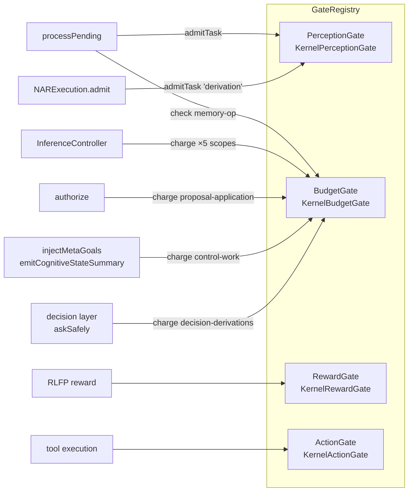

### 6.1 PerceptionGate — the only gate on the tick's write path

Two entry points matter. The tick uses `admitTask`; ingress (from `nar-io.input()`) uses the async `admit()`.

**`admitTask(term, type, truth, source, correlationId)`** — `:288`, **synchronous**, and this is what the cycle uses:

```
decideAdmission → emitAdmitted:
  normalized = asBeliefTruth(truth)
  emitAdmitted({term, taskType, truth: normalized, source: mapSource(source),
                confidence: normalized?.confidence ?? 0.5, correlationId})
    taskId = makeId()
    budget  = {priority: 0.5×confidence, durability: 0.8, quality: 0.9, cycles: 10, depth: 5}
    validateCognitiveEvent(task.admitted)
    eventLog.push(...)
    return {admitted: true, task}
```

**On the tick path this gate has no refusal branch.** `decideAdmission` always returns `admitted: true`. The only way the cycle's `admit()` sees `!result.admitted` is if `validateCognitiveEvent` throws. So:

> On the cycle path the perception gate is an **event emitter and a budget deriver**, not a filter. The "fail-closed" story at `:203-213` applies to the *async ingress* path only.

This is the single most important asymmetry in the gate design, and the reason §12.1 flags it as drift.

**`admit(input)`** — `:125`, the async ingress path used by `NARIO.input()` when System One is enabled:

```mermaid
flowchart TB
  A["admit&#40;input&#41;"] --> B["confidence = reputationCeiling × sensorConfidence<br/>key = domainKey&#40;sourceId&#41; ?? sourceId"]
  B --> C{"rawObservationToTerm&#40;·&#41; parses?"}
  C -- no --> CX["✗ REJECT<br/>'Failed to parse observation into valid Narsese term'"]
  C -- yes --> D["taskType = inferTaskType&#40;·&#41;<br/>&#40;parseTaskTolerant: retry with . ? !&#41;"]
  D --> E{"systemOne.enabled AND judge bound?"}
  E -- no --> Z["emitAdmitted — legacy path"]
  E -- yes --> F["raceDeadline&#40;judge.judge&#40;·&#41;, timeoutMs ?? 2000&#41;"]
  F --> G{"timed out?"}
  G -- yes --> GF["✗ FAIL-CLOSED reject<br/>recordPolicyViolation 'epistemic-firewall'<br/>'System One ingress fault: admission rejected (fail-closed)'"]
  F --> H{"judge threw?"}
  H -- yes --> GF
  H -- no --> I{"verdict.vetoReason?"}
  I -- yes --> IX["✗ REJECT with the judge's reason"]
  I -- no --> J{"verdict.ambiguityFlag?"}
  J -- yes --> K["stimulate curiosity +1"]
  J -- no --> Z2["emitAdmitted with verdict.truth,<br/>verdict.confidence, verdict.taskType ?? inferred"]
  K --> Z2
```

Timeout and fault deliberately share one reason (`:203-205`): *"both mean the judgment did not arrive, and neither may fall through to legacy admission — that is the injection veto, not a default."*

### 6.2 ActionGate — the autonomy ladder

Not on the tick's write path; it gates **tool execution**. The real state machine in this system:

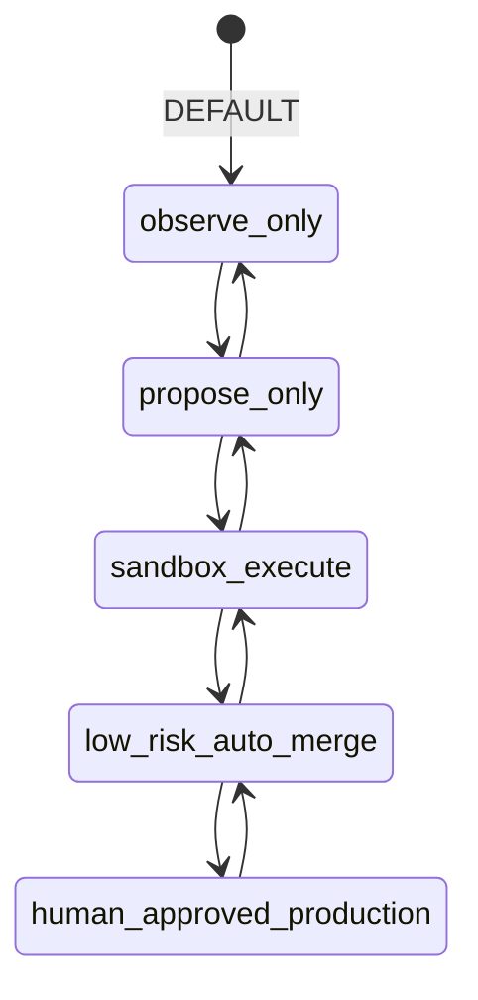

`LEGAL_TRANSITIONS` — `KernelActionGate.ts:17`. Escalating beyond `sandbox-execute` requires `authorizedBy ∈ {human, external-governance}`; `'system'` is refused (`:86-92`).

Scoped authorization for `game:<scopeId>:<action>` operations (`:136`) has three refusals: unknown scope, mode is `observe-only`/`propose-only`, operation not in the scope's allowlist.

### 6.3 RewardGate

`KernelRewardGate` (159 LOC) — reached from RLFP, not structurally from the tick. The tick's own reward recording is `recordRLFPReward()` at `:192`, which pushes to a bounded ring (cap 100) and forwards to `rlfp?.reward()`.

### 6.4 BudgetGate

See §7.

---

## 7. Layer 6 — Budgets

### 7.1 Two budget tiers

| Tier | Owner | Reset | Charge API |
|---|---|---|---|
| **Main budget** | `KernelBudgetGate.budget` | never (lifetime) — `resetBudget()` only | `gate.check({operation, scopeId?, estimatedCost})` |
| **Control scopes** (6) | `KernelBudgetGate.scopes` map | `budgets.beginCycle()` every cycle | `budgets.charge(scopeId, cost?)` |

Main limits — `NAR_BUDGET_LIMITS` `KernelBudgetGate.ts:99`: `maxCycles: 1000`, `maxDepth: 100`, `maxMemoryOps: 10000`, `maxLMCalls: 50`.

### 7.2 The six declared control scopes

`BUDGET_SCOPES` — `nar/src/kernel/budget-scopes.ts:54`. One row answers six questions.

| Scope id | Operation | Dimension | Ceiling | Owner | Config source | Termination reason | Charged at |
|---|---|---|---|---|---|---|---|
| `derivations` | `derivation` | `cycles` | `100` | `InferenceController` | `inference.maxDerivationsPerStep` | `cycle-budget` | `inference-controller.ts:175` |
| `premises` | `premise-selection` | `cycles` | `64` | `InferenceController` | `controlBudgets.premises` | `cycle-budget` | `inference-controller.ts:136` |
| `candidate-derivations` | `candidate-derivation` | `cycles` | `16384` | `RuleProcessor.applySyncRules` | `controlBudgets.candidate-derivations` | `cycle-budget` | inside the rule processor |
| `proposal-application` | `proposal-application` | `memoryOps` | `64` | `NARExecution.authorize` | `controlBudgets.proposal-application` | `memory-budget` | `nar-execution.ts:281` |
| `control-work` | `control-work` | `cycles` | `16` | `NARExecution` control/observability | `controlBudgets.control-work` | `cycle-budget` | `nar-execution.ts:608`, `:615`, `:647` |
| `decision-derivations` | `decision-derivation` | `llmCalls` | `8` | the decision layer | `controlBudgets.decision-derivations` | `llm-budget` | `rankForAdmission` / `vetoAtEgress` via `budget` field |

Design properties the source states explicitly:

- **Not a second budget type** — every scope is the same `ReasoningBudget` the gate already accounts; a scope is a `scopeId` plus its own ceilings.
- **Not a shared counter with symbolic derivations** — `decision-derivations` and `derivations` are separate rows, so a decision budget of zero leaves the symbolic derivation count unchanged. That is the four-configuration invariance (§8.4) *budgeted* rather than asserted.
- **Not a cost model** — defaults are behaviour-neutral relative to what call sites already enforced.

### 7.3 Open-once semantics

```mermaid
flowchart LR
  A["charge&#40;scopeId, cost=1&#41;"] --> B{"scope already open?"}
  B -- no --> C["reopen from declared ceilings<br/>consumed = all zeros"]
  B -- yes --> D["reuse — consumption preserved"]
  C --> E["gate.check&#40;{operation: scopeSpec.operation,<br/>scopeId, estimatedCost: cost&#41;"]
  D --> E
  E --> F{"remaining >= cost?"}
  F -- no --> G["✗ return false<br/>emit budget.exhausted<br/>terminationReason from the scope table"]
  F -- yes --> H["consumed&#91;dimension&#93; += cost<br/>terminationReason = undefined<br/>● return true"]
```

`open()` on every charge would reset the consumption that decided the previous charge, "so a scope could never exhaust — a bound wearing a counter" (`:57-60`).

`scopeBudget()` inherits every dimension *except* the scope's own from the base budget (`budget-scopes.ts:133-145`): "a scope must raise *its own* reason when it exhausts, never trip an unrelated dimension it never spends."

### 7.4 Which stage spends what

```mermaid
flowchart TB
  subgraph CY["Per cycle — beginCycle&#40;&#41; reopens all six"]
    P["perceive"]
    A["attend"]
    R["reason"]
    Z["authorize"]
    Q["propose"]
    L["learn"]
  end
  P -. "no scope charge" .-> MAIN["⚠ MAIN budget: memory-op × N, lifetime, never reset per cycle"]
  A -. "control-work ×1 &#40;meta-goal dedup&#41;" .-> CW["control-work"]
  R -. "premises ×1 per concept<br/>derivations ×1 per derivation" .-> INF
  Z -. "proposal-application ×1 per settled proposal<br/>decision-derivations ×1 per LM call" .-> PA
  L -. "control-work ×2 per summary" .-> CW
```

⚠ **`processPending` charges the main budget, not a scope.** So the memory-write path's bound is *lifetime* (10 000 ops) while the proposal path's bound is *per cycle* (64). The two write paths into memory have differently-shaped bounds. `manager.ts:116`.

---

## 8. Layer 7 — State Machines

### 8.1 Task lifecycle — `nar/src/task/manager.ts:7`

```mermaid
stateDiagram-v2
  [*] --> pending : addTask&#40;·, timeout&#41;
  pending --> running : processPending + budget granted + gate admitted
  running --> completed : memory.addTask truthy
  running --> failed : gate rejected OR addTask falsy
  pending --> expired : setTimeout&#40;timeout&#41; fires · default 30000ms
  pending --> failed : cancelTask
  pending --> [*] : removePending — no terminal state, taken by tool dispatch
  completed --> [*]
  failed --> [*]
  expired --> [*]
```

`removePending` (`:78`) is the odd one out: it deletes with **no lifecycle transition and no terminal record**. It is used only by `dispatchToolGoals` to take ownership of a tool goal. A task that vanishes this way is untraceable.

Defaults (`:29`): `defaultTimeout: 30000`, `maxRetries: 3`, `retryBackoffMs: 1000`, `enablePriorityScheduling: true`.

⚠ `maxRetries` and `retryBackoffMs` are **configured and never read**. There is no retry path in `TaskManager`.

### 8.2 Proposal lifecycle — `nar/src/proposal/lifecycle.ts`

```mermaid
stateDiagram-v2
  [*] --> submitted : submit&#40;proposal&#41; — refuses LOUDLY when the queue is full
  submitted --> admitted : admit&#40;{resolves}&#41;
  admitted --> committed : commit&#40;verdict, stampId&#41; / commit&#40;verdict&#41; for rules
  admitted --> rejected : !verdict.admitted
  rejected --> [*]
  committed --> [*]
```

Kinds diverge at commit: a `rule` proposal calls `admitRule?.admit(declaration, {revision, baseRevision, proposalId})` and yields **no task**; a `content` proposal commits with the task's stamp id and yields the task (`:158-186`).

Revision is a single monotonic counter — `proposal.revision` (`:189`). Every proposal records the revision it was judged against.

The design property stated at `:154-157`: *"a task is absent because the lifecycle refused it with a recorded reason, never because the gate silently ate it."*

### 8.3 Component lifecycle — `core/src/Lifecycle.ts:8`

`created → initialized → started ⇄ stopped → disposed`.

### 8.4 The four NAR configurations

The system's load-bearing invariant: **only three booleans may differ across configurations.** `LMService` present/absent × `DecisionPort` present/absent = 4 configurations, and the cycle's control flow must be identical in all four.

| | no `DecisionPort` | `DecisionPort` |
|---|---|---|
| **no `LMService`** | no producer (`proposals` absent) → `propose` stages nothing; no veto, no reorder | same; `decision` bound but `proposals` absent |
| **`LMService`** | producer pumps; `decision` absent → symbolic rank only | producer pumps; veto + reorder consult the port, both fail-open |

The budget table is what makes this testable rather than asserted: `decision-derivations` is a separate scope with a separate counter from `derivations`, so a decision budget of zero provably does not change the symbolic derivation count.

### 8.5 Drive homeostasis — `DriveManager.ts:42`

`isActive = currentIntensity >= activationThreshold`. Each `updateCycle()` moves intensity `10%` toward `targetIntensity` and then decays by `decayRate`, clamped to `[0,1]`.

---

## 9. Layer 8 — Failure & Degradation Matrix

Every `try`/`catch` on the cycle path, and what the flow does.

| Site | Protected call | Policy | On failure |
|---|---|---|---|
| `phases.ts:76-78` | `engine.reason()` | **fail-open** | `catch {}` — silent, no log. An engine error is invisible. |
| `phases.ts:132-134` | `capture.onExchange()` | **fail-open** | swallowed; "capture is best-effort (I5)" |
| `phases.ts:145-147` | `reflect()` | **fail-open** | swallowed |
| `phases.ts:230-232` | `consolidateLearning()` | **fail-open** | swallowed; "never blocks the cycle" |
| `phases.ts:246-248` | `traceGrader()` | **fail-open** | swallowed |
| `phases.ts:205-207` | `engine.absorb?.()` | **fail-open** | `catch {}` — silent |
| `phases.ts:356-359` | whole pipeline dispatch | **unprotected** | propagates out of `runCycleStream`; `stream.close()` still runs via `finally` |
| `nar-execution.ts:325-327` | `assessQuality()` + `performSelfCorrection()` | **fail-open, logged** | `logger.warn('Self-assessment failed')`; correction skipped |
| `nar-execution.ts:556-558` | `proposals.pump()` | **fail-open, logged** | `logger.warn('Proposal pump failed')` — but only once the detached promise rejects |
| `nar-execution.ts:691-715` | `toolGoalExecutor()` | **fail-open, logged + rewarded** | `−0.5` reward, competence `−0.15` |
| `KernelPerceptionGate.ts:210-213` | ingress `judge.judge()` | **FAIL-CLOSED** | reject + `policy.violation` telemetry |
| `KernelPerceptionGate.ts:206-208` | ingress judge deadline | **FAIL-CLOSED** | reject + `policy.violation` telemetry |
| `nar-execution.ts:299-309` | `rlfp.optimize()` | ⚠ **UNPROTECTED** | a throw aborts the `learn` stage and propagates out of `run()` |
| `nar-execution.ts:332-334` | `emitCognitiveStateSummary()` | ⚠ **UNPROTECTED** | a throw propagates out of `run()` |
| `nar-execution.ts:220-221` | `dispatchToolGoals()` / `processPending()` | ⚠ **UNPROTECTED** | propagates out of `run()` |
| `nar-execution.ts:682-716` | `recordRLFPReward` | ⚠ **UNPROTECTED** | propagates |
| `inference-controller.ts` | entire cycle | ⚠ **UNPROTECTED** | propagates out of `stage('reason')` → out of `run()` |

### 9.1 The asymmetry, stated plainly

| Path | Policy | Rationale in code |
|---|---|---|
| **Ingress** (untrusted observation → memory) | **fail closed** | degrading to unjudged admission would bypass the injection veto the judge exists to apply (`KernelPerceptionGate.ts:43-47`) |
| **Egress** (derived conclusion → memory) | **fail open** | the baseline is the symbolic ranking that already ran; failing closed "would halt cognition on a provider fault — the one thing a bounded runtime may not do" (`nar-execution.ts:499-507`) |
| **Everything else** | fail open, mostly unlogged | cognition must not stop |

⚠ The Macro-Cycle's two silent `catch {}` blocks on `engine.reason` and `engine.absorb` are the largest blind spot: an engine that throws on every turn produces a perfectly healthy cycle with zero derivations, zero events, and no log line.

---

## 10. Layer 9 — Concurrency & Re-entrancy

```mermaid
sequenceDiagram
  participant C as Caller
  participant S as runCycleStream
  participant Q as PushQueue (unbounded)
  participant P as Phase pipeline
  participant T as Tool / LM
  participant N as NAR tick

  C->>S: next&#40;&#41;
  S->>P: dispatch — detached IIFE, NOT awaited
  par pipeline
    P->>Q: push text-delta per token
    P->>N: reason → NARExecution.run&#40;3&#41; or run&#40;5&#41;
    N-->>P: derivations
  and stream
    S->>Q: next&#40;&#41;
    Q-->>S: item → yield text-delta
  end
  P->>T: motor.execute — awaited
  P->>Q: push all remaining
  P->>P: stream.close&#40;&#41; in finally
  S->>Q: next&#40;&#41; → done
  S->>S: await running
  S-->>C: return lastResponse || narrativeText
```

| # | Concurrency fact | Consequence |
|---|---|---|
| 1 | The pipeline runs **detached** from the stream drain (`phases.ts:354-362`) | narration reaches the caller while `act`/`record`/`announce` are still executing |
| 2 | `PushQueue.#items` is **unbounded** (`util/src/events/push-queue.ts:7`) | a slow consumer grows the buffer without limit; `push` after `close` is a **silent drop** (`:20`) |
| 3 | `propose` pumps **detached** and serialised on the producer's own `inFlight` chain (`lm-rule-producer.ts:141`) | pump errors never surface in the cycle; proposals are admitted ≥1 cycle late |
| 4 | `run()` is **strictly serial**; there is no lock | two concurrent `run()` calls interleave cycles and share `_cycleCount` |
| 5 | `dispatch()` throws on double `next()` (`middleware.ts:16`) | a mis-authored phase kills the cycle loudly |
| 6 | `beginCycle()` resets all scopes | concurrent `run()` calls would reset each other's scopes mid-flight |
| 7 | `buildInferenceController()` discards the live controller | a reconfigure during `step()` loses `derivationCount` and circular-detector state |
| 8 | `Agent.#emitCognitive` swallows listener errors (`Agent.ts:297-300`) | subscribers cannot break the cycle, and cannot signal failure |

---

## 11. Layer 10 — Observability (the flow's shadow)

### 11.1 Every event the cycle can emit, with its trigger

| Event | Bus | Site | Condition |
|---|---|---|---|
| `task.admitted` | gate event log | `KernelPerceptionGate.ts:346` | every `emitAdmitted`, on **all three** gate paths |
| `budget.exhausted` | gate event log | `KernelBudgetGate.ts:166` | `remaining < estimatedCost` |
| `policy.violation` | gate event log | `KernelPerceptionGate.ts:104`, `KernelActionGate.ts` | judge fault/timeout; unauthorized tool |
| `autonomy.mode.changed` | gate autonomy log | `KernelActionGate.ts:97` | legal transition |
| `nar:reasoning:cycle` | system bus | `nar-execution.ts:254` | `systemEventBus` present, every cycle |
| `nar:derivation` | system bus | `nar-execution.ts:401` | admitted task of type `belief` |
| `nar:derivation` | system bus | `nar-io.ts:95` | first sighting of a concept, on the ingress path |
| `contradiction` | system bus | `nar-execution.ts:418` | `classifyTask` yields `contradiction` on an admitted belief |
| `nar:drive:changed` | system bus | `DriveManager.ts:56` | `stimulate` with a non-zero amount |
| `cognitive:state:summary` | system bus | `nar-execution.ts:633` | `_cycleCount % 10 === 0` |
| `warning` | event bus | `nar-io.ts:122` | ingress rejected when System One is enabled |
| `input.user` | cognitive | `phases.ts:38` | every macro-cycle |
| `egress.gate.rejected` | cognitive | `phases.ts:27` | groundedness gate refused the narration |
| `derivation.made` | cognitive | `phases.ts:255` | one per derivation |
| `skill.executed` | cognitive | `phases.ts:264` | one per tool result |
| `concept:created` | event bus | `nar-io.ts:93` | first sighting |

### 11.2 Two independent traces

| Trace | Records | Accessed via | Used by |
|---|---|---|---|
| `PhaseTimer` | stack-disciplined `begin/end` of free-form `category`+`name` | `nar.getPhaseTimer()` — `nar.ts:716` | flame charts; `formatFlameChart()` |
| `CycleTrace` | `begin`/`end` of the 6 typed `CycleStage`s, `BoundedRing` depth 512 | `nar.getCycleTrace()` — `nar-execution.ts:567` | the no-nested-`propose` invariant (§12.2) |

`CycleTrace` is the one that matters for reasoning about the control flow, because stage names are typed. `PhaseTimer` names are strings, so a typo is a silent split of one phase into two.

`findStageOverlaps()` and `findInCycleProposals()` (`cycle-trace.ts:76`, `:98`) are pure functions over the event list — the gate, the tests and a human reading a trace all agree on what "nested" means.

---

## 12. Layer 11 — Invariants & Document Drift

### 12.1 Document drift — code vs prose

Found while building this document. Each is a candidate for a fix.

| # | Claim | Source | Reality |
|---|---|---|---|
| 1 | Micro-Tick has **11 stages** | `README.md:1034` | The live tick runs **6**. The 11-stage pipeline (`tick.ts:58`) is dead code; only its type is used. |
| 2 | Macro-Cycle is `Perceive → Recall → Reason → Narrate → Act → Consolidate` | `README.md:1209`, `:1245-1251` | The code runs **8** phases in a **different order**: consolidate(⑤) precedes act(⑥), plus `record` and `announce`. |
| 3 | `CYCLE_STAGES` order | `cycle-trace.ts:21` | Listed `authorize, perceive, attend, reason, propose, learn`. Runtime order is `perceive, attend, reason, authorize, propose, learn`. |
| 4 | "Four of the five declared scopes are per cycle" | `control-budgets.ts:48`, `nar-execution.ts:209` | There are **six** scopes, and `beginCycle()` reopens **all six** — including the `llmCalls`-dimensioned one. |
| 5 | Perception gate "fail-closed" | implied by `KernelPerceptionGate.ts:112` | True only for the **async ingress** path. On the tick's `admitTask` path there is **no refusal branch at all** — it always returns `admitted: true`. |
| 6 | `maxRetries: 3` | `manager.ts:31` | Configured, never read. No retry path exists. |
| 7 | `pending_tool_executions` | `nar-execution.ts:628` | Hard-coded `[]` with the comment "would be populated by tool execution tracking". |
| 8 | Cognitive-cycle flowcharts | `docs/tech/deep-dive.md:48-141`, `docs/intro/conceptual-overview.md:146-174` | Reference a `Cycle` class, `TaskFactory`, `PriorityManager`, `Reasoner` — none exist in this tree. |
| 9 | `Agent.capabilities()` | `core/src/Agent.ts:172` | Hard-coded booleans, not derived from wiring. |
| 10 | `reason` under RLFP | `nar-execution.ts:238` | Gated on an **env var** (`RLFP_ENABLED`), read once per `run()` call, not on config. |

### 12.2 Invariants enforced by CI gates

| Invariant | Enforced by | Property |
|---|---|---|
| One inference path | `pnpm gates:one-cycle-path` (`scripts/gates-one-cycle-path.ts`) | exactly one `new InferenceController(` and one `.step(` site |
| `propose` never nests inside `reason` | `findInCycleProposals` + `tests/nar/todo29a-a1.test.ts` | stage-region overlap |
| Cycle path never imports `nar/src/lm/` | `pnpm core:no-lm` + `CYCLE_PATH_PREFIXES` | import census |
| Every provider seam on the cycle path is bounded | `pnpm cycle:no-provider` (`scripts/cycle-no-provider.ts`) | call-site census |
| Control budgets are declared, not ad-hoc | `pnpm control-budgets` | every `charge()` names a `BudgetScopeId` |
| No wildcard dispatch | `pnpm dispatch:no-wildcard` | static |
| Rules are loaded data | `pnpm rules:loaded-data` | static |
| Every rule has a fallback | `pnpm rule:has-fallback` | static |
| Memory is ported | `pnpm memory:ports` | static |
| Attention has one write surface | `pnpm attention:write-surface` | static |
| Proposal protocol is respected | `pnpm proposal:protocol` | static |
| Resource policy | `pnpm resource:policy` | static |
| Core contains no LM | `pnpm core:no-lm` | static |
| No circular deps | `pnpm deps:check` (dpdm) | static |

### 12.3 Declared design invariants worth preserving

From the source comments, in the words of the code:

1. *"The one stage through which anything reaches state"* — `authorize` (`:263-265`). Nothing else writes to memory.
2. *"It only ever removes"* — egress judging (`:490`).
3. *"It is not a second admission path"* — survivors go through `admit()`, the same gate (`:497-498`).
4. *"Absence means no veto, and is recorded"* — the opposite of ingress (`:499-507`).
5. *"The decision cannot bypass admission"* — it is consulted for **order, not admission** (`:437-443`).
6. *"A stage the trace cannot see is a stage nothing can assert about"* — why `stage()` exists (`:358-362`).
7. *"A per-cycle bound that is never re-opened is a lifetime bound wearing a per-cycle name"* — why `beginCycle()` exists (`control-budgets.ts:48-50`).
8. *"Opening it on every charge would reset the consumption that decided the previous charge, so a scope could never exhaust — a bound wearing a counter"* (`:57-60`).
9. *"Optimization may never change what counts as committed state"* — why the decision reorders instead of selecting (TODO30 §7, cited at `:494-496`).
10. *"A cycle's progress may not depend on a provider"* — why `pump` is detached (`:434-435`).
11. *"Observability that costs O(N) is control work and is bounded like it"* — `control-work` scope (`:606-607`).
12. *"A literal in this file is a constant, so it is either right or a build break"* — why meta-goals are parsed at module load (`:57-61`).

---

## 13. Layer 12 — Change-Planning Surface

### 13.1 Choke points — where a change has leverage

| Choke point | Location | Blast radius | Notes |
|---|---|---|---|
| **`stage()` wrapper** | `nar-execution.ts:363` | all 6 stages | Single place to add timing, tracing, or a stage-level policy. Anything not routed through it is unassertable. |
| **`admit()`** | `nar-execution.ts:381` | every cycle→memory write | The only write path on the tick. Any new admission source must route here or the invariant breaks. |
| **`ControlBudgets.beginCycle()`** | `control-budgets.ts:51` | all 6 scopes | The reset point for every per-cycle bound. Adding a per-cycle bound = add a `BUDGET_SCOPES` row; it is reopened automatically. |
| **`dispatch()`** | `util/src/middleware.ts:13` | Loop A **and** the dead tick pipeline | One primitive serves both. A change here moves the macro-cycle. |
| **`DEFAULT_MACRO_PIPELINE`** | `phases.ts:321` | Loop A | Reorderable array. `setMacroPipeline()` replaces it wholesale. |
| **`rankDerivations()`** | `rules/impls/ranking.ts:22` | both write paths | Symbolic ranking + `maxAdmissions` truncation. Precedes the decision reorder. |
| **`KernelBudgetGate.decideBudget()`** | `KernelBudgetGate.ts:155` | all budget accounting | The single grant/deny decision. |
| **`emitAdmitted()`** | `KernelPerceptionGate.ts:322` | all 3 gate entry points | "The single admission path." |
| **`CognitiveController.buildInferenceController()`** | `CognitiveController.ts:135` | all 5 strategy slots | Rebuilds wholesale; resolves + installs attention. |
| **`NAREngine.reason()`** | `engine/NAREngine.ts:38` | macro→micro bridge | Owns the `run(3)`/`run(5)` step counts and the Narsese router. |

### 13.2 Extension seams that already exist

| Want to… | Do this | Cost |
|---|---|---|
| add a macro-cycle phase | `Agent.setMacroPipeline([...DEFAULT_MACRO_PIPELINE, myPhase])` | ~10 lines; no kernel change |
| swap a reasoning strategy | `CognitiveController.setStrategy(slot, spec, config)` | validates + rebuilds |
| bound new control work | add a `BUDGET_SCOPES` row | auto-reopened per cycle |
| add an observation source | call `perceptionGate.admit()` | inherits judge + reputation + fail-closed |
| gate a new decision | reuse `askSafely` with `position:'cycle'` | inherits timeout/breaker/budget |
| observe a new cycle phase | call `phaseTimer.begin/end` **via `stage()`** | — |

### 13.3 Structural gaps — no seam exists

| Gap | Why it matters | Where a change would go |
|---|---|---|
| **No stage-level conditionality** | `run()` is a fixed 6-stage sequence; the only branch is `abort`. Stage skipping is impossible without restructuring. | `nar-execution.ts:216-335` — and this is precisely the open design item in `REFACTOR.todo3.md:32` (§12 "Tick stage graph") and `REFACTOR.todo4.md:114` ("stage graph as conditional edges on the middleware primitive") |
| **Stage order is not data** | Loop A's order is an array; Loop B's order is straight-line code. No shared model. | Loop B needs the `Middleware` treatment Loop A already has |
| **`derived` conflates two quantities** | `processPending` count + inference count (`:222`, `:250`) | `run()` return value; `nar.ts:384` |
| **No cycle-to-cycle causality** | `CycleTrace` keys on `cycle` number, not on `correlationId`; a trace cannot be tied to the stimulus that caused it | `CycleTrace.begin(cycle, stage)` — thread a correlation id |
| **Egress veto has no ingress counterpart in the trace** | a vetoed candidate produces a `logger.warn` and nothing else — no event | `nar-execution.ts:543` |
| **Silent engine failures** | `phases.ts:76-78` — no log, no event, no counter | `core/src/agent/phases.ts:66` |
| **`control-work` exhaustion is indistinguishable from health** | `emitCognitiveStateSummary` reports `aikrPressure: 'low'` when it simply could not measure | `nar-execution.ts:615-619` |
| **Unbounded `PushQueue`** | backpressure has no mechanism | `util/src/events/push-queue.ts:7` |
| **`removePending` leaves no trace** | a task taken by tool dispatch is untracked after removal | `nar/src/task/manager.ts:78` |
| **Reconfigure is not guarded against in-flight reasoning** | controller rebuild loses `derivationCount` and circular state | `CognitiveController.ts:113-117` |

### 13.4 Highest-leverage changes, ranked by (seam exists) × (structural pressure)

1. **Conditional stage edges in Loop B** — the one open design item blocking the most architectural flexibility. Loop A already solved the dispatch primitive; Loop B has not adopted it.
2. **Thread `correlationId` through the Micro-Tick** — makes the trace joinable to the stimulus, the event log, and the gate events. Currently impossible to answer "which cycle admitted this?" for a given turn.
3. **Replace the `catch {}` on `engine.reason`** — one line, closes the largest observability hole in Loop A.
4. **Reconcile the six documented drift items in §12.1** — several are one-line source comments that will mislead the next reader of the code, not just of the docs.
5. **Make `control-work` exhaustion report as its own condition** — the summary currently misreports starvation as health.

### 13.5 Extending this document

This is layer-structured for progressive drilling. To go deeper:

| Target | § to extend |
|---|---|
| A specific stage in detail | [§4](#4-layer-3--per-stage-drill-down) — one subsection per stage, following the same `graph → node table → guard table` shape |
| A derivation strategy's internals | [§5](#5-layer-4--the-inference-cycle-reason-stage-internals) — one subsection per `DerivationStrategy` |
| The proposal seam | §4.5 + §8.2 — expand to cover `StreamReasoner` pressure/flush/queue-full paths |
| Memory internals | §4.7 + `nar/src/memory/memory.ts` |
| A proposed refactor | §13.3 — add the row, then trace the affected choke points in §13.1 |

**Verification rule for any future edit:** every new claim needs a `file:line`. If a line number moves, the claim moves with it — do not let §12.1 become §12.2.

---

## Appendix A — Cycle Path File Index

| Path | LOC | Role in the flow |
|---|---|---|
| `nar/src/nar-execution.ts` | 718 | **Loop B.** Entry, stages, `admit`, veto, rank, meta-goals, tool dispatch |
| `nar/src/reason/inference-controller.ts` | 183 | **Loop C.** The inference cycle and its three nested loops |
| `nar/src/reason/inference-utils.ts` | 65 | depth limit, circular detector, task-from-concept |
| `nar/src/kernel/KernelBudgetGate.ts` | 255 | every grant/deny decision |
| `nar/src/kernel/budget-scopes.ts` | 145 | the six declared scopes |
| `nar/src/kernel/control-budgets.ts` | 108 | `charge()` / `beginCycle()` |
| `nar/src/kernel/KernelPerceptionGate.ts` | 400 | admission decision + `task.admitted` |
| `nar/src/kernel/KernelActionGate.ts` | 239 | autonomy ladder |
| `nar/src/kernel/GateRegistry.ts` | 125 | the four gates |
| `nar/src/task/manager.ts` | 215 | task lifecycle, `processPending` |
| `nar/src/proposal/cycle-trace.ts` | 103 | `CycleStage` type + stage regions |
| `nar/src/proposal/lifecycle.ts` | 299 | proposal lifecycle, revision counter |
| `nar/src/proposal/lm-rule-producer.ts` | 245 | `stage` / `pump` / `takeDerived` |
| `nar/src/drives/impls/DriveManager.ts` | 94 | drive homeostasis + `injectDriveGoal` |
| `nar/src/cognitive/impls/CognitiveController.ts` | 241 | `adapt`, `buildInferenceController` |
| `nar/src/tick/tick.ts` | 144 | **dormant** 11-stage vocabulary |
| `nar/src/trace/phase-timer.ts` | 85 | free-form phase timing |
| `nar/src/memory/memory.ts` | 693 | concepts, links, bags, `consolidate` |
| `core/src/agent/phases.ts` | 364 | **Loop A.** The 8 phases |
| `core/src/agent/pipeline.ts` | 148 | `CycleHost`, `MacroContext`, opt-in phases |
| `core/src/Agent.ts` | 308 | Loop A entry, wiring, transport |
| `nar/src/engine/NAREngine.ts` | 145 | macro→micro bridge, Narsese router |
| `util/src/middleware.ts` | 32 | `dispatch` — Loop A's onion primitive |
| `util/src/events/push-queue.ts` | — | Loop A's unbounded stream |

## Appendix B — Glossary

| Term | Meaning |
|---|---|
| **Cycle** / **Micro-Tick** | Loop B — `NARExecution.run()`'s 6 stages |
| **Macro-Cycle** | Loop A — the Agent's 8-phase pipeline |
| **Stage** | A typed `CycleStage` region in Loop B, traced by `CycleTrace` |
| **Phase** | Loop A's onion middleware unit. Also the `PhaseTimer` category — the two uses collide |
| **Scope** | A named `ReasoningBudget` ceiling with its own dimension, re-opened per cycle |
| **Admit** | The decision to write into memory. One method: `NARExecution.admit` |
| **Veto** | Remove-only egress judging. The opposite of admission |
| **Proposal** | A staged, lifecycle-judged candidate. Committed one cycle after it is staged |
| **Drive** | A homeostasis channel (`competence`, `curiosity`, `coherence`, `social`) |
| **Meta-goal** | A self-operation injected as a goal when a drive falls below threshold |
| **AIKR** | Attention / Importance / Knowledge / Reason — the pressure model behind `memoryPressure` and consolidation |
| **RLFP** | Reinforcement learning from feedback — the strategy-priority and reward loop |
| **System One** | The fast/epistemic layer: the ingress judge and the egress veto |
| **Groundedness gate** | Loop A's per-narration verifier, distinct from Loop B's egress judging |
| **Autonomy mode** | The 5-rung ActionGate ladder |
